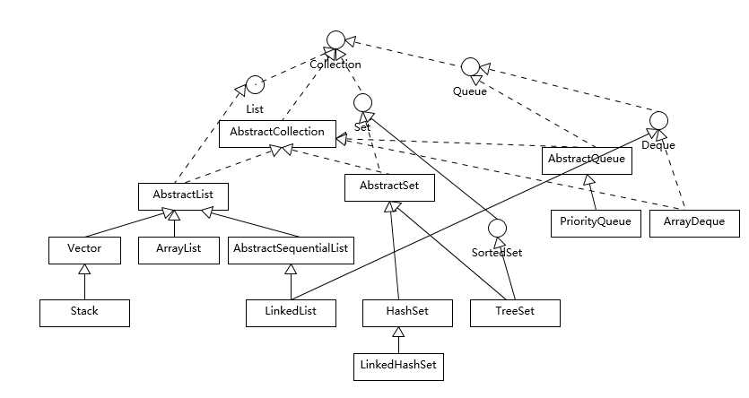
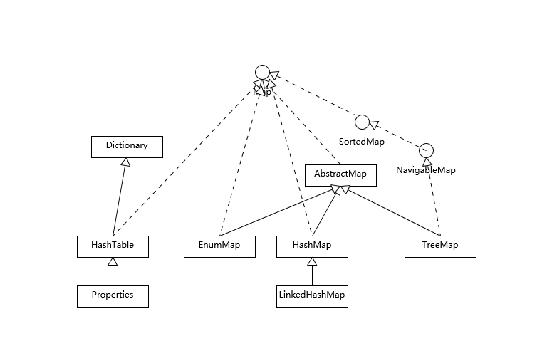
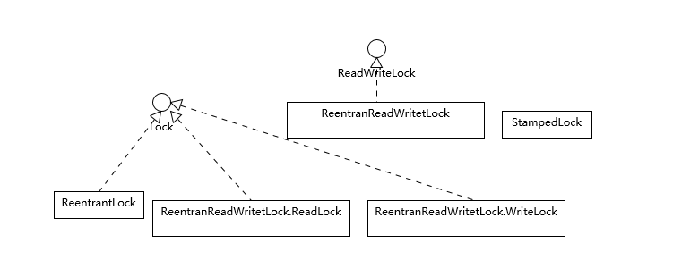

## 一篇文章了解 Java 核心技术

### Java 异常处理机制

#### Throwable 类图


#### 简述
Exception 和 Error 都继承了 Throwable 类，在 Java 中只有 Throwable 的实例才可以被抛出或捕获，它是异常处理机制的基本组成类型。

Exception 和 Error 体现了 Java 平台设计者对不同异常情况的分类。
- Exception 是程序正常运行中，可以预料的意外情况，可能并且应该被捕获，进行相应处理。Exception 又分为可检查异常和不检查异常。可检查异常在源代码里必须显示地进行捕获处理，这是编译期检查的一部分。不检查异常就是所谓的运行时异常，如 ：NullPointerException、ArrayIndeOutOfBoundsException 等，通常是可以编码避免的逻辑错误，具体根据需要来判断是否需要捕获处理，编译期不检查运行时异常。
- Error 指在正常情况下，不大可能出现的情况，绝大部分的 Error 都会导致程序处于非正常的、不可恢复状态。所以不便于也不需要捕获。如：OutOfMemoryError。

#### 异常处理的两个基本原则
1. 尽量不要捕获类似 Exception 这样的通用异常，而是应该捕获特定异常。
2. 不要生吞异常。

如以下代码则违反了这两个基本原则：

```
try {
  // 业务代码
  // …
  Thread.sleep(1000L);
} catch (Exception e) {
  // Ignore it
}

```

```
try {
   // 业务代码
   // …
} catch (IOException e) {
    e.printStackTrace();
}

```


---
### Java引用
Java引用分为：强引用、软引用、弱引用、幻想引用。不同的引用类型，主要体现的是对象的可达性状态和对垃圾收集的影响。
- 强引用：就是我们通常使用的普通引用，可以通过强引用访问对象。GC不会收集有强引用指向的对象。 
- 软引用：比强引用弱化一些的引用，它可以豁免一些垃圾收集，GC可以确保在抛出OOM之前清理掉软引用指向的对象。可以用于实现内存敏感的缓存。 
- 弱引用：主要是提供一种在弱引用状态下访问对象的途径。可以用来构建一种没有特定约束的关系，如维护一种非强制性的映射关系。 
- 幻象引用：不能通过它访问对象。仅仅是提供了一种对象被finalize以后，做某些事情的机制，比如：post-mortem清理机制、cleaner机制等。	


---
### 谈谈final、finally、 finalize有什么不同？
final 可以用来修饰类、方法、变量，分别有不同的意义，final 修饰的 class 代表不可以继承扩展，final 的变量是不可以修改的，而 final 的方法也是不可以重写的（override）。

finally 则是 Java 保证重点代码一定要被执行的一种机制。我们可以使用 try-finally 或者 try-catch-finally 来进行类似关闭 JDBC 连接、保证 unlock 锁等动作。

finalize 是基础类 java.lang.Object 的一个方法，它的设计目的是保证对象在被垃圾收集前完成特定资源的回收。finalize 机制现在已经不推荐使用，并且在 JDK 9 开始被标记为 deprecated。


---
### String、StringBuffer、StringBuilder有什么区别？
String 是 Java 语言非常基础和重要的类，提供了构造和管理字符串的各种基本逻辑。它是典型的 Immutable 类，被声明成为 final class，所有属性也都是 final 的。也由于它的不可变性，类似拼接、裁剪字符串等动作，都会产生新的 String 对象。由于字符串操作的普遍性，所以相关操作的效率往往对应用性能有明显影响。

StringBuffer 是为解决上面提到拼接产生太多中间对象的问题而提供的一个类，我们可以用 append 或者 add 方法，把字符串添加到已有序列的末尾或者指定位置。StringBuffer 本质是一个线程安全的可修改字符序列，它保证了线程安全，也随之带来了额外的性能开销，所以除非有线程安全的需要，不然还是推荐使用它的后继者，也就是 StringBuilder。

StringBuilder 是 Java 1.5 中新增的，在能力上和 StringBuffer 没有本质区别，但是它去掉了线程安全的部分，有效减小了开销，是绝大部分情况下进行字符串拼接的首选。


---
### 动态代理是基于什么原理？
反射机制是 Java 语言提供的一种基础功能，赋予程序在运行时**自省**（introspect，官方用语）的能力。通过反射我们可以直接操作类或者对象，比如获取某个对象的类定义，获取类声明的属性和方法，调用方法或者构造对象，甚至可以运行时修改类定义。

动态代理是一种方便运行时动态构建代理、动态处理代理方法调用的机制，很多场景都是利用类似机制做到的，比如用来包装 RPC 调用、面向切面的编程（AOP）。

实现动态代理的方式很多，比如：
1. JDK 自身提供的动态代理主要利用了反射机制。
2. 利用更高性能的字节码操作机制，类似 ASM、cglib（基于 ASM）、Javassist 等。


---
### int和Integer有什么区别？
int 是我们常说的整形数字，是 Java 的 8 个原始数据类型（boolean【1字节】、byte【1字节】 、short【2字节】、char【2字节】、int【4字节】、float【4字节】、long【8字节】、double【8字节】）之一。
所谓的一切皆是对象并不包括原始数据类型。

Integer 是 int 对应的包装类，它有一个 int 类型的字段存储数据，并且提供了基本操作，比如数学运算、int 和字符串之间转换等。在 Java 5 中，引入了自动装箱和自动拆箱功能（boxing/unboxing），Java 可以根据上下文，自动进行转换，极大地简化了相关编程。

关于 Integer 的值缓存，这涉及 Java 5 中另一个改进。构建 Integer 对象的传统方式是直接调用构造器，直接 new 一个对象。但是根据实践，我们发现大部分数据操作都是集中在有限的、较小的数值范围，因而，在 Java 5 中新增了静态工厂方法 valueOf，在调用它的时候会利用一个缓存机制，带来了明显的性能改进。按照 Javadoc，**这个值默认缓存是 -128 到 127 之间。**


---
### 对比Vector、ArrayList、LinkedList有何区别？
#### Collection 整体结构


#### 简述
这三者都是实现集合框架中的 List，也就是所谓的有序集合，因此具体功能也比较近似，比如都提供按照位置进行定位、添加或者删除的操作，都提供迭代器以遍历其内容等。但因为具体的设计区别，在行为、性能、线程安全等方面，表现又有很大不同。

Vector 是 Java 早期提供的**线程安全的动态数组**，如果不需要线程安全，并不建议选择，毕竟同步是有额外开销的。Vector 内部是使用对象数组来保存数据，可以根据需要自动的增加容量，当数组已满时，会创建新的数组，并拷贝原有数组数据。

ArrayList 是应用更加广泛的**动态数组**实现，它本身不是线程安全的，所以性能要好很多。与 Vector 近似，ArrayList 也是可以根据需要调整容量，不过两者的调整逻辑有所区别，Vector 在扩容时会提高 1 倍，而 ArrayList 则是增加 50%。

LinkedList 顾名思义是 Java 提供的双向链表，所以它不需要像上面两种那样调整容量，它也不是线程安全的。


---
### 对比Hashtable、HashMap、TreeMap有什么不同？
#### Map 整体结构


#### 简述
Hashtable、HashMap、TreeMap 都是最常见的一些 Map 实现，是以**键值对**的形式存储和操作数据的容器类型。

Hashtable 是早期 Java 类库提供的一个哈希表实现，本身是同步的，不支持 null 键和值，由于同步导致的性能开销，所以已经很少被推荐使用。

HashMap 是应用更加广泛的哈希表实现，行为上大致上与 HashTable 一致，主要区别在于 HashMap 不是同步的，支持 null 键和值等。通常情况下，HashMap 进行 put 或者 get 操作，可以达到常数时间的性能，所以**它是绝大部分利用键值对存取场景的首选**，比如，实现一个用户 ID 和用户信息对应的运行时存储结构。

TreeMap 则是基于红黑树的一种提供顺序访问的 Map，和 HashMap 不同，它的 get、put、remove 之类操作都是 O（log(n)）的时间复杂度，具体顺序可以由指定的 Comparator 来决定，或者根据键的自然顺序来判断。


---
### 如何保证集合是线程安全的? ConcurrentHashMap如何实现高效地线程安全？
Java 提供了不同层面的线程安全支持。在传统集合框架内部，除了 Hashtable 等同步容器，还提供了所谓的同步包装器（Synchronized Wrapper），我们可以调用 Collections 工具类提供的包装方法，来获取一个同步的包装容器（如 Collections.synchronizedMap），但是它们都是利用非常粗粒度的同步方式，在高并发情况下，性能比较低下。

另外，更加普遍的选择是利用并发包提供的线程安全容器类，它提供了：
- 各种并发容器，比如 ConcurrentHashMap、CopyOnWriteArrayList。
- 各种线程安全队列（Queue/Deque），如 ArrayBlockingQueue、SynchronousQueue。
- 各种有序容器的线程安全版本等。

具体保证线程安全的方式，包括有从简单的 synchronize 方式，到基于更加精细化的，比如基于分离锁实现的 ConcurrentHashMap 等并发实现等。具体选择要看开发的场景需求，总体来说，并发包内提供的容器通用场景，远优于早期的简单同步实现。

ConcurrentHashMap如何实现高效的线程安全可以参考下面这个早期 ConcurrentHashMap 内部结构的示意图，其核心是利用分段设计，在进行并发操作的时候，只需要锁定相应段，这样就有效避免了类似 Hashtable 整体同步的问题，大大提高了性能。


---
### Java提供了哪些IO方式？ NIO如何实现多路复用？
#### IO 方式简述
Java IO 方式有很多种，基于不同的 IO 抽象模型和交互方式，可以进行简单区分。

首先，传统的 java.io 包，它基于流模型实现，提供了我们最熟知的一些 IO 功能，比如 File 抽象、输入输出流等。交互方式是同步、阻塞的方式，也就是说，在读取输入流或者写入输出流时，在读、写动作完成之前，线程会一直阻塞在那里，它们之间的调用是可靠的线性顺序。

java.io 包的好处是代码比较简单、直观，缺点则是 IO 效率和扩展性存在局限性，容易成为应用性能的瓶颈。

很多时候，人们也把 java.net 下面提供的部分网络 API，比如 Socket、ServerSocket、HttpURLConnection 也归类到同步阻塞 IO 类库，因为网络通信同样是 IO 行为。

第二，在 Java  1.4 中引入了 NIO 框架（java.nio 包），提供了 Channel、Selector、Buffer 等新的抽象，可以构建多路复用的、同步非阻塞 IO 程序，同时提供了更接近操作系统底层的高性能数据操作方式。

第三，在 Java 7 中，NIO 有了进一步的改进，也就是 NIO 2，引入了异步非阻塞 IO 方式，也有很多人叫它 AIO（Asynchronous IO）。异步 IO 操作基于事件和回调机制，可以简单理解为，应用操作直接返回，而不会阻塞在那里，当后台处理完成，操作系统会通知相应线程进行后续工作。

#### BIO（即传统的 java.io 包）主要知识点
- IO 不仅仅是对文件的操作，网络编程中，比如 Socket 通信，都是典型的 IO 操作目标。
- 输入流、输出流（InputStream/OutputStream）是用于读取或写入字节的，例如操作图片文件。
- 而 Reader/Writer 则是用于操作字符，增加了字符编解码等功能，适用于类似从文件中读取或者写入文本信息。本质上计算机操作的都是字节，不管是网络通信还是文件读取，Reader/Writer 相当于构建了应用逻辑和原始数据之间的桥梁。
- BufferedOutputStream 等带缓冲区的实现，可以避免频繁的磁盘读写，进而提高 IO 处理效率。这种设计利用了缓冲区，将批量数据进行一次操作，但在使用中千万别忘了 flush。
- 参考下面这张类图，很多 IO 工具类都实现了 Closeable 接口，因为需要进行资源的释放。比如，打开 FileInputStream，它就会获取相应的文件描述符（FileDescriptor），需要利用 try-with-resources、 try-finally 等机制保证 FileInputStream 被明确关闭，进而相应文件描述符也会失效，否则将导致资源无法被释放。利用 Cleaner 或 finalize 机制作为资源释放的最后把关，也是必要的。

日常开发常用的类型和结构关系：


#### NIO 主要知识点
##### NIO 主要组成部分
- Buffer，高效的数据容器，除了布尔类型，所有原始数据类型都有相应的 Buffer 实现。
- Channel，类似在 Linux 之类操作系统上看到的文件描述符，是 NIO 中被用来支持批量式 IO 操作的一种抽象。  File 或者 Socket，通常被认为是比较高层次的抽象，而 Channel 则是更加操作系统底层的一种抽象，这也使得 NIO 得以充分利用现代操作系统底层机制，获得特定场景的性能优化，例如，DMA（Direct Memory Access）等。不同层次的抽象是相互关联的，我们可以通过 Socket 获取 Channel，反之亦然。
- Selector，是 NIO 实现多路复用的基础，它提供了一种高效的机制，可以检测到注册在 Selector 上的多个 Channel 中，是否有 Channel 处于就绪状态，进而实现了单线程对多 Channel 的高效管理。

Selector 同样是基于底层操作系统机制，不同模式、不同版本都存在区别，例如，在最新的代码库里，相关实现如下：
Linux 上依赖于 epoll（http://hg.openjdk.java.net/jdk/jdk/file/d8327f838b88/src/java.base/linux/classes/sun/nio/ch/EPollSelectorImpl.java）。
Windows 上 NIO2（AIO）模式则是依赖于 iocp（http://hg.openjdk.java.net/jdk/jdk/file/d8327f838b88/src/java.base/windows/classes/sun/nio/ch/Iocp.java）。

- Chartset，提供 Unicode 字符串定义，NIO 也提供了相应的编解码器等，例如，通过下面的方式进行字符串到 ByteBuffer 的转换：

```
Charset.defaultCharset().encode("Hello world!"));
```


##### NIO 多路复用
**实现一个简单的服务器应用（BIO方式）：**

```
serverSocket = new ServerSocket(0);
executor = Executors.newFixedThreadPool(8);
 while (true) {
    Socket socket = serverSocket.accept();
    RequestHandler requestHandler = new RequestHandler(socket);
    executor.execute(requestHandler);
}

```

通过一个固定大小的线程池，来负责管理工作线程，避免频繁创建、销毁线程的开销，这是我们构建并发服务的典型方式。这种工作方式，可以参考下图来理解。


如果连接数并不是非常多，只有最多几百个连接的普通应用，这种模式往往可以工作的很好。但是，如果连接数量急剧上升，这种实现方式就无法很好地工作了，因为线程上下文切换开销会在高并发时变得很明显，这是同步阻塞方式的低扩展性劣势。


**实现一个简单的服务器应用（NIO方式，即多路复用）：**

```
public class NIOServer extends Thread {
    public void run() {
        try (Selector selector = Selector.open();
            ServerSocketChannel serverSocket = ServerSocketChannel.open();) {// 创建 Selector 和 Channel
            serverSocket.bind(new InetSocketAddress(InetAddress.getLocalHost(), 8888));
            serverSocket.configureBlocking(false);
            // 注册到 Selector，并说明关注点
            serverSocket.register(selector, SelectionKey.OP_ACCEPT);
            while (true) {
                selector.select();// 阻塞等待就绪的 Channel，这是关键点之一
                Set<SelectionKey> selectedKeys = selector.selectedKeys();
                Iterator<SelectionKey> iter = selectedKeys.iterator();
                while (iter.hasNext()) {
                    SelectionKey key = iter.next();
                   // 生产系统中一般会额外进行就绪状态检查
                    sayHelloWorld((ServerSocketChannel) key.channel());
                    iter.remove();
                }
            }
        } catch (IOException e) {
            e.printStackTrace();
        }
    }
    private void sayHelloWorld(ServerSocketChannel server) throws IOException {
        try (SocketChannel client = server.accept();) {          
        	client.write(Charset.defaultCharset().encode("Hello world!"));
        }
    }
   // 省略了与前面类似的 main
}

```


这个非常精简的样例掀开了 NIO 多路复用的面纱，我们可以分析下主要步骤和元素：
- 首先，通过 Selector.open() 创建一个 Selector，作为类似调度员的角色。
- 然后，创建一个 ServerSocketChannel，并且向 Selector 注册，通过指定 SelectionKey.OP_ACCEPT，告诉调度员，它关注的是新的连接请求。**注意**，为什么我们要明确配置非阻塞模式呢？这是因为阻塞模式下，注册操作是不允许的，会抛出 IllegalBlockingModeException 异常。
- Selector 阻塞在 select 操作，当有 Channel 发生接入请求，就会被唤醒。
- 在 sayHelloWorld 方法中，通过 SocketChannel 和 Buffer 进行数据操作，在本例中是发送了一段字符串。

可以看到，在前面两个样例中，IO 都是同步阻塞模式，所以需要多线程以实现多任务处理。而 NIO 则是利用了单线程轮询事件的机制，通过高效地定位就绪的 Channel，来决定做什么，仅仅 select 阶段是阻塞的，可以有效避免大量客户端连接时，频繁线程切换带来的问题，应用的扩展能力有了非常大的提高。下面这张图对这种实现思路进行了形象地说明。


**实现一个简单的服务器应用（AIO方式）：** 

```
AsynchronousServerSocketChannel serverSock = AsynchronousServerSocketChannel.open().bind(sockAddr);
serverSock.accept(serverSock, new CompletionHandler<>() { // 为异步操作指定 CompletionHandler 回调函数
    @Override
    public void completed(AsynchronousSocketChannel sockChannel, AsynchronousServerSocketChannel serverSock) {
        serverSock.accept(serverSock, this);
        // 另外一个 write（sock，CompletionHandler{}）
        sayHelloWorld(sockChannel, Charset.defaultCharset().encode("Hello World!"));
    }
  // 省略其他路径处理方法...
});

```

与NIO对比如下：
- 基本抽象很相似，AsynchronousServerSocketChannel 对应于上面例子中的 ServerSocketChannel；AsynchronousSocketChannel 则对应 SocketChannel。
- 业务逻辑的关键在于，通过指定 CompletionHandler 回调接口，在 accept/read/write 等关键节点，通过事件机制调用，这是非常不同的一种编程思路。


---
### Java有几种文件拷贝方式？哪一种最高效？
Java 有多种比较典型的文件拷贝实现方式，比如：
1. 利用 java.io 类库，直接为源文件构建一个 FileInputStream 读取，然后再为目标文件构建一个 FileOutputStream，完成写入工作。

```
public static void copyFileByStream(File source, File dest) throws IOException {
    try (InputStream is = new FileInputStream(source);
        OutputStream os = new FileOutputStream(dest);){
        byte[] buffer = new byte[1024];
        int length;
        while ((length = is.read(buffer)) > 0) {
            os.write(buffer, 0, length);
        }
    }
 }

```


2. 利用 java.nio 类库提供的 transferTo 或 transferFrom 方法实现。

```
public static void copyFileByChannel(File source, File dest) throws IOException {
    try (FileChannel sourceChannel = new FileInputStream(source).getChannel();
        FileChannel targetChannel = new FileOutputStream(dest).getChannel();){
        for (long count = sourceChannel.size() ;count>0 ;) {
            long transferred = sourceChannel.transferTo(sourceChannel.position(), count, targetChannel);            
            sourceChannel.position(sourceChannel.position() + transferred);
            count -= transferred;
        }
    }
 }

```


3. Java 标准类库本身已经提供了几种 Files.copy 的实现。

对于 Copy 的效率，这个其实与操作系统和配置等情况相关，总体上来说，NIO transferTo/From 的方式可能更快，因为它更能利用现代操作系统底层机制，避免不必要拷贝和上下文切换。

**拷贝实现机制分析:**

先来理解一下，前面实现的不同拷贝方法，本质上有什么明显的区别。

首先，需要理解用户态空间（User Space）和内核态空间（Kernel Space），这是操作系统层面的基本概念，操作系统内核、硬件驱动等运行在内核态空间，具有相对高的特权；而用户态空间，则是给普通应用和服务使用。可以参考：https://en.wikipedia.org/wiki/User_space 。

当我们使用输入输出流进行读写时，实际上是进行了多次上下文切换，比如应用读取数据时，先在内核态将数据从磁盘读取到内核缓存，再切换到用户态将数据从内核缓存读取到用户缓存。

写入操作也是类似，仅仅是步骤相反，可以参考下面这张图。


所以，这种方式会带来一定的额外开销，可能会降低 IO 效率。

而基于 NIO transferTo 的实现方式，在 Linux 和 Unix 上，则会使用到零拷贝技术，数据传输并不需要用户态参与，省去了上下文切换的开销和不必要的内存拷贝，进而可能提高应用拷贝性能。注意，transferTo 不仅仅是可以用在文件拷贝中，与其类似的，例如读取磁盘文件，然后进行 Socket 发送，同样可以享受这种机制带来的性能和扩展性提高。

transferTo 的传输过程是：


**NIO Buffer**

Buffer 是 NIO 操作数据的基本工具，Java 为每种原始数据类型都提供了相应的 Buffer 实现（布尔除外），所以掌握和使用 Buffer 是十分必要的，尤其是涉及 Direct  Buffer 等使用，因为其在垃圾收集等方面的特殊性，更要重点掌握。


Buffer 有几个基本属性：
- capcity，它反映这个 Buffer 到底有多大，也就是数组的长度。
- position，要操作的数据起始位置。
- limit，相当于操作的限额。在读取或者写入时，limit 的意义很明显是不一样的。比如，读取操作时，很可能将 limit 设置到所容纳数据的上限；而在写入时，则会设置容量或容量以下的可写限度。
- mark，记录上一次 postion 的位置，默认是 0，算是一个便利性的考虑，往往不是必须的。

前面三个是我们日常使用最频繁的，简单梳理下 Buffer 的基本操作：
- 我们创建了一个 ByteBuffer，准备放入数据，capcity 当然就是缓冲区大小，而 position 就是 0，limit 默认就是 capcity 的大小。
- 当我们写入几个字节的数据时，position 就会跟着水涨船高，但是它不可能超过 limit 的大小。
- 如果我们想把前面写入的数据读出来，需要调用 flip 方法，将 position 设置为 0，limit 设置为以前的 position 那里。
- 如果还想从头再读一遍，可以调用 rewind，让 limit 不变，position 再次设置为 0。


---
### 谈谈接口和抽象类有什么区别？
接口和抽象类是 Java 面向对象设计的两个基础机制。

接口用 interface 关键字修饰，是对行为的抽象，它是抽象方法的集合，利用接口可以达到 API 定义和实现分离的目的。
接口不能实例化。
接口类中只能定义常量成员、抽象方法和静态方法。任何 field 都是隐含着 public static final 的意义。
Java 标准类库中，定义了非常多的接口，比如 java.util.List。

抽象类用 abstract 关键字修饰，抽象类大多用于抽取相关 Java 类的共用方法实现或者共同成员变量，然后通过继承的方式达到代码复用的目的。
抽象类不能实例化。
抽象类中可以定义零个、一个或者多个抽象方法，也可以没有抽象方法。
Java 标准库中，比如 collection 框架，很多通用部分就被抽取成为抽象类，例如 java.util.AbstractList。


**面向对象的基本要素：封装、继承、多态。**

- 封装：*目的是隐藏事务内部的实现细节，以便提高安全性和简化编程。*封装提供了合理的边界，避免外部调用者接触到内部的细节。我们在日常开发中，因为无意间暴露了细节导致的难缠 bug 太多了，比如在多线程环境暴露内部状态，导致的并发修改问题。从另外一个角度看，封装这种隐藏，也提供了简化的界面，避免太多无意义的细节浪费调用者的精力。
- 继承：*是代码复用的基础机制*，类似于我们对于马、白马、黑马的归纳总结。但要注意，继承可以看作*是非常紧耦合的一种关系*，父类代码修改，子类行为也会变动。在实践中，*过度滥用继承，可能会起到反效果*。
- 多态：你可能立即会想到重写（override）和重载（overload）、向上转型。简单说，重写是父子类中相同名字和参数的方法，不同的实现；重载则是相同名字的方法，但是不同的参数，本质上这些方法签名是不一样的。


**面向对象基本设计原则：S.O.L.I.D 原则。**

- 单一职责（Single Responsibility），类或者对象最好是只有单一职责，在程序设计中如果发现某个类承担着多种义务，可以考虑进行拆分。
- 开关原则（Open-Close, Open for extension, close for modification），设计要对扩展开放，对修改关闭。换句话说，程序设计应保证平滑的扩展性，尽量避免因为新增同类功能而修改已有实现，这样可以少产出些回归（regression）问题。
- 里氏替换（Liskov Substitution），这是面向对象的基本要素之一，进行继承关系抽象时，凡是可以用父类或者基类的地方，都可以用子类替换。
- 接口分离（Interface Segregation），我们在进行类和接口设计时，如果在一个接口里定义了太多方法，其子类很可能面临两难，就是只有部分方法对它是有意义的，这就破坏了程序的内聚性。
- 依赖反转（Dependency Inversion），实体应该依赖于抽象而不是实现。也就是说高层次模块，不应该依赖于低层次模块，而是应该基于抽象。实践这一原则是保证产品代码之间适当耦合度的法宝。


---
### 谈谈常用的设计模式？
大致按照模式的应用目标分类，设计模式可以分为创建型模式、结构型模式和行为型模式。
- 创建型模式，是对对象创建过程的各种问题和解决方案的总结，包括各种工厂模式（Factory、Abstract Factory）、单例模式（Singleton）、构建器模式（Builder）、原型模式（ProtoType）。
- 结构型模式，是针对软件设计结构的总结，关注于类、对象继承、组合方式的实践经验。常见的结构型模式，包括桥接模式（Bridge）、适配器模式（Adapter）、装饰者模式（Decorator）、代理模式（Proxy）、组合模式（Composite）、外观模式（Facade）、享元模式（Flyweight）等。
- 行为型模式，是从类或对象之间交互、职责划分等角度总结的模式。比较常见的行为型模式有策略模式（Strategy）、解释器模式（Interpreter）、命令模式（Command）、观察者模式（Observer）、迭代器模式（Iterator）、模板方法模式（Template Method）、访问者模式（Visitor）。


**常用设计模式举例：**

IO 框架，我们知道 InputStream 是一个抽象类，标准类库中提供了 FileInputStream、ByteArrayInputStream 等各种不同的子类，分别从不同角度对 InputStream 进行了功能扩展，这是典型的装饰器模式应用案例。


创建型模式尤其是工厂模式，在我们的代码中随处可见，举个相对不同的 API 设计实践。比如，JDK 最新版本中 HTTP/2 Client API，下面这个创建 HttpRequest 的过程，就是典型的构建器模式（Builder），通常会被实现成fluent 风格的 API，也有人叫它方法链。

```
HttpRequest request = HttpRequest.newBuilder(new URI(uri))
                     .header(headerAlice, valueAlice)
                     .headers(headerBob, value1Bob,
                      headerCarl, valueCarl,
                      headerBob, value2Bob)
                     .GET()
                     .build();

```


使用构建器模式，可以比较优雅地解决构建复杂对象的麻烦，这里的“复杂”是指类似需要输入的参数组合较多，如果用构造函数，我们往往需要为每一种可能的输入参数组合实现相应的构造函数，一系列复杂的构造函数会让代码阅读性和可维护性变得很差。

单例模式：

```
public class Singleton {
	private static volatile Singleton singleton = null;
	private Singleton() {
	}

	public static Singleton getSingleton() {
    	if (singleton == null) { // 尽量避免重复进入同步块
        	synchronized (Singleton.class) { // 同步.class，意味着对同步类方法调用
            	if (singleton == null) {
                	singleton = new Singleton();
            	}
        	}
    	}
    	return singleton;
	}
}

```


Spring 在 API 设计中使用的设计模式：
- BeanFactory 和 ApplicationContext 应用了工厂模式。
- 在 Bean 的创建中，Spring 也为不同 scope 定义的对象，提供了单例和原型等模式实现。
- AOP 领域则是使用了代理模式、装饰器模式、适配器模式等。
- 各种事件监听器，是观察者模式的典型应用。
- 类似 JdbcTemplate 等则是应用了模板模式。


---
<font face="黑体" color=red >*前面属于基础部分，后面属于进阶部分。*</font>

---
### synchronized 和 ReentrantLock 有什么区别呢？

synchronized 是 Java 内建的同步机制，所以也有人称其为 Intrinsic Locking，它提供了互斥的语义和可见性，当一个线程已经获取当前锁时，其他试图获取的线程只能等待或者阻塞在那里。

在 Java 5 以前，synchronized 是仅有的同步手段，在代码中， synchronized 可以用来修饰方法，也可以使用在特定的代码块儿上，本质上 synchronized 方法等同于把方法全部语句用 synchronized 块包起来。

ReentrantLock，通常翻译为再入锁，是 Java 5 提供的锁实现，它的语义和 synchronized 基本相同。再入锁通过代码直接调用 lock() 方法获取，代码书写也更加灵活。与此同时，ReentrantLock 提供了很多实用的方法，能够实现很多 synchronized 无法做到的细节控制，比如可以控制 fairness，也就是公平性，或者利用定义条件等。但是，编码中也需要注意，必须要明确调用 unlock() 方法释放，不然就会一直持有该锁。

synchronized 和 ReentrantLock 的性能不能一概而论，早期版本 synchronized 在很多场景下性能相差较大，在后续版本进行了较多改进，在低竞争场景中表现可能优于 ReentrantLock。


**线程安全需要保证几个基本特性：**

- 原子性：简单说就是相关操作不会中途被其他线程干扰，一般通过同步机制实现。
- 可见性：是一个线程修改了某个共享变量，其状态能够立即被其他线程知晓，通常被解释为将线程本地状态反映到主内存上，volatile 就是负责保证可见性的。
- 有序性：是保证线程内串行语义，避免指令重排等。

产生并发问题的根源：缓存导致的可见性问题，线程切换导致的原子性问题，指令重排序导致的有序性问题。


**条件变量（java.util.concurrent.Condition）**

如果说 ReentrantLock 是 synchronized 的替代选择，Condition 则是将 wait、notify、notifyAll 等操作转化为相应的对象，将复杂而晦涩的同步操作转变为直观可控的对象行为。

条件变量最为典型的应用场景就是标准类库中的 ArrayBlockingQueue 等。

我们参考下面的源码，首先，通过再入锁获取条件变量：

```
/** Condition for waiting takes */
private final Condition notEmpty;

/** Condition for waiting puts */
private final Condition notFull;
 
public ArrayBlockingQueue(int capacity, boolean fair) {
	if (capacity <= 0)
    	throw new IllegalArgumentException();
	this.items = new Object[capacity];
	lock = new ReentrantLock(fair);
	notEmpty = lock.newCondition();
	notFull =  lock.newCondition();
}

```


两个条件变量是从**同一再入锁**创建出来，然后使用在特定操作中，如下面的 take 方法，判断和等待条件满足：

```
public E take() throws InterruptedException {
	final ReentrantLock lock = this.lock;
	lock.lockInterruptibly();
	try {
    	while (count == 0)
            notEmpty.await();
    	return dequeue();
	} finally {
    	lock.unlock();
	}
}

```

当队列为空时，试图 take 的线程的正确行为应该是等待入队发生，而不是直接返回，这是 BlockingQueue 的语义，使用条件 notEmpty 就可以优雅地实现这一逻辑。


那么，怎么保证入队触发后续 take 操作呢？请看 enqueue 实现：

```
private void enqueue(E e) {
	// assert lock.isHeldByCurrentThread();
	// assert lock.getHoldCount() == 1;
	// assert items[putIndex] == null;
	final Object[] items = this.items;
	items[putIndex] = e;
	if (++putIndex == items.length) putIndex = 0;
	count++;
	notEmpty.signal(); // 通知等待的线程，非空条件已经满足
}

```

通过 signal/await 的组合，完成了条件判断和通知等待线程，非常顺畅就完成了状态流转。注意，signal 和 await 成对调用非常重要，不然假设只有 await 动作，线程会一直等待直到被打断（interrupt）。


---
### synchronized 底层如何实现？什么是锁的升级、降级？

synchronized 代码块是由一对儿 monitorenter/monitorexit 指令实现的，Monitor 对象是同步的基本实现。

在 Java 6 之前，Monitor 的实现完全是依靠操作系统内部的互斥锁，因为需要进行用户态到内核态的切换，所以同步操作是一个无差别的重量级操作。

现代的（Oracle）JDK 中，JVM 对此进行了大刀阔斧地改进，提供了三种不同的 Monitor 实现，也就是常说的三种不同的锁：偏斜锁（Biased Locking）、轻量级锁和重量级锁，大大改进了其性能。

所谓锁的升级、降级，就是 JVM 优化 synchronized 运行的机制，当 JVM 检测到不同的竞争状况时，会自动切换到适合的锁实现，这种切换就是锁的升级、降级。

当没有竞争出现时，默认会使用偏斜锁。JVM 会利用 CAS 操作（[compare and swap](https://en.wikipedia.org/wiki/Compare-and-swap)），在对象头上的 Mark Word 部分设置线程 ID，以表示这个对象偏向于当前线程，所以并不涉及真正的互斥锁。这样做的假设是基于在很多应用场景中，大部分对象生命周期中最多会被一个线程锁定，使用偏斜锁可以降低无竞争开销。

如果有另外的线程试图锁定某个已经被偏斜过的对象，JVM 就需要撤销（revoke）偏斜锁，并切换到轻量级锁实现。轻量级锁依赖 CAS 操作 Mark Word 来试图获取锁，如果重试成功，就使用普通的轻量级锁；否则，进一步升级为重量级锁。

当 JVM 进入安全点（[SafePoint](http://blog.ragozin.info/2012/10/safepoints-in-hotspot-jvm.html)）的时候，会检查是否有闲置的 Monitor，然后试图进行降级。


**Java 核心类库中还有其他一些特别的锁类型，具体请参考下面的图。**




你可能注意到了，这些锁竟然不都是实现了 Lock 接口，ReadWriteLock 是一个单独的接口，它通常是代表了一对儿锁，分别对应只读和写操作，标准类库中提供了再入版本的读写锁实现（ReentrantReadWriteLock），对应的语义和 ReentrantLock 比较相似。

StampedLock 竟然也是个单独的类型，从类图结构可以看出它是不支持再入性的语义的，也就是它不是以持有锁的线程为单位。


为什么我们需要读写锁（ReadWriteLock）等其他锁呢？

这是因为，虽然 ReentrantLock 和 synchronized 简单实用，但是行为上有一定局限性，通俗点说就是“太霸道”，要么不占，要么独占。实际应用场景中，有的时候不需要大量竞争的写操作，而是以并发读取为主，如何进一步优化并发操作的粒度呢？

Java 并发包提供的读写锁等扩展了锁的能力，它所基于的原理是多个读操作是不需要互斥的，因为读操作并不会更改数据，所以不存在互相干扰。而写操作则会导致并发一致性的问题，所以写线程之间、读写线程之间，需要精心设计的互斥逻辑。


下面是一个基于读写锁实现的数据结构，当数据量较大，并发读多、并发写少的时候，能够比纯同步版本更有优势。

```
public class RWSample {
	private final Map<String, String> m = new TreeMap<>();
	private final ReentrantReadWriteLock rwl = new ReentrantReadWriteLock();
	private final Lock r = rwl.readLock();
	private final Lock w = rwl.writeLock();

	public String get(String key) {
    	r.lock();
    	System.out.println(" 读锁锁定！");
    	try {
        	return m.get(key);
    	} finally {
        	r.unlock();
    	}
	}

	public String put(String key, String entry) {
    	w.lock();
		System.out.println(" 写锁锁定！");
	    	try {
	        	return m.put(key, entry);
	    	} finally {
	        	w.unlock();
	    	}
		}
	// …
	}

```

在运行过程中，如果读锁试图锁定时，写锁是被某个线程持有，读锁将无法获得，而只好等待对方操作结束，这样就可以自动保证不会读取到有争议的数据。


读写锁看起来比 synchronized 的粒度细一些，但在实际应用中，其表现也并不尽如人意，主要还是因为相对比较大的开销。

所以，JDK 在后期引入了 StampedLock，在提供类似读写锁的同时，还支持优化读模式。优化读基于假设，大多数情况下读操作并不会和写操作冲突，其逻辑是先试着读，然后通过 validate 方法确认是否进入了写模式，如果没有进入，就成功避免了开销；如果进入，则尝试获取读锁。请参考下面的样例代码。

```
public class StampedSample {
	private final StampedLock sl = new StampedLock();

	void mutate() {
    	long stamp = sl.writeLock();
    	try {
        	write();
    	} finally {
        	sl.unlockWrite(stamp);
    	}
	}

	Data access() {
    	long stamp = sl.tryOptimisticRead();
    	Data data = read();
    	if (!sl.validate(stamp)) {
        	stamp = sl.readLock();
        	try {
            	data = read();
        	} finally {
            	sl.unlockRead(stamp);
        	}
    	}
    	return data;
	}
	// …
}

```

注意，这里的 writeLock 和 unLockWrite 一定要保证成对调用。


**这些显式锁的实现机制:**

Java 并发包内的各种同步工具，不仅仅是各种 Lock，其他的如[Semaphore](https://docs.oracle.com/javase/10/docs/api/java/util/concurrent/Semaphore.html)、[CountDownLatch](https://docs.oracle.com/javase/10/docs/api/java/util/concurrent/CountDownLatch.html)，甚至是早期的[FutureTask](https://docs.oracle.com/javase/10/docs/api/java/util/concurrent/FutureTask.html)等，都是基于一种[AQS](https://docs.oracle.com/javase/10/docs/api/java/util/concurrent/locks/AbstractQueuedSynchronizer.html)框架。


---
### 一个线程两次调用start()方法会出现什么情况？
Java 的线程是不允许启动两次的，第二次调用必然会抛出 IllegalThreadStateException，这是一种运行时异常，多次调用 start 被认为是编程错误。

线程生命周期的不同状态，在 Java 5 以后，线程状态被明确定义在其公共内部枚举类型 java.lang.Thread.State 中，分别是：

- 新建（NEW），表示线程被创建出来还没真正启动的状态，可以认为它是个 Java 内部状态。
- 就绪（RUNNABLE），表示该线程已经在 JVM 中执行，当然由于执行需要计算资源，它可能是正在运行，也可能还在等待系统分配给它 CPU 片段，在就绪队列里面排队。
- 在其他一些分析中，会额外区分一种状态 RUNNING，但是从 Java API 的角度，并不能表示出来。
- 阻塞（BLOCKED），这个状态和我们前面两讲介绍的同步非常相关，阻塞表示线程在等待 Monitor lock。比如，线程试图通过 synchronized 去获取某个锁，但是其他线程已经独占了，那么当前线程就会处于阻塞状态。
- 等待（WAITING），表示正在等待其他线程采取某些操作。一个常见的场景是类似生产者消费者模式，发现任务条件尚未满足，就让当前消费者线程等待（wait），另外的生产者线程去准备任务数据，然后通过类似 notify 等动作，通知消费线程可以继续工作了。Thread.join() 也会令线程进入等待状态。
- 计时等待（TIMED_WAIT），其进入条件和等待状态类似，但是调用的是存在超时条件的方法，比如 wait 或 join 等方法的指定超时版本。
- 终止（TERMINATED），不管是意外退出还是正常执行结束，线程已经完成使命，终止运行，也有人把这个状态叫作死亡。


线程状态流转如下图所示：


---
### 什么情况下Java程序会产生死锁？如何定位、修复？
死锁是指在多线程场景中，两个或多个线程之间，由于互相持有对方需要的锁，而永久处于阻塞的状态。死锁不仅仅是在线程之间会发生，存在资源独占的进程之间同样也可能出现死锁。死锁通常是由于循环依赖、嵌套的synchronize或lock等导致。

你可以利用下面的示例图理解基本的死锁问题：


定位死锁最常见的方式就是利用 jstack 等工具获取线程栈，然后定位互相之间的依赖关系，进而找到死锁。如果是比较明显的死锁，往往 jstack 等就能直接定位，类似 JConsole 甚至可以在图形界面进行有限的死锁检测。

如果程序运行时发生了死锁，绝大多数情况下都是无法在线解决的，只能重启、修正程序本身问题。所以，代码开发阶段互相审查，或者利用工具进行预防性排查，往往也是很重要的。


由于之前面试时，面试官要求写一个死锁程序代码，所以在此贴一个死锁样例代码：

```
public class DeadLockSample extends Thread {
	private String first;
	private String second;
	public DeadLockSample(String name, String first, String second) {
    	super(name);
    	this.first = first;
    	this.second = second;
	}

	public  void run() {
    	synchronized (first) {
        	System.out.println(this.getName() + " obtained: " + first);
        	try {
            	Thread.sleep(1000L);
            	synchronized (second) {
                	System.out.println(this.getName() + " obtained: " + second);
            	}
        	} catch (InterruptedException e) {
            	// Do nothing
        	}
    	}
	}
	public static void main(String[] args) throws InterruptedException {
    	String lockA = "lockA";
    	String lockB = "lockB";
    	DeadLockSample t1 = new DeadLockSample("Thread1", lockA, lockB);
    	DeadLockSample t2 = new DeadLockSample("Thread2", lockB, lockA);
    	t1.start();
    	t2.start();
    	t1.join();
    	t2.join();
	}
}

```


**jstack 死锁问题定位思路：**

- 首先，可以使用 jps 或者系统的 ps 命令、任务管理器等工具，确定进程 ID。
- 其次，调用 jstack 获取线程栈：`${JAVA_HOME}\bin\jstack your_pid`
- 然后，分析得到的输出，具体片段如下：

- 最后，结合代码分析线程栈信息。找到处于 BLOCKED 状态的线程，按照试图获取（waiting）的锁 ID 查找，很快就定位问题。 jstack 本身也会把类似的简单死锁抽取出来，直接打印出来。

在实际应用中，死锁情况未必有如此清晰的输出，但是总体上可以理解为：<br/>
*区分线程状态 -> 查看等待目标 -> 对比 Monitor 等持有状态*


基本上死锁的发生是因为：

- 互斥条件，类似 Java 中 Monitor 都是独占的，要么是我用，要么是你用。
- 互斥条件是长期持有的，在使用结束之前，自己不会释放，也不能被其他线程抢占。
- 循环依赖关系，两个或者多个个体之间出现了锁的链条环。


所以，我们可以据此分析可能的避免死锁的思路和方法：

1. 如果可能的话，尽量避免使用多个锁，并且只有需要时才持有锁。否则，即使是非常精通并发编程的工程师，也难免会掉进坑里，嵌套的 synchronized 或者 lock 非常容易出问题。
2. 如果必须使用多个锁，尽量设计好锁的获取顺序，这个说起来简单，做起来可不容易。
3. 使用带超时的方法，为程序带来更多可控性。
4. 业界也有一些其他方面的尝试，比如通过静态代码分析（如 FindBugs）去查找固定的模式，进而定位可能的死锁或者竞争情况。实践证明这种方法也有一定作用，请参考[相关文档](https://plugins.jetbrains.com/plugin/3847-findbugs-idea)。


除了典型应用中的死锁场景，其实还有一些更令人头疼的死锁，比如类加载过程发生的死锁，尤其是在框架大量使用自定义类加载时，因为往往不是在应用本身的代码库中，jstack 等工具也不见得能够显示全部锁信息，所以处理起来比较棘手。对此，Java 有[官方文档](https://docs.oracle.com/javase/7/docs/technotes/guides/lang/cl-mt.html)进行了详细解释，并针对特定情况提供了相应 JVM 参数和基本原则。


---
### Java并发包提供了哪些并发工具类？


**文章持续更新中！！！**


