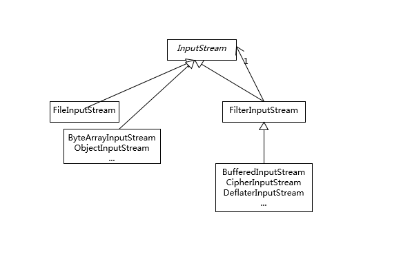
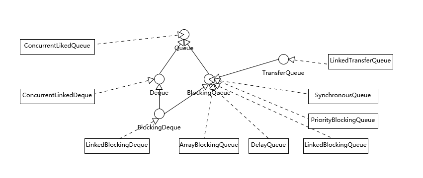
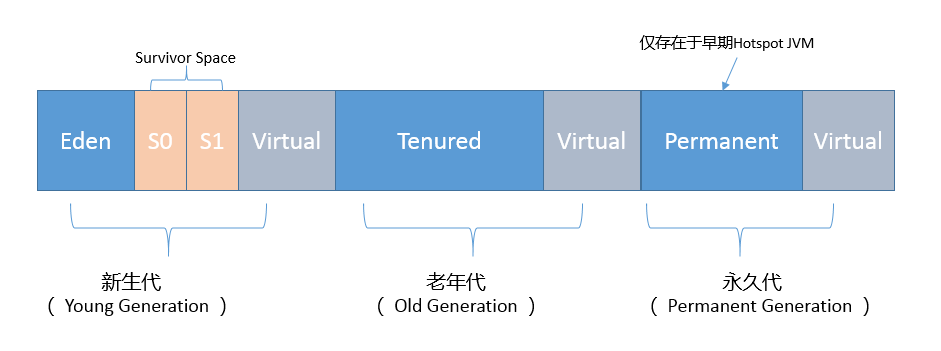
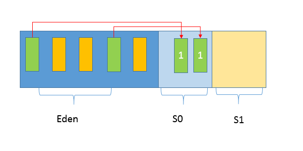

## 一篇文章了解 Java 核心技术

### Java 异常处理机制

#### Throwable 类图


#### 简述
Exception 和 Error 都继承了 Throwable 类，在 Java 中只有 Throwable 的实例才可以被抛出或捕获，它是异常处理机制的基本组成类型。

Exception 和 Error 体现了 Java 平台设计者对不同异常情况的分类。
- Exception 是程序正常运行中，可以预料的意外情况，可能并且应该被捕获，进行相应处理。Exception 又分为可检查异常和不检查异常。可检查异常在源代码里必须显示地进行捕获处理，这是编译期检查的一部分。不检查异常就是所谓的运行时异常，如 ：NullPointerException、ArrayIndexOutOfBoundsException 等，通常是可以编码避免的逻辑错误，具体根据需要来判断是否需要捕获处理，编译期不检查运行时异常。
- Error 指在正常情况下，不大可能出现的情况，绝大部分的 Error 都会导致程序处于非正常的、不可恢复状态。所以不便于也不需要捕获。如：OutOfMemoryError。

#### 异常处理的两个基本原则
1. 尽量不要捕获类似 Exception 这样的通用异常，而是应该捕获特定异常。
2. 不要生吞异常。

如以下代码则违反了这两个基本原则：

```
try {
  // 业务代码
  // …
  Thread.sleep(1000L);
} catch (Exception e) {
  // Ignore it
}

```

```
try {
   // 业务代码
   // …
} catch (IOException e) {
    e.printStackTrace();
}

```


---
### Java引用
Java引用分为：强引用、软引用、弱引用、幻想引用。不同的引用类型，主要体现的是对象的可达性状态和对垃圾收集的影响。
- 强引用：就是我们通常使用的普通引用，可以通过强引用访问对象。GC不会收集有强引用指向的对象。 
- 软引用：比强引用弱化一些的引用，它可以豁免一些垃圾收集，GC可以确保在抛出OOM之前清理掉软引用指向的对象。可以用于实现内存敏感的缓存。 
- 弱引用：主要是提供一种在弱引用状态下访问对象的途径。可以用来构建一种没有特定约束的关系，如维护一种非强制性的映射关系。 
- 幻象引用：不能通过它访问对象。仅仅是提供了一种对象被finalize以后，做某些事情的机制，比如：post-mortem清理机制、cleaner机制等。	


---
### 谈谈final、finally、 finalize有什么不同？
final 可以用来修饰类、方法、变量，分别有不同的意义，final 修饰的类不可以继承扩展，final 修饰的方法不可以重写（override），final 修饰的变量不可以修改。

finally 则是 Java 保证重点代码一定要被执行的一种机制。我们可以使用 try-finally 或者 try-catch-finally 来进行类似关闭 JDBC 连接、保证 unlock 锁等动作。

finalize 是基础类 java.lang.Object 的一个方法，它的设计目的是保证对象在被垃圾收集前完成特定资源的回收。finalize 机制现在已经不推荐使用，并且在 JDK 9 开始被标记为 deprecated。


---
### String、StringBuffer、StringBuilder有什么区别？
String 是 Java 语言非常基础和重要的类，提供了构造和管理字符串的各种基本逻辑。它是典型的 Immutable 类，被声明成为 final class，所有属性也都是 final 的。也由于它的不可变性，类似拼接、裁剪字符串等动作，都会产生新的 String 对象。由于字符串操作的普遍性，所以相关操作的效率往往对应用性能有明显影响。

StringBuffer 是为解决上面提到拼接产生太多中间对象的问题而提供的一个类，我们可以用 append 或者 add 方法，把字符串添加到已有序列的末尾或者指定位置。StringBuffer 本质是一个线程安全的可修改字符序列，它保证了线程安全，也随之带来了额外的性能开销，所以除非有线程安全的需要，不然还是推荐使用它的后继者，也就是 StringBuilder。

StringBuilder 是 Java 1.5 中新增的，在能力上和 StringBuffer 没有本质区别，但是它去掉了线程安全的部分，有效减小了开销，是绝大部分情况下进行字符串拼接的首选。


---
### 动态代理是基于什么原理？
反射机制是 Java 语言提供的一种基础功能，赋予程序在运行时**自省**（introspect，官方用语）的能力。通过反射我们可以直接操作类或者对象，比如获取某个对象的类定义，获取类声明的属性和方法，调用方法或者构造对象，甚至可以运行时修改类定义。

动态代理是一种方便运行时动态构建代理、动态处理代理方法调用的机制，很多场景都是利用类似机制做到的，比如用来包装 RPC 调用、面向切面的编程（AOP）。

实现动态代理的方式很多，比如：
1. JDK 自身提供的动态代理主要利用了反射机制。
2. 利用更高性能的字节码操作机制，类似 ASM、cglib（基于 ASM）、Javassist 等。


---
### int和Integer有什么区别？
int 是我们常说的整形数字，是 Java 的 8 个原始数据类型（boolean【1字节】、byte【1字节】 、short【2字节】、char【2字节】、int【4字节】、float【4字节】、long【8字节】、double【8字节】）之一。
所谓的一切皆是对象并不包括原始数据类型。

Integer 是 int 对应的包装类，它有一个 int 类型的字段存储数据，并且提供了基本操作，比如数学运算、int 和字符串之间转换等。在 Java 5 中，引入了自动装箱和自动拆箱功能（boxing/unboxing），Java 可以根据上下文，自动进行转换，极大地简化了相关编程。

关于 Integer 的值缓存，这涉及 Java 5 中另一个改进。构建 Integer 对象的传统方式是直接调用构造器，直接 new 一个对象。但是根据实践，我们发现大部分数据操作都是集中在有限的、较小的数值范围，因而，在 Java 5 中新增了静态工厂方法 valueOf，在调用它的时候会利用一个缓存机制，带来了明显的性能改进。按照 Javadoc，**这个值默认缓存是 -128 到 127 之间。**


---
### 对比Vector、ArrayList、LinkedList有何区别？
#### Collection 整体结构


#### 简述
这三者都是实现集合框架中的 List，也就是所谓的有序集合，因此具体功能也比较近似，比如都提供按照位置进行定位、添加或者删除的操作，都提供迭代器以遍历其内容等。但因为具体的设计区别，在行为、性能、线程安全等方面，表现又有很大不同。

Vector 是 Java 早期提供的**线程安全的动态数组**，如果不需要线程安全，并不建议选择，毕竟同步是有额外开销的。Vector 内部是使用对象数组来保存数据，可以根据需要自动的增加容量，当数组已满时，会创建新的数组，并拷贝原有数组数据。

ArrayList 是应用更加广泛的**动态数组**实现，它本身不是线程安全的，所以性能要好很多。与 Vector 近似，ArrayList 也是可以根据需要调整容量，不过两者的调整逻辑有所区别，Vector 在扩容时会提高 1 倍，而 ArrayList 则是增加 50%。

LinkedList 顾名思义是 Java 提供的双向链表，所以它不需要像上面两种那样调整容量，它也不是线程安全的。


---
### 对比Hashtable、HashMap、TreeMap有什么不同？
#### Map 整体结构


#### 简述
Hashtable、HashMap、TreeMap 都是最常见的一些 Map 实现，是以**键值对**的形式存储和操作数据的容器类型。

Hashtable 是早期 Java 类库提供的一个哈希表实现，本身是同步的，不支持 null 键和值，由于同步导致的性能开销，所以已经很少被推荐使用。

HashMap 是应用更加广泛的哈希表实现，行为上大致上与 HashTable 一致，主要区别在于 HashMap 不是同步的，支持 null 键和值等。通常情况下，HashMap 进行 put 或者 get 操作，可以达到常数时间的性能，所以**它是绝大部分利用键值对存取场景的首选**，比如，实现一个用户 ID 和用户信息对应的运行时存储结构。

TreeMap 则是基于红黑树的一种提供顺序访问的 Map，和 HashMap 不同，它的 get、put、remove 之类操作都是 O（log(n)）的时间复杂度，具体顺序可以由指定的 Comparator 来决定，或者根据键的自然顺序来判断。


---
### 如何保证集合是线程安全的? ConcurrentHashMap如何实现高效地线程安全？
Java 提供了不同层面的线程安全支持。在传统集合框架内部，除了 Hashtable 等同步容器，还提供了所谓的同步包装器（Synchronized Wrapper），我们可以调用 Collections 工具类提供的包装方法，来获取一个同步的包装容器（如 Collections.synchronizedMap），但是它们都是利用非常粗粒度的同步方式，在高并发情况下，性能比较低下。

另外，更加普遍的选择是利用并发包提供的线程安全容器类，它提供了：
- 各种并发容器，比如 ConcurrentHashMap、CopyOnWriteArrayList。
- 各种线程安全队列（Queue/Deque），如 ArrayBlockingQueue、SynchronousQueue。
- 各种有序容器的线程安全版本等。

具体保证线程安全的方式，包括有从简单的 synchronize 方式，到基于更加精细化的，比如基于分离锁实现的 ConcurrentHashMap 等并发实现等。具体选择要看开发的场景需求，总体来说，并发包内提供的容器通用场景，远优于早期的简单同步实现。

ConcurrentHashMap如何实现高效的线程安全可以参考下面这个早期 ConcurrentHashMap 内部结构的示意图，其核心是利用分段设计，在进行并发操作的时候，只需要锁定相应段，这样就有效避免了类似 Hashtable 整体同步的问题，大大提高了性能。


---
### Java提供了哪些IO方式？ NIO如何实现多路复用？
#### IO 方式简述
Java IO 方式有很多种，基于不同的 IO 抽象模型和交互方式，可以进行简单区分。

首先，传统的 java.io 包，它基于流模型实现，提供了我们最熟知的一些 IO 功能，比如 File 抽象、输入输出流等。交互方式是同步、阻塞的方式，也就是说，在读取输入流或者写入输出流时，在读、写动作完成之前，线程会一直阻塞在那里，它们之间的调用是可靠的线性顺序。

java.io 包的好处是代码比较简单、直观，缺点则是 IO 效率和扩展性存在局限性，容易成为应用性能的瓶颈。

很多时候，人们也把 java.net 下面提供的部分网络 API，比如 Socket、ServerSocket、HttpURLConnection 也归类到同步阻塞 IO 类库，因为网络通信同样是 IO 行为。

第二，在 Java  1.4 中引入了 NIO 框架（java.nio 包），提供了 Channel、Selector、Buffer 等新的抽象，可以构建多路复用的、同步非阻塞 IO 程序，同时提供了更接近操作系统底层的高性能数据操作方式。

第三，在 Java 7 中，NIO 有了进一步的改进，也就是 NIO 2，引入了异步非阻塞 IO 方式，也有很多人叫它 AIO（Asynchronous IO）。异步 IO 操作基于事件和回调机制，可以简单理解为，应用操作直接返回，而不会阻塞在那里，当后台处理完成，操作系统会通知相应线程进行后续工作。

#### BIO（即传统的 java.io 包）主要知识点
- IO 不仅仅是对文件的操作，网络编程中，比如 Socket 通信，都是典型的 IO 操作目标。
- 输入流、输出流（InputStream/OutputStream）是用于读取或写入字节的，例如操作图片文件。
- 而 Reader/Writer 则是用于操作字符，增加了字符编解码等功能，适用于类似从文件中读取或者写入文本信息。本质上计算机操作的都是字节，不管是网络通信还是文件读取，Reader/Writer 相当于构建了应用逻辑和原始数据之间的桥梁。
- BufferedOutputStream 等带缓冲区的实现，可以避免频繁的磁盘读写，进而提高 IO 处理效率。这种设计利用了缓冲区，将批量数据进行一次操作，但在使用中千万别忘了 flush。
- 参考下面这张类图，很多 IO 工具类都实现了 Closeable 接口，因为需要进行资源的释放。比如，打开 FileInputStream，它就会获取相应的文件描述符（FileDescriptor），需要利用 try-with-resources、 try-finally 等机制保证 FileInputStream 被明确关闭，进而相应文件描述符也会失效，否则将导致资源无法被释放。利用 Cleaner 或 finalize 机制作为资源释放的最后把关，也是必要的。

日常开发常用的类型和结构关系：


#### NIO 主要知识点
##### NIO 主要组成部分
- Buffer，高效的数据容器，除了布尔类型，所有原始数据类型都有相应的 Buffer 实现。
- Channel，类似在 Linux 之类操作系统上看到的文件描述符，是 NIO 中被用来支持批量式 IO 操作的一种抽象。  File 或者 Socket，通常被认为是比较高层次的抽象，而 Channel 则是更加操作系统底层的一种抽象，这也使得 NIO 得以充分利用现代操作系统底层机制，获得特定场景的性能优化，例如，DMA（Direct Memory Access）等。不同层次的抽象是相互关联的，我们可以通过 Socket 获取 Channel，反之亦然。
- Selector，是 NIO 实现多路复用的基础，它提供了一种高效的机制，可以检测到注册在 Selector 上的多个 Channel 中，是否有 Channel 处于就绪状态，进而实现了单线程对多 Channel 的高效管理。

Selector 同样是基于底层操作系统机制，不同模式、不同版本都存在区别，例如，在最新的代码库里，相关实现如下：
Linux 上依赖于 epoll（http://hg.openjdk.java.net/jdk/jdk/file/d8327f838b88/src/java.base/linux/classes/sun/nio/ch/EPollSelectorImpl.java）。
Windows 上 NIO2（AIO）模式则是依赖于 iocp（http://hg.openjdk.java.net/jdk/jdk/file/d8327f838b88/src/java.base/windows/classes/sun/nio/ch/Iocp.java）。

- Chartset，提供 Unicode 字符串定义，NIO 也提供了相应的编解码器等，例如，通过下面的方式进行字符串到 ByteBuffer 的转换：

```
Charset.defaultCharset().encode("Hello world!"));
```


##### NIO 多路复用
**实现一个简单的服务器应用（BIO方式）：**

```
serverSocket = new ServerSocket(0);
executor = Executors.newFixedThreadPool(8);
 while (true) {
    Socket socket = serverSocket.accept();
    RequestHandler requestHandler = new RequestHandler(socket);
    executor.execute(requestHandler);
}

```

通过一个固定大小的线程池，来负责管理工作线程，避免频繁创建、销毁线程的开销，这是我们构建并发服务的典型方式。这种工作方式，可以参考下图来理解。


如果连接数并不是非常多，只有最多几百个连接的普通应用，这种模式往往可以工作的很好。但是，如果连接数量急剧上升，这种实现方式就无法很好地工作了，因为线程上下文切换开销会在高并发时变得很明显，这是同步阻塞方式的低扩展性劣势。


**实现一个简单的服务器应用（NIO方式，即多路复用）：**

```
public class NIOServer extends Thread {
    public void run() {
        try (Selector selector = Selector.open();
            ServerSocketChannel serverSocket = ServerSocketChannel.open();) {// 创建 Selector 和 Channel
            serverSocket.bind(new InetSocketAddress(InetAddress.getLocalHost(), 8888));
            serverSocket.configureBlocking(false);
            // 注册到 Selector，并说明关注点
            serverSocket.register(selector, SelectionKey.OP_ACCEPT);
            while (true) {
                selector.select();// 阻塞等待就绪的 Channel，这是关键点之一
                Set<SelectionKey> selectedKeys = selector.selectedKeys();
                Iterator<SelectionKey> iter = selectedKeys.iterator();
                while (iter.hasNext()) {
                    SelectionKey key = iter.next();
                   // 生产系统中一般会额外进行就绪状态检查
                    sayHelloWorld((ServerSocketChannel) key.channel());
                    iter.remove();
                }
            }
        } catch (IOException e) {
            e.printStackTrace();
        }
    }
    private void sayHelloWorld(ServerSocketChannel server) throws IOException {
        try (SocketChannel client = server.accept();) {          
        	client.write(Charset.defaultCharset().encode("Hello world!"));
        }
    }
   // 省略了与前面类似的 main
}

```


这个非常精简的样例掀开了 NIO 多路复用的面纱，我们可以分析下主要步骤和元素：
- 首先，通过 Selector.open() 创建一个 Selector，作为类似调度员的角色。
- 然后，创建一个 ServerSocketChannel，并且向 Selector 注册，通过指定 SelectionKey.OP_ACCEPT，告诉调度员，它关注的是新的连接请求。**注意**，为什么我们要明确配置非阻塞模式呢？这是因为阻塞模式下，注册操作是不允许的，会抛出 IllegalBlockingModeException 异常。
- Selector 阻塞在 select 操作，当有 Channel 发生接入请求，就会被唤醒。
- 在 sayHelloWorld 方法中，通过 SocketChannel 和 Buffer 进行数据操作，在本例中是发送了一段字符串。

可以看到，在前面两个样例中，IO 都是同步阻塞模式，所以需要多线程以实现多任务处理。而 NIO 则是利用了单线程轮询事件的机制，通过高效地定位就绪的 Channel，来决定做什么，仅仅 select 阶段是阻塞的，可以有效避免大量客户端连接时，频繁线程切换带来的问题，应用的扩展能力有了非常大的提高。下面这张图对这种实现思路进行了形象地说明。


**实现一个简单的服务器应用（AIO方式）：** 

```
AsynchronousServerSocketChannel serverSock = AsynchronousServerSocketChannel.open().bind(sockAddr);
serverSock.accept(serverSock, new CompletionHandler<>() { // 为异步操作指定 CompletionHandler 回调函数
    @Override
    public void completed(AsynchronousSocketChannel sockChannel, AsynchronousServerSocketChannel serverSock) {
        serverSock.accept(serverSock, this);
        // 另外一个 write（sock，CompletionHandler{}）
        sayHelloWorld(sockChannel, Charset.defaultCharset().encode("Hello World!"));
    }
  // 省略其他路径处理方法...
});

```

与NIO对比如下：
- 基本抽象很相似，AsynchronousServerSocketChannel 对应于上面例子中的 ServerSocketChannel；AsynchronousSocketChannel 则对应 SocketChannel。
- 业务逻辑的关键在于，通过指定 CompletionHandler 回调接口，在 accept/read/write 等关键节点，通过事件机制调用，这是非常不同的一种编程思路。


---
### Java有几种文件拷贝方式？哪一种最高效？
Java 有多种比较典型的文件拷贝实现方式，比如：
1. 利用 java.io 类库，直接为源文件构建一个 FileInputStream 读取，然后再为目标文件构建一个 FileOutputStream，完成写入工作。

```
public static void copyFileByStream(File source, File dest) throws IOException {
    try (InputStream is = new FileInputStream(source);
        OutputStream os = new FileOutputStream(dest);){
        byte[] buffer = new byte[1024];
        int length;
        while ((length = is.read(buffer)) > 0) {
            os.write(buffer, 0, length);
        }
    }
 }

```


2. 利用 java.nio 类库提供的 transferTo 或 transferFrom 方法实现。

```
public static void copyFileByChannel(File source, File dest) throws IOException {
    try (FileChannel sourceChannel = new FileInputStream(source).getChannel();
        FileChannel targetChannel = new FileOutputStream(dest).getChannel();){
        for (long count = sourceChannel.size() ;count>0 ;) {
            long transferred = sourceChannel.transferTo(sourceChannel.position(), count, targetChannel);            
            sourceChannel.position(sourceChannel.position() + transferred);
            count -= transferred;
        }
    }
 }

```


3. Java 标准类库本身已经提供了几种 Files.copy 的实现。

对于 Copy 的效率，这个其实与操作系统和配置等情况相关，总体上来说，NIO transferTo/From 的方式可能更快，因为它更能利用现代操作系统底层机制，避免不必要拷贝和上下文切换。

**拷贝实现机制分析:**

先来理解一下，前面实现的不同拷贝方法，本质上有什么明显的区别。

首先，需要理解用户态空间（User Space）和内核态空间（Kernel Space），这是操作系统层面的基本概念，操作系统内核、硬件驱动等运行在内核态空间，具有相对高的特权；而用户态空间，则是给普通应用和服务使用。可以参考：https://en.wikipedia.org/wiki/User_space 。

当我们使用输入输出流进行读写时，实际上是进行了多次上下文切换，比如应用读取数据时，先在内核态将数据从磁盘读取到内核缓存，再切换到用户态将数据从内核缓存读取到用户缓存。

写入操作也是类似，仅仅是步骤相反，可以参考下面这张图。


所以，这种方式会带来一定的额外开销，可能会降低 IO 效率。

而基于 NIO transferTo 的实现方式，在 Linux 和 Unix 上，则会使用到零拷贝技术，数据传输并不需要用户态参与，省去了上下文切换的开销和不必要的内存拷贝，进而可能提高应用拷贝性能。注意，transferTo 不仅仅是可以用在文件拷贝中，与其类似的，例如读取磁盘文件，然后进行 Socket 发送，同样可以享受这种机制带来的性能和扩展性提高。

transferTo 的传输过程是：


**NIO Buffer**

Buffer 是 NIO 操作数据的基本工具，Java 为每种原始数据类型都提供了相应的 Buffer 实现（布尔除外），所以掌握和使用 Buffer 是十分必要的，尤其是涉及 Direct  Buffer 等使用，因为其在垃圾收集等方面的特殊性，更要重点掌握。


Buffer 有几个基本属性：
- capcity，它反映这个 Buffer 到底有多大，也就是数组的长度。
- position，要操作的数据起始位置。
- limit，相当于操作的限额。在读取或者写入时，limit 的意义很明显是不一样的。比如，读取操作时，很可能将 limit 设置到所容纳数据的上限；而在写入时，则会设置容量或容量以下的可写限度。
- mark，记录上一次 postion 的位置，默认是 0，算是一个便利性的考虑，往往不是必须的。

前面三个是我们日常使用最频繁的，简单梳理下 Buffer 的基本操作：
- 我们创建了一个 ByteBuffer，准备放入数据，capcity 当然就是缓冲区大小，而 position 就是 0，limit 默认就是 capcity 的大小。
- 当我们写入几个字节的数据时，position 就会跟着水涨船高，但是它不可能超过 limit 的大小。
- 如果我们想把前面写入的数据读出来，需要调用 flip 方法，将 position 设置为 0，limit 设置为以前的 position 那里。
- 如果还想从头再读一遍，可以调用 rewind，让 limit 不变，position 再次设置为 0。


---
### 谈谈接口和抽象类有什么区别？
接口和抽象类是 Java 面向对象设计的两个基础机制。

接口用 interface 关键字修饰，是对行为的抽象，它是抽象方法的集合，利用接口可以达到 API 定义和实现分离的目的。
接口不能实例化。
接口类中只能定义常量成员、抽象方法和静态方法。任何 field 都是隐含着 public static final 的意义。
Java 标准类库中，定义了非常多的接口，比如 java.util.List。

抽象类用 abstract 关键字修饰，抽象类大多用于抽取相关 Java 类的共用方法实现或者共同成员变量，然后通过继承的方式达到代码复用的目的。
抽象类不能实例化。
抽象类中可以定义零个、一个或者多个抽象方法，也可以没有抽象方法。
Java 标准库中，比如 collection 框架，很多通用部分就被抽取成为抽象类，例如 java.util.AbstractList。


**面向对象的基本要素：封装、继承、多态。**

- 封装：*目的是隐藏事务内部的实现细节，以便提高安全性和简化编程。*封装提供了合理的边界，避免外部调用者接触到内部的细节。我们在日常开发中，因为无意间暴露了细节导致的难缠 bug 太多了，比如在多线程环境暴露内部状态，导致的并发修改问题。从另外一个角度看，封装这种隐藏，也提供了简化的界面，避免太多无意义的细节浪费调用者的精力。
- 继承：*是代码复用的基础机制*，类似于我们对于马、白马、黑马的归纳总结。但要注意，继承可以看作*是非常紧耦合的一种关系*，父类代码修改，子类行为也会变动。在实践中，*过度滥用继承，可能会起到反效果*。
- 多态：你可能立即会想到重写（override）和重载（overload）、向上转型。简单说，重写是父子类中相同名字和参数的方法，不同的实现；重载则是相同名字的方法，但是不同的参数，本质上这些方法签名是不一样的。


**面向对象基本设计原则：S.O.L.I.D 原则。**

- 单一职责（Single Responsibility），类或者对象最好是只有单一职责，在程序设计中如果发现某个类承担着多种义务，可以考虑进行拆分。
- 开关原则（Open-Close, Open for extension, close for modification），设计要对扩展开放，对修改关闭。换句话说，程序设计应保证平滑的扩展性，尽量避免因为新增同类功能而修改已有实现，这样可以少产出些回归（regression）问题。
- 里氏替换（Liskov Substitution），这是面向对象的基本要素之一，进行继承关系抽象时，凡是可以用父类或者基类的地方，都可以用子类替换。
- 接口分离（Interface Segregation），我们在进行类和接口设计时，如果在一个接口里定义了太多方法，其子类很可能面临两难，就是只有部分方法对它是有意义的，这就破坏了程序的内聚性。
- 依赖反转（Dependency Inversion），实体应该依赖于抽象而不是实现。也就是说高层次模块，不应该依赖于低层次模块，而是应该基于抽象。实践这一原则是保证产品代码之间适当耦合度的法宝。


---
### 谈谈常用的设计模式？
大致按照模式的应用目标分类，设计模式可以分为创建型模式、结构型模式和行为型模式。
- 创建型模式，是对对象创建过程的各种问题和解决方案的总结，包括各种工厂模式（Factory、Abstract Factory）、单例模式（Singleton）、构建器模式（Builder）、原型模式（ProtoType）。
- 结构型模式，是针对软件设计结构的总结，关注于类、对象继承、组合方式的实践经验。常见的结构型模式，包括桥接模式（Bridge）、适配器模式（Adapter）、装饰者模式（Decorator）、代理模式（Proxy）、组合模式（Composite）、外观模式（Facade）、享元模式（Flyweight）等。
- 行为型模式，是从类或对象之间交互、职责划分等角度总结的模式。比较常见的行为型模式有策略模式（Strategy）、解释器模式（Interpreter）、命令模式（Command）、观察者模式（Observer）、迭代器模式（Iterator）、模板方法模式（Template Method）、访问者模式（Visitor）。


**常用设计模式举例：**

IO 框架，我们知道 InputStream 是一个抽象类，标准类库中提供了 FileInputStream、ByteArrayInputStream 等各种不同的子类，分别从不同角度对 InputStream 进行了功能扩展，这是典型的装饰器模式应用案例。


创建型模式尤其是工厂模式，在我们的代码中随处可见，举个相对不同的 API 设计实践。比如，JDK 最新版本中 HTTP/2 Client API，下面这个创建 HttpRequest 的过程，就是典型的构建器模式（Builder），通常会被实现成fluent 风格的 API，也有人叫它方法链。

```
HttpRequest request = HttpRequest.newBuilder(new URI(uri))
                     .header(headerAlice, valueAlice)
                     .headers(headerBob, value1Bob,
                      headerCarl, valueCarl,
                      headerBob, value2Bob)
                     .GET()
                     .build();

```


使用构建器模式，可以比较优雅地解决构建复杂对象的麻烦，这里的“复杂”是指类似需要输入的参数组合较多，如果用构造函数，我们往往需要为每一种可能的输入参数组合实现相应的构造函数，一系列复杂的构造函数会让代码阅读性和可维护性变得很差。

单例模式：

```
public class Singleton {
	private static volatile Singleton singleton = null;
	private Singleton() {
	}

	public static Singleton getSingleton() {
    	if (singleton == null) { // 尽量避免重复进入同步块
        	synchronized (Singleton.class) { // 同步.class，意味着对同步类方法调用
            	if (singleton == null) {
                	singleton = new Singleton();
            	}
        	}
    	}
    	return singleton;
	}
}

```


Spring 在 API 设计中使用的设计模式：
- BeanFactory 和 ApplicationContext 应用了工厂模式。
- 在 Bean 的创建中，Spring 也为不同 scope 定义的对象，提供了单例和原型等模式实现。
- AOP 领域则是使用了代理模式、装饰器模式、适配器模式等。
- 各种事件监听器，是观察者模式的典型应用。
- 类似 JdbcTemplate 等则是应用了模板模式。


---
<font face="黑体" color=red >*前面属于基础部分，后面属于进阶部分。*</font>

---
### synchronized 和 ReentrantLock 有什么区别呢？

synchronized 是 Java 内建的同步机制，所以也有人称其为 Intrinsic Locking，它提供了互斥的语义和可见性，当一个线程已经获取当前锁时，其他试图获取的线程只能等待或者阻塞在那里。

在 Java 5 以前，synchronized 是仅有的同步手段，在代码中， synchronized 可以用来修饰方法，也可以使用在特定的代码块儿上，本质上 synchronized 方法等同于把方法全部语句用 synchronized 块包起来。

ReentrantLock，通常翻译为再入锁，是 Java 5 提供的锁实现，它的语义和 synchronized 基本相同。再入锁通过代码直接调用 lock() 方法获取，代码书写也更加灵活。与此同时，ReentrantLock 提供了很多实用的方法，能够实现很多 synchronized 无法做到的细节控制，比如可以控制 fairness，也就是公平性，或者利用定义条件等。但是，编码中也需要注意，必须要明确调用 unlock() 方法释放，不然就会一直持有该锁。

synchronized 和 ReentrantLock 的性能不能一概而论，早期版本 synchronized 在很多场景下性能相差较大，在后续版本进行了较多改进，在低竞争场景中表现可能优于 ReentrantLock。


**线程安全需要保证几个基本特性：**

- 原子性：简单说就是相关操作不会中途被其他线程干扰，一般通过同步机制实现。
- 可见性：是一个线程修改了某个共享变量，其状态能够立即被其他线程知晓，通常被解释为将线程本地状态反映到主内存上，volatile 就是负责保证可见性的。
- 有序性：是保证线程内串行语义，避免指令重排等。

产生并发问题的根源：缓存导致的可见性问题，线程切换导致的原子性问题，指令重排序导致的有序性问题。


**条件变量（java.util.concurrent.Condition）**

如果说 ReentrantLock 是 synchronized 的替代选择，Condition 则是将 wait、notify、notifyAll 等操作转化为相应的对象，将复杂而晦涩的同步操作转变为直观可控的对象行为。

条件变量最为典型的应用场景就是标准类库中的 ArrayBlockingQueue 等。

我们参考下面的源码，首先，通过再入锁获取条件变量：

```
/** Condition for waiting takes */
private final Condition notEmpty;

/** Condition for waiting puts */
private final Condition notFull;
 
public ArrayBlockingQueue(int capacity, boolean fair) {
	if (capacity <= 0)
    	throw new IllegalArgumentException();
	this.items = new Object[capacity];
	lock = new ReentrantLock(fair);
	notEmpty = lock.newCondition();
	notFull =  lock.newCondition();
}

```


两个条件变量是从**同一再入锁**创建出来，然后使用在特定操作中，如下面的 take 方法，判断和等待条件满足：

```
public E take() throws InterruptedException {
	final ReentrantLock lock = this.lock;
	lock.lockInterruptibly();
	try {
    	while (count == 0)
            notEmpty.await();
    	return dequeue();
	} finally {
    	lock.unlock();
	}
}

```

当队列为空时，试图 take 的线程的正确行为应该是等待入队发生，而不是直接返回，这是 BlockingQueue 的语义，使用条件 notEmpty 就可以优雅地实现这一逻辑。


那么，怎么保证入队触发后续 take 操作呢？请看 enqueue 实现：

```
private void enqueue(E e) {
	// assert lock.isHeldByCurrentThread();
	// assert lock.getHoldCount() == 1;
	// assert items[putIndex] == null;
	final Object[] items = this.items;
	items[putIndex] = e;
	if (++putIndex == items.length) putIndex = 0;
	count++;
	notEmpty.signal(); // 通知等待的线程，非空条件已经满足
}

```

通过 signal/await 的组合，完成了条件判断和通知等待线程，非常顺畅就完成了状态流转。注意，signal 和 await 成对调用非常重要，不然假设只有 await 动作，线程会一直等待直到被打断（interrupt）。


---
### synchronized 底层如何实现？什么是锁的升级、降级？

synchronized 代码块是由一对儿 monitorenter/monitorexit 指令实现的，Monitor 对象是同步的基本实现。

在 Java 6 之前，Monitor 的实现完全是依靠操作系统内部的互斥锁，因为需要进行用户态到内核态的切换，所以同步操作是一个无差别的重量级操作。

现代的（Oracle）JDK 中，JVM 对此进行了大刀阔斧地改进，提供了三种不同的 Monitor 实现，也就是常说的三种不同的锁：偏斜锁（Biased Locking）、轻量级锁和重量级锁，大大改进了其性能。

所谓锁的升级、降级，就是 JVM 优化 synchronized 运行的机制，当 JVM 检测到不同的竞争状况时，会自动切换到适合的锁实现，这种切换就是锁的升级、降级。

当没有竞争出现时，默认会使用偏斜锁。JVM 会利用 CAS 操作（[compare and swap](https://en.wikipedia.org/wiki/Compare-and-swap)），在对象头上的 Mark Word 部分设置线程 ID，以表示这个对象偏向于当前线程，所以并不涉及真正的互斥锁。这样做的假设是基于在很多应用场景中，大部分对象生命周期中最多会被一个线程锁定，使用偏斜锁可以降低无竞争开销。

如果有另外的线程试图锁定某个已经被偏斜过的对象，JVM 就需要撤销（revoke）偏斜锁，并切换到轻量级锁实现。轻量级锁依赖 CAS 操作 Mark Word 来试图获取锁，如果重试成功，就使用普通的轻量级锁；否则，进一步升级为重量级锁。

当 JVM 进入安全点（[SafePoint](http://blog.ragozin.info/2012/10/safepoints-in-hotspot-jvm.html)）的时候，会检查是否有闲置的 Monitor，然后试图进行降级。


**Java 核心类库中还有其他一些特别的锁类型，具体请参考下面的图。**


你可能注意到了，这些锁竟然不都是实现了 Lock 接口，ReadWriteLock 是一个单独的接口，它通常是代表了一对儿锁，分别对应只读和写操作，标准类库中提供了再入版本的读写锁实现（ReentrantReadWriteLock），对应的语义和 ReentrantLock 比较相似。

StampedLock 竟然也是个单独的类型，从类图结构可以看出它是不支持再入性的语义的，也就是它不是以持有锁的线程为单位。


为什么我们需要读写锁（ReadWriteLock）等其他锁呢？

这是因为，虽然 ReentrantLock 和 synchronized 简单实用，但是行为上有一定局限性，通俗点说就是“太霸道”，要么不占，要么独占。实际应用场景中，有的时候不需要大量竞争的写操作，而是以并发读取为主，如何进一步优化并发操作的粒度呢？

Java 并发包提供的读写锁等扩展了锁的能力，它所基于的原理是多个读操作是不需要互斥的，因为读操作并不会更改数据，所以不存在互相干扰。而写操作则会导致并发一致性的问题，所以写线程之间、读写线程之间，需要精心设计的互斥逻辑。


下面是一个基于读写锁实现的数据结构，当数据量较大，并发读多、并发写少的时候，能够比纯同步版本更有优势。

```
public class RWSample {
	private final Map<String, String> m = new TreeMap<>();
	private final ReentrantReadWriteLock rwl = new ReentrantReadWriteLock();
	private final Lock r = rwl.readLock();
	private final Lock w = rwl.writeLock();

	public String get(String key) {
    	r.lock();
    	System.out.println(" 读锁锁定！");
    	try {
        	return m.get(key);
    	} finally {
        	r.unlock();
    	}
	}

	public String put(String key, String entry) {
    	w.lock();
		System.out.println(" 写锁锁定！");
	    	try {
	        	return m.put(key, entry);
	    	} finally {
	        	w.unlock();
	    	}
		}
	// …
	}

```

在运行过程中，如果读锁试图锁定时，写锁是被某个线程持有，读锁将无法获得，而只好等待对方操作结束，这样就可以自动保证不会读取到有争议的数据。


读写锁看起来比 synchronized 的粒度细一些，但在实际应用中，其表现也并不尽如人意，主要还是因为相对比较大的开销。

所以，JDK 在后期引入了 StampedLock，在提供类似读写锁的同时，还支持优化读模式。优化读基于假设，大多数情况下读操作并不会和写操作冲突，其逻辑是先试着读，然后通过 validate 方法确认是否进入了写模式，如果没有进入，就成功避免了开销；如果进入，则尝试获取读锁。请参考下面的样例代码。

```
public class StampedSample {
	private final StampedLock sl = new StampedLock();

	void mutate() {
    	long stamp = sl.writeLock();
    	try {
        	write();
    	} finally {
        	sl.unlockWrite(stamp);
    	}
	}

	Data access() {
    	long stamp = sl.tryOptimisticRead();
    	Data data = read();
    	if (!sl.validate(stamp)) {
        	stamp = sl.readLock();
        	try {
            	data = read();
        	} finally {
            	sl.unlockRead(stamp);
        	}
    	}
    	return data;
	}
	// …
}

```

注意，这里的 writeLock 和 unLockWrite 一定要保证成对调用。


**这些显式锁的实现机制:**

Java 并发包内的各种同步工具，不仅仅是各种 Lock，其他的如[Semaphore](https://docs.oracle.com/javase/10/docs/api/java/util/concurrent/Semaphore.html)、[CountDownLatch](https://docs.oracle.com/javase/10/docs/api/java/util/concurrent/CountDownLatch.html)，甚至是早期的[FutureTask](https://docs.oracle.com/javase/10/docs/api/java/util/concurrent/FutureTask.html)等，都是基于一种[AQS](https://docs.oracle.com/javase/10/docs/api/java/util/concurrent/locks/AbstractQueuedSynchronizer.html)框架。


---
### 一个线程两次调用start()方法会出现什么情况？
Java 的线程是不允许启动两次的，第二次调用必然会抛出 IllegalThreadStateException，这是一种运行时异常，多次调用 start 被认为是编程错误。

线程生命周期的不同状态，在 Java 5 以后，线程状态被明确定义在其公共内部枚举类型 java.lang.Thread.State 中，分别是：

- 新建（NEW），表示线程被创建出来还没真正启动的状态，可以认为它是个 Java 内部状态。
- 就绪（RUNNABLE），表示该线程已经在 JVM 中执行，当然由于执行需要计算资源，它可能是正在运行，也可能还在等待系统分配给它 CPU 片段，在就绪队列里面排队。
- 在其他一些分析中，会额外区分一种状态 RUNNING，但是从 Java API 的角度，并不能表示出来。
- 阻塞（BLOCKED），这个状态和我们前面两讲介绍的同步非常相关，阻塞表示线程在等待 Monitor lock。比如，线程试图通过 synchronized 去获取某个锁，但是其他线程已经独占了，那么当前线程就会处于阻塞状态。
- 等待（WAITING），表示正在等待其他线程采取某些操作。一个常见的场景是类似生产者消费者模式，发现任务条件尚未满足，就让当前消费者线程等待（wait），另外的生产者线程去准备任务数据，然后通过类似 notify 等动作，通知消费线程可以继续工作了。Thread.join() 也会令线程进入等待状态。
- 计时等待（TIMED_WAIT），其进入条件和等待状态类似，但是调用的是存在超时条件的方法，比如 wait 或 join 等方法的指定超时版本。
- 终止（TERMINATED），不管是意外退出还是正常执行结束，线程已经完成使命，终止运行，也有人把这个状态叫作死亡。


线程状态流转如下图所示：


---
### 什么情况下Java程序会产生死锁？如何定位、修复？
死锁是指在多线程场景中，两个或多个线程之间，由于互相持有对方需要的锁，而永久处于阻塞的状态。死锁不仅仅是在线程之间会发生，存在资源独占的进程之间同样也可能出现死锁。死锁通常是由于循环依赖、嵌套的synchronize或lock等导致。

你可以利用下面的示例图理解基本的死锁问题：


定位死锁最常见的方式就是利用 jstack 等工具获取线程栈，然后定位互相之间的依赖关系，进而找到死锁。如果是比较明显的死锁，往往 jstack 等就能直接定位，类似 JConsole 甚至可以在图形界面进行有限的死锁检测。

如果程序运行时发生了死锁，绝大多数情况下都是无法在线解决的，只能重启、修正程序本身问题。所以，代码开发阶段互相审查，或者利用工具进行预防性排查，往往也是很重要的。


由于之前面试时，面试官要求写一个死锁程序代码，所以在此贴一个死锁样例代码：

```
public class DeadLockSample extends Thread {
	private String first;
	private String second;
	public DeadLockSample(String name, String first, String second) {
    	super(name);
    	this.first = first;
    	this.second = second;
	}

	public  void run() {
    	synchronized (first) {
        	System.out.println(this.getName() + " obtained: " + first);
        	try {
            	Thread.sleep(1000L);
            	synchronized (second) {
                	System.out.println(this.getName() + " obtained: " + second);
            	}
        	} catch (InterruptedException e) {
            	// Do nothing
        	}
    	}
	}
	public static void main(String[] args) throws InterruptedException {
    	String lockA = "lockA";
    	String lockB = "lockB";
    	DeadLockSample t1 = new DeadLockSample("Thread1", lockA, lockB);
    	DeadLockSample t2 = new DeadLockSample("Thread2", lockB, lockA);
    	t1.start();
    	t2.start();
    	t1.join();
    	t2.join();
	}
}

```


**jstack 死锁问题定位思路：**

- 首先，可以使用 jps 或者系统的 ps 命令、任务管理器等工具，确定进程 ID。
- 其次，调用 jstack 获取线程栈：`${JAVA_HOME}\bin\jstack your_pid`
- 然后，分析得到的输出，具体片段如下：

- 最后，结合代码分析线程栈信息。找到处于 BLOCKED 状态的线程，按照试图获取（waiting）的锁 ID 查找，很快就定位问题。 jstack 本身也会把类似的简单死锁抽取出来，直接打印出来。

在实际应用中，死锁情况未必有如此清晰的输出，但是总体上可以理解为：<br/>
*区分线程状态 -> 查看等待目标 -> 对比 Monitor 等持有状态*


基本上死锁的发生是因为：

- 互斥条件，类似 Java 中 Monitor 都是独占的，要么是我用，要么是你用。
- 互斥条件是长期持有的，在使用结束之前，自己不会释放，也不能被其他线程抢占。
- 循环依赖关系，两个或者多个个体之间出现了锁的链条环。


所以，我们可以据此分析可能的避免死锁的思路和方法：

1. 如果可能的话，尽量避免使用多个锁，并且只有需要时才持有锁。否则，即使是非常精通并发编程的工程师，也难免会掉进坑里，嵌套的 synchronized 或者 lock 非常容易出问题。
2. 如果必须使用多个锁，尽量设计好锁的获取顺序，这个说起来简单，做起来可不容易。
3. 使用带超时的方法，为程序带来更多可控性。
4. 业界也有一些其他方面的尝试，比如通过静态代码分析（如 FindBugs）去查找固定的模式，进而定位可能的死锁或者竞争情况。实践证明这种方法也有一定作用，请参考[相关文档](https://plugins.jetbrains.com/plugin/3847-findbugs-idea)。


除了典型应用中的死锁场景，其实还有一些更令人头疼的死锁，比如类加载过程发生的死锁，尤其是在框架大量使用自定义类加载时，因为往往不是在应用本身的代码库中，jstack 等工具也不见得能够显示全部锁信息，所以处理起来比较棘手。对此，Java 有[官方文档](https://docs.oracle.com/javase/7/docs/technotes/guides/lang/cl-mt.html)进行了详细解释，并针对特定情况提供了相应 JVM 参数和基本原则。


---
### Java并发包提供了哪些并发工具类？
我们通常所说的并发包也就是 java.util.concurrent 及其子包，集中了 Java 并发的各种基础工具类，具体主要包括几个方面：
- 提供了比 synchronized 更加高级的各种同步结构，包括 CountDownLatch、CyclicBarrier、Semaphore 等，可以实现更加丰富的多线程操作，比如利用 Semaphore 作为资源控制器，限制同时进行工作的线程数量。
- 各种线程安全的容器，比如最常见的 ConcurrentHashMap、有序的 ConcunrrentSkipListMap，或者通过类似快照机制，实现线程安全的动态数组 CopyOnWriteArrayList 等。
- 各种并发队列实现，如各种 BlockedQueue 实现，比较典型的 ArrayBlockingQueue、 SynchorousQueue 或针对特定场景的 PriorityBlockingQueue 等。
- 强大的 Executor 框架，可以创建各种不同类型的线程池，调度任务运行等，绝大部分情况下，不再需要自己从头实现线程池和任务调度器。


**CountDownLatch、CyclicBarrier、Semaphore**

- [CountDownLatch](https://docs.oracle.com/javase/9/docs/api/java/util/concurrent/CountDownLatch.html)，允许一个或多个线程等待某些操作完成。
- [CyclicBarrier](https://docs.oracle.com/javase/9/docs/api/java/util/concurrent/CyclicBarrier.htm)，一种辅助性的同步结构，允许多个线程等待到达某个屏障。
- [Semaphore](https://docs.oracle.com/javase/9/docs/api/java/util/concurrent/Semaphore.html)，Java 版本的信号量实现。


场景：在车站、机场等出租车时，当很多空出租车就位时，为防止过度拥挤，调度员指挥排队等待坐车的队伍一次进来 5 个人上车，等这 5 个人坐车出发，再放进去下一批。使用 CountDownLatch、CyclicBarrier、Semaphore 实现。


Semaphore 示例代码：

```
import java.util.concurrent.Semaphore;
public class UsualSemaphoreSample {
	public static void main(String[] args) throws InterruptedException {
    	System.out.println("Action...GO!");
    	Semaphore semaphore = new Semaphore(5);
    	for (int i = 0; i < 10; i++) {
        	Thread t = new Thread(new SemaphoreWorker(semaphore));
        	t.start();
    	}
	}
}
class SemaphoreWorker implements Runnable {
	private String name;
	private Semaphore semaphore;
	public SemaphoreWorker(Semaphore semaphore) {
    	this.semaphore = semaphore;
	}
	@Override
	public void run() {
    	try {
        	log("is waiting for a permit!");
       	semaphore.acquire();
        	log("acquired a permit!");
        	log("executed!");
    	} catch (InterruptedException e) {
        	e.printStackTrace();
    	} finally {
        	log("released a permit!");
        	semaphore.release();
    	}
	}
	private void log(String msg){
    	if (name == null) {
        	name = Thread.currentThread().getName();
    	}
    	System.out.println(name + " " + msg);
	}
}

```


这段代码是比较典型的 Semaphore 示例，其逻辑是，线程试图获得工作允许，得到许可则进行任务，然后释放许可，这时等待许可的其他线程，就可获得许可进入工作状态，直到全部处理结束。编译运行，我们就能看到 Semaphore 的允许机制对工作线程的限制。

总的来说，我们可以看出 Semaphore 就是个**计数器**，**其基本逻辑基于 acquire/release**，并没有太复杂的同步逻辑。

如果 Semaphore 的数值被初始化为 1，那么一个线程就可以通过 acquire 进入互斥状态，本质上和互斥锁是非常相似的。但是区别也非常明显，比如互斥锁是有持有者的，而对于 Semaphore 这种计数器结构，虽然有类似功能，但其实不存在真正意义的持有者，除非我们进行扩展包装。


**CountDownLatch VS CyclicBarrier**

- CountDownLatch 是不可以重置的，所以无法重用；而 CyclicBarrier 则没有这种限制，可以重用。
- CountDownLatch 的基本操作组合是 countDown/await。调用 await 的线程阻塞等待 countDown 足够的次数，不管你是在一个线程还是多个线程里 countDown，只要次数足够即可。所以，CountDownLatch 操作的是事件。
- CyclicBarrier 的基本操作组合，则就是 await，当所有的伙伴（parties）都调用了 await，才会继续进行任务，并自动进行重置。**注意**，正常情况下，CyclicBarrier 的重置都是自动发生的，如果我们调用 reset 方法，但还有线程在等待，就会导致等待线程被打扰，抛出 BrokenBarrierException 异常。CyclicBarrier 侧重点是线程，而不是调用事件，它的典型应用场景是用来等待并发线程结束。


CountDownLatch 示例代码：

```
import java.util.concurrent.CountDownLatch;
public class LatchSample {
	public static void main(String[] args) throws InterruptedException {
    	CountDownLatch latch = new CountDownLatch(6);
           for (int i = 0; i < 5; i++) {
                Thread t = new Thread(new FirstBatchWorker(latch));
                t.start();
    	}
    	for (int i = 0; i < 5; i++) {
        	    Thread t = new Thread(new SecondBatchWorker(latch));
        	    t.start();
    	}
        // 注意这里也是演示目的的逻辑，并不是推荐的协调方式
    	while ( latch.getCount() != 1 ){
        	    Thread.sleep(100L);
    	}
    	System.out.println("Wait for first batch finish");
    	latch.countDown();
	}
}
class FirstBatchWorker implements Runnable {
	private CountDownLatch latch;
	public FirstBatchWorker(CountDownLatch latch) {
    	this.latch = latch;
	}
	@Override
	public void run() {
        	System.out.println("First batch executed!");
        	latch.countDown();
	}
}
class SecondBatchWorker implements Runnable {
	private CountDownLatch latch;
	public SecondBatchWorker(CountDownLatch latch) {
    	this.latch = latch;
	}
	@Override
	public void run() {
    	try {
        	latch.await();
        	System.out.println("Second batch executed!");
    	} catch (InterruptedException e) {
        	e.printStackTrace();
    	}
	}
}

```

CountDownLatch 的调度方式相对简单，后一批次的线程进行 await，等待前一批 countDown 足够多次。这个例子也从侧面体现出了它的局限性，虽然它也能够支持 10 个人排队的情况，但是因为不能重用，如果要支持更多人排队，就不能依赖一个 CountDownLatch 进行了。其编译运行输出如下：


在实际应用中的条件依赖，往往没有这么别扭，CountDownLatch 用于线程间等待操作结束是非常简单普遍的用法。通过 countDown/await 组合进行通信是很高效的，通常不建议使用例子里那个循环等待方式。


如果用 CyclicBarrier 来表达这个场景呢？我们知道 CyclicBarrier 其实反映的是线程并行运行时的协调，在下面的示例里，从逻辑上，5 个工作线程其实更像是代表了 5 个可以就绪的空车，而不再是 5 个乘客，对比前面 CountDownLatch 的例子更有助于我们区别它们的抽象模型，请看下面的示例代码：

```
import java.util.concurrent.BrokenBarrierException;
import java.util.concurrent.CyclicBarrier;
public class CyclicBarrierSample {
	public static void main(String[] args) throws InterruptedException {
    	CyclicBarrier barrier = new CyclicBarrier(5, new Runnable() {
        	@Override
        	public void run() {
            	System.out.println("Action...GO again!");
        	}
    	});
    	for (int i = 0; i < 5; i++) {
        	Thread t = new Thread(new CyclicWorker(barrier));
        	t.start();
    	}
	}
	static class CyclicWorker implements Runnable {
    	private CyclicBarrier barrier;
    	public CyclicWorker(CyclicBarrier barrier) {
        	this.barrier = barrier;
    	}
    	@Override
    	public void run() {
        	try {
            	for (int i=0; i<3 ; i++){
                	System.out.println("Executed!");
                	barrier.await();
            	}
        	} catch (BrokenBarrierException e) {
            	e.printStackTrace();
        	} catch (InterruptedException e) {
            	e.printStackTrace();
        	}
 	   }
	}
}

```

为了让输出更能表达运行时序，我使用了 CyclicBarrier 特有的 barrierAction，当屏障被触发时，Java 会自动调度该动作。因为 CyclicBarrier 会**自动**进行重置，所以这个逻辑其实可以非常自然的支持更多排队人数。其编译输出如下：


Java 并发类库还提供了[Phaser](https://docs.oracle.com/javase/9/docs/api/java/util/concurrent/Phaser.html)，功能与 CountDownLatch 很接近，但是它允许线程动态地注册到 Phaser 上面，而 CountDownLatch 显然是不能动态设置的。Phaser 的设计初衷是，实现多个线程类似步骤、阶段场景的协调，线程注册等待屏障条件触发，进而协调彼此间行动，具体请参考这个[例子](http://www.baeldung.com/java-phaser)


**线程安全 Map、List 和 Set**

参考下面的类图：


可以看到，总体上种类和结构还是比较简单的，如果我们的应用侧重于 Map 放入或者获取的速度，而不在乎顺序，大多推荐使用 ConcurrentHashMap，反之则使用 ConcurrentSkipListMap；如果我们需要对大量数据进行非常频繁地修改，ConcurrentSkipListMap 也可能表现出优势。


在文章的前面部分谈到了普通无顺序场景选择 HashMap，有顺序场景则可以选择类似 TreeMap 等，但是为什么并发容器里面没有 ConcurrentTreeMap 呢？

这是因为 TreeMap 要实现高效的线程安全是非常困难的，它的实现基于复杂的红黑树。为保证访问效率，当我们插入或删除节点时，会移动节点进行平衡操作，这导致在并发场景中难以进行合理粒度的同步。而 SkipList 结构则要相对简单很多，通过层次结构提高访问速度，虽然不够紧凑，空间使用有一定提高（O(nlogn)），但是在增删元素时线程安全的开销要好很多。为了方便理解 SkipList 的内部结构，可以参考下面示意图。


关于两个 CopyOnWrite 容器，其实 CopyOnWriteArraySet 是通过包装了 CopyOnWriteArrayList 来实现的，所以在学习时，我们可以专注于理解一种。

CopyOnWrite 到底是什么意思呢？它的原理是，任何修改操作，如 add、set、remove，都会拷贝原数组，修改后替换原来的数组，通过这种防御性的方式，实现另类的线程安全。请看下面的代码片段，我进行注释的地方，可以清晰地理解其逻辑。

```
public boolean add(E e) {
	synchronized (lock) {
    	Object[] elements = getArray();
    	int len = elements.length;
           // 拷贝
    	Object[] newElements = Arrays.copyOf(elements, len + 1);
    	newElements[len] = e;
           // 替换
    	setArray(newElements);
    	return true;
    }
}
final void setArray(Object[] a) {
	array = a;
}

```

所以这种数据结构，相对比较适合读多写少的操作，不然修改的开销还是非常明显的。


---
### 并发包中的ConcurrentLinkedQueue和LinkedBlockingQueue有什么区别？

- Concurrent 类型基于 lock-free (基于CAS)，在常见的多线程访问场景，一般可以提供较高吞吐量。
- 而 LinkedBlockingQueue 内部则是基于锁，并提供了 BlockingQueue 的等待性方法。


常见的集合中如 LinkedList 是个 Deque，只不过不是线程安全的。下面这张图是 Java 并发类库提供的各种各样的**线程安全**队列实现，注意，图中并未将非线程安全部分包含进来。



我们可以从不同的角度进行分类，从基本的数据结构的角度分析，有两个特别的[Deque](https://docs.oracle.com/javase/9/docs/api/java/util/Deque.html)实现，ConcurrentLinkedDeque 和 LinkedBlockingDeque。Deque 的侧重点是支持对队列头尾都进行插入和删除，所以提供了特定的方法，如:

- 尾部插入时需要的 addLast(e)、offerLast(e)。
- 尾部删除所需要的 removeLast()、pollLast()。


从行为特征来看，绝大部分 Queue 都是实现了 BlockingQueue 接口。在常规队列操作基础上，Blocking 意味着其提供了特定的等待性操作，获取时（take）等待元素进队（队列非空），或者插入时（put）等待队列出现空位（队列不满）。

```
 /**
 * 获取并移除队列头结点，如果必要，其会等待直到队列出现元素
	…
 */
E take() throws InterruptedException;

/**
 * 插入元素，如果队列已满，则等待直到队列出现空闲空间
   …
 */
void put(E e) throws InterruptedException;  

```


另一个 BlockingQueue 经常被考察的点，就是是否有界（Bounded、Unbounded），这一点也往往会影响我们在应用开发中的选择，我这里简单总结一下。

- ArrayBlockingQueue 是最典型的的有界队列，其内部以 final 的数组保存数据，数组的大小就决定了队列的边界，所以我们在创建 ArrayBlockingQueue 时，都要指定容量，如：`public ArrayBlockingQueue(int capacity, boolean fair)`
- LinkedBlockingQueue，容易被误解为无边界，但其实其行为和内部代码都是基于有界的逻辑实现的，只不过如果我们没有在创建队列时就指定容量，那么其容量限制就自动被设置为 Integer.MAX_VALUE，成为了无界队列。
- SynchronousQueue，这是一个非常奇葩的队列实现，每个删除操作都要等待插入操作，反之每个插入操作也都要等待删除动作。那么这个队列的容量是多少呢？是 1 吗？其实不是的，其内部容量是 0。
- PriorityBlockingQueue 是无边界的优先队列，虽然严格意义上来讲，其大小总归是要受系统资源影响。
- DelayedQueue 和 LinkedTransferQueue 同样是无边界的队列。对于无边界的队列，有一个自然的结果，就是 put 操作永远也不会发生其他 BlockingQueue 的那种等待情况。


如果我们分析不同队列的底层实现，BlockingQueue 基本都是基于锁实现，一起来看看典型的 LinkedBlockingQueue。

```
/** Lock held by take, poll, etc */
private final ReentrantLock takeLock = new ReentrantLock();

/** Wait queue for waiting takes */
private final Condition notEmpty = takeLock.newCondition();

/** Lock held by put, offer, etc */
private final ReentrantLock putLock = new ReentrantLock();

/** Wait queue for waiting puts */
private final Condition notFull = putLock.newCondition();

```


在介绍 ReentrantLock 的条件变量用法的时候分析过 ArrayBlockingQueue，不知道你有没有注意到，其条件变量与 LinkedBlockingQueue 版本的实现是有区别的。notEmpty、notFull 都是同一个再入锁的条件变量，而 LinkedBlockingQueue 则改进了锁操作的粒度，头、尾操作使用不同的锁，所以在通用场景下，它的吞吐量相对要更好一些。

下面的 take 方法与 ArrayBlockingQueue 中的实现，也是有不同的，由于其内部结构是链表，需要自己维护元素数量值，请参考下面的代码。

```
public E take() throws InterruptedException {
    final E x;
    final int c;
    final AtomicInteger count = this.count;
    final ReentrantLock takeLock = this.takeLock;
    takeLock.lockInterruptibly();
    try {
        while (count.get() == 0) {
            notEmpty.await();
        }
        x = dequeue();
        c = count.getAndDecrement();
        if (c > 1)
            notEmpty.signal();
    } finally {
        takeLock.unlock();
    }
    if (c == capacity)
        signalNotFull();
    return x;
}

```


类似 ConcurrentLinkedQueue 等，则是基于 CAS 的无锁技术，不需要在每个操作时使用锁，所以扩展性表现要更加优异。

SynchronousQueue，在 Java 6 中，其实现发生了非常大的变化，利用 CAS 替换掉了原本基于锁的逻辑，同步开销比较小。它是 Executors.newCachedThreadPool() 的默认队列。


**队列使用场景与典型用例**

在实际开发中，我提到过 Queue 被广泛使用在生产者 - 消费者场景，比如利用 BlockingQueue 来实现，由于其提供的等待机制，我们可以少操心很多协调工作，可以参考下面样例代码：

```
import java.util.concurrent.ArrayBlockingQueue;
import java.util.concurrent.BlockingQueue;

public class ConsumerProducer {
    public static final String EXIT_MSG  = "Good bye!";
    public static void main(String[] args) {
// 使用较小的队列，以更好地在输出中展示其影响
        BlockingQueue<String> queue = new ArrayBlockingQueue<>(3);
        Producer producer = new Producer(queue);
        Consumer consumer = new Consumer(queue);
        new Thread(producer).start();
        new Thread(consumer).start();
    }


    static class Producer implements Runnable {
        private BlockingQueue<String> queue;
        public Producer(BlockingQueue<String> q) {
            this.queue = q;
        }

        @Override
        public void run() {
            for (int i = 0; i < 20; i++) {
                try{
                    Thread.sleep(5L);
                    String msg = "Message" + i;
                    System.out.println("Produced new item: " + msg);
                    queue.put(msg);
                } catch (InterruptedException e) {
                    e.printStackTrace();
                }
            }

            try {
                System.out.println("Time to say good bye!");
                queue.put(EXIT_MSG);
            } catch (InterruptedException e) {
                e.printStackTrace();
            }
        }
    }

    static class Consumer implements Runnable{
        private BlockingQueue<String> queue;
        public Consumer(BlockingQueue<String> q){
            this.queue=q;
        }

        @Override
        public void run() {
            try{
                String msg;
                while(!EXIT_MSG.equalsIgnoreCase( (msg = queue.take()))){
                    System.out.println("Consumed item: " + msg);
                    Thread.sleep(10L);
                }
                System.out.println("Got exit message, bye!");
            }catch(InterruptedException e) {
                e.printStackTrace();
            }
        }
    }
}

```

上面是一个典型的生产者 - 消费者样例，如果使用非 Blocking 的队列，那么我们就要自己去实现轮询、条件判断（如检查 poll 返回值是否 null）等逻辑，如果没有特别的场景要求，Blocking 实现起来代码更加简单、直观。

前面介绍了各种队列实现，在日常的应用开发中，如何进行选择呢？

以 LinkedBlockingQueue、ArrayBlockingQueue 和 SynchronousQueue 为例，我们一起来分析一下，根据需求可以从很多方面考量：

- 考虑应用场景中对队列边界的要求。ArrayBlockingQueue 是有明确的容量限制的，而 LinkedBlockingQueue 则取决于我们是否在创建时指定，SynchronousQueue 则干脆不能缓存任何元素。
- 从空间利用角度，数组结构的 ArrayBlockingQueue 要比 LinkedBlockingQueue 紧凑，因为其不需要创建所谓节点，但是其初始分配阶段就需要一段连续的空间，所以初始内存需求更大。
- 通用场景中，LinkedBlockingQueue 的吞吐量一般优于 ArrayBlockingQueue，因为它实现了更加细粒度的锁操作。
- ArrayBlockingQueue 实现比较简单，性能更好预测，属于表现稳定的“选手”。
- 如果我们需要实现的是两个线程之间接力性（handoff）的场景，你可能会选择 CountDownLatch，但是 [SynchronousQueue](http://www.baeldung.com/java-synchronous-queue)也是完美符合这种场景的，而且线程间协调和数据传输统一起来，代码更加规范。
- 可能令人意外的是，很多时候 SynchronousQueue 的性能表现，往往大大超过其他实现，尤其是在队列元素较小的场景。


---
### Java并发类库提供的线程池有哪几种？ 分别有什么特点？
通常开发者都是利用 Executors 提供的通用线程池创建方法，去创建不同配置的线程池，主要区别在于不同的 ExecutorService 类型或者不同的初始参数。

Executors 目前提供了 5 种不同的线程池创建配置：

- newCachedThreadPool()，它是一种用来处理大量短时间工作任务的线程池，具有几个鲜明特点：它会试图缓存线程并重用，当无缓存线程可用时，就会创建新的工作线程；如果线程闲置的时间超过 60 秒，则被终止并移出缓存；长时间闲置时，这种线程池，不会消耗什么资源。其内部使用 SynchronousQueue 作为工作队列。
- newFixedThreadPool(int nThreads)，重用指定数目（nThreads）的线程，其背后使用的是无界的工作队列，任何时候最多有 nThreads 个工作线程是活动的。这意味着，如果任务数量超过了活动队列数目，将在工作队列中等待空闲线程出现；如果有工作线程退出，将会有新的工作线程被创建，以补足指定的数目 nThreads。
- newSingleThreadExecutor()，它的特点在于工作线程数目被限制为 1，操作一个无界的工作队列，所以它保证了所有任务的都是被顺序执行，最多会有一个任务处于活动状态，并且不允许使用者改动线程池实例，因此可以避免其改变线程数目。
- newSingleThreadScheduledExecutor() 和 newScheduledThreadPool(int corePoolSize)，创建的是个 ScheduledExecutorService，可以进行定时或周期性的工作调度，区别在于单一工作线程还是多个工作线程。
- newWorkStealingPool(int parallelism)，这是一个经常被人忽略的线程池，Java 8 才加入这个创建方法，其内部会构建[ForkJoinPool](https://docs.oracle.com/javase/9/docs/api/java/util/concurrent/ForkJoinPool.html)，利用[Work-Stealing](https://en.wikipedia.org/wiki/Work_stealing) 算法，并行地处理任务，不保证处理顺序。


我们来看看 Executor 框架的基本组成，请参考下面的类图。


我们从整体上把握一下各个类型的主要设计目的：

- Executor 是一个基础的接口，其初衷是将任务提交和任务执行细节解耦，这一点可以体会其定义的唯一方法。

`void execute(Runnable command);`

Executor 的设计是源于 Java 早期线程 API 使用的教训，开发者在实现应用逻辑时，被太多线程创建、调度等不相关细节所打扰。就像我们进行 HTTP 通信，如果还需要自己操作 TCP 握手，开发效率低下，质量也难以保证。


- ExecutorService 则更加完善，不仅提供 service 的管理功能，比如 shutdown 等方法，也提供了更加全面的提交任务机制，如返回[Future](https://docs.oracle.com/javase/9/docs/api/java/util/concurrent/Future.html)，而不是 void 的 submit 方法。

`<T> Future<T> submit(Callable<T> task);`

注意，这个例子输入的可是[Callable](https://docs.oracle.com/javase/9/docs/api/java/util/concurrent/Callable.html)，它解决了 Runnable 无法返回结果的困扰。


- Java 标准类库提供了几种基础实现，比如[ThreadPoolExecutor](https://docs.oracle.com/javase/9/docs/api/java/util/concurrent/ThreadPoolExecutor.html)、[ScheduledThreadPoolExecutor](https://docs.oracle.com/javase/9/docs/api/java/util/concurrent/ScheduledThreadPoolExecutor.html)、[ForkJoinPool](https://docs.oracle.com/javase/9/docs/api/java/util/concurrent/ForkJoinPool.html)。这些线程池的设计特点在于其高度的可调节性和灵活性，以尽量满足复杂多变的实际应用场景。

- Executors 则从简化使用的角度，为我们提供了各种方便的静态工厂方法。


下面我就从源码角度，分析线程池的设计与实现，主要围绕最基础的 ThreadPoolExecutor 源码。ScheduledThreadPoolExecutor 是 ThreadPoolExecutor 的扩展，主要是增加了调度逻辑。而 ForkJoinPool 则是为 ForkJoinTask 定制的线程池，与通常意义的线程池有所不同。

这部分内容比较晦涩，罗列概念也不利于理解，所以我会配合一些示意图来说明。在现实应用中，理解应用与线程池的交互和线程池的内部工作过程，可以参考下图。
 

简单理解一下：

-工作队列负责存储用户提交的各个任务，这个工作队列，可以是容量为 0 的 SynchronousQueue（使用 newCachedThreadPool），也可以是像固定大小线程池（newFixedThreadPool）那样使用 LinkedBlockingQueue。

`private final BlockingQueue<Runnable> workQueue;`

- 内部的“线程池”，这是指保持工作线程的集合，线程池需要在运行过程中管理线程创建、销毁。例如，对于带缓存的线程池，当任务压力较大时，线程池会创建新的工作线程；当业务压力退去，线程池会在闲置一段时间（默认 60 秒）后结束线程。

`private final HashSet<Worker> workers = new HashSet<>();`

线程池的工作线程被抽象为静态内部类 Worker，基于 AQS 实现。


- ThreadFactory 提供上面所需要的创建线程逻辑。
- 如果任务提交时被拒绝，比如线程池已经处于 SHUTDOWN 状态，需要为其提供处理逻辑，Java 标准库提供了类似[ThreadPoolExecutor.AbortPolicy](https://docs.oracle.com/javase/9/docs/api/java/util/concurrent/ThreadPoolExecutor.AbortPolicy.html)等默认实现，也可以按照实际需求自定义。


从上面的分析，就可以看出线程池的几个基本组成部分，一起都体现在线程池的构造函数中，从字面我们就可以大概猜测到其用意：

- corePoolSize，所谓的核心线程数，可以大致理解为长期驻留的线程数目（除非设置了 allowCoreThreadTimeOut）。对于不同的线程池，这个值可能会有很大区别，比如 newFixedThreadPool 会将其设置为 nThreads，而对于 newCachedThreadPool 则是为 0。
- maximumPoolSize，顾名思义，就是线程不够时能够创建的最大线程数。同样进行对比，对于 newFixedThreadPool，当然就是 nThreads，因为其要求是固定大小，而 newCachedThreadPool 则是 Integer.MAX_VALUE。
- keepAliveTime 和 TimeUnit，这两个参数指定了额外的线程能够闲置多久，显然有些线程池不需要它。
- workQueue，工作队列，必须是 BlockingQueue。

通过配置不同的参数，我们就可以创建出行为大相径庭的线程池，这就是线程池高度灵活性的基础。

```
public ThreadPoolExecutor(int corePoolSize,
                      	int maximumPoolSize,
                      	long keepAliveTime,
                      	TimeUnit unit,
                      	BlockingQueue<Runnable> workQueue,
                      	ThreadFactory threadFactory,
                      	RejectedExecutionHandler handler)


```


---
### AtomicInteger底层实现原理是什么？如何在自己的产品代码中应用CAS操作？

AtomicIntger 是对 int 类型的一个封装，提供原子性的访问和更新操作，其原子性操作的实现是基于 CAS（[compare-and-swap](https://en.wikipedia.org/wiki/Compare-and-swap)）技术。

所谓 CAS，表征的是一系列操作的集合，获取当前数值，进行一些运算，利用 CAS 指令试图进行更新。如果当前数值未变，代表没有其他线程进行并发修改，则成功更新。否则，可能出现不同的选择，要么进行重试，要么就返回一个成功或者失败的结果。

从 AtomicInteger 的内部属性可以看出，它依赖于 Unsafe 提供的一些底层能力，进行底层操作；以 volatile 的 value 字段，记录数值，以保证可见性。

```
private static final jdk.internal.misc.Unsafe U = jdk.internal.misc.Unsafe.getUnsafe();
private static final long VALUE = U.objectFieldOffset(AtomicInteger.class, "value");
private volatile int value;

```


具体的原子操作细节，可以参考任意一个原子更新方法，比如下面的 getAndIncrement。

Unsafe 会利用 value 字段的内存地址偏移，直接完成操作。

```
public final int getAndIncrement() {
    return U.getAndAddInt(this, VALUE, 1);
}

```

因为 getAndIncrement 需要返回数值，所以需要添加失败重试逻辑。

```
public final int getAndAddInt(Object o, long offset, int delta) {
    int v;
    do {
        v = getIntVolatile(o, offset);
    } while (!weakCompareAndSetInt(o, offset, v, v + delta));
    return v;
}

```

而类似 compareAndSet 这种返回 boolean 类型的函数，因为其返回值表现的就是成功与否，所以不需要重试。

```
public final boolean compareAndSet(int expectedValue, int newValue)

```

CAS 是 Java 并发中所谓 lock-free 机制的基础。


关于 CAS 的使用，你可以设想这样一个场景：在数据库产品中，为保证索引的一致性，一个常见的选择是，保证只有一个线程能够排他性地修改一个索引分区，如何在数据库抽象层面实现呢？

可以考虑为索引分区对象添加一个逻辑上的锁，例如，以当前独占的线程 ID 作为锁的数值，然后通过原子操作设置 lock 数值，来实现加锁和释放锁，伪代码如下：

```
public class AtomicBTreePartition {
private volatile long lock;
public void acquireLock(){}
public void releaseeLock(){}
}

```

那么在 Java 代码中，我们怎么实现锁操作呢？Unsafe 似乎不是个好的选择，例如，我就注意到类似 Cassandra 等产品，因为 Java 9 中移除了 Unsafe.moniterEnter()/moniterExit()，导致无法平滑升级到新的 JDK 版本。目前 Java 提供了两种公共 API，可以实现这种 CAS 操作，比如使用 java.util.concurrent.atomic.AtomicLongFieldUpdater，它是基于反射机制创建，我们需要保证类型和字段名称正确。

```
private static final AtomicLongFieldUpdater<AtomicBTreePartition> lockFieldUpdater =
        AtomicLongFieldUpdater.newUpdater(AtomicBTreePartition.class, "lock");

private void acquireLock(){
    long t = Thread.currentThread().getId();
    while (!lockFieldUpdater.compareAndSet(this, 0L, t)){
        // 等待一会儿，数据库操作可能比较慢
         …
    }
}

```


[Atomic 包](https://docs.oracle.com/javase/9/docs/api/java/util/concurrent/atomic/package-summary.html)提供了最常用的原子性数据类型，甚至是引用、数组等相关原子类型和更新操作工具，是很多线程安全程序的首选。


使用原子数据类型和 Atomic\*FieldUpdater，创建更加紧凑的计数器实现，以替代 AtomicLong。优化永远是针对特定需求、特定目的，我这里的侧重点是介绍可能的思路，具体还是要看需求。如果仅仅创建一两个对象，其实完全没有必要进行前面的优化，但是如果对象成千上万或者更多，就要考虑紧凑性的影响了。而 atomic 包提供的[LongAdder](https://docs.oracle.com/javase/9/docs/api/java/util/concurrent/atomic/LongAdder.html)，在高度竞争环境下，可能就是比 AtomicLong 更佳的选择，尽管它的本质是空间换时间。


回归正题，如果是 Java 9 以后，我们完全可以采用另外一种方式实现，也就是 Variable Handle API，这是源自于[JEP 193](http://openjdk.java.net/jeps/193)，提供了各种粒度的原子或者有序性的操作等。我将前面的代码修改为如下实现：

```
private static final VarHandle HANDLE = MethodHandles.lookup().findStaticVarHandle
        (AtomicBTreePartition.class, "lock");

private void acquireLock(){
    long t = Thread.currentThread().getId();
    while (!HANDLE.compareAndSet(this, 0L, t)){
        // 等待一会儿，数据库操作可能比较慢
        …
    }
}

```

过程非常直观，首先，获取相应的变量句柄，然后直接调用其提供的 CAS 方法。


一般来说，我们进行的类似 CAS 操作，可以并且推荐使用 Variable Handle API 去实现，其提供了精细粒度的公共底层 API。我这里强调公共，是因为其 API 不会像内部 API 那样，发生不可预测的修改，这一点提供了对于未来产品维护和升级的基础保障，坦白说，很多额外工作量，都是源于我们使用了 Hack 而非 Solution 的方式解决问题。


CAS 也并不是没有副作用，试想，其常用的失败重试机制，隐含着一个假设，即竞争情况是短暂的。大多数应用场景中，确实大部分重试只会发生一次就获得了成功，但是总是有意外情况，所以在有需要的时候，还是要考虑限制自旋的次数，以免过度消耗 CPU。


另外一个就是著名的[ABA](https://en.wikipedia.org/wiki/ABA_problem)问题，这是通常只在 lock-free 算法下暴露的问题。我前面说过 CAS 是在更新时比较前值，如果对方只是恰好相同，例如期间发生了 A -> B -> A 的更新，仅仅判断数值是 A，可能导致不合理的修改操作。针对这种情况，Java 提供了 AtomicStampedReference 工具类，通过为引用建立类似版本号（stamp）的方式，来保证 CAS 的正确性，具体用法请参考这里的[介绍](http://tutorials.jenkov.com/java-util-concurrent/atomicstampedreference.html)。


前面介绍了 CAS 的场景与实现，幸运的是，大多数情况下，Java 开发者并不需要直接利用 CAS 代码去实现线程安全容器等，更多是通过并发包等间接享受到 lock-free 机制在扩展性上的好处。


下面我来介绍一下 AbstractQueuedSynchronizer（AQS），它是 Java 并发包中，实现各种同步结构和部分其他组成单元（如线程池中的 Worker）的基础。

学习 AQS，如果上来就去看它的一系列方法，很有可能把自己看晕，这种似懂非懂的状态也没有太大的实践意义。

我建议的思路是，尽量简化一下，理解为什么需要 AQS，如何使用 AQS，至少要做什么，再进一步结合 JDK 源代码中的实践，理解 AQS 的原理与应用。


[Doug Lea](https://en.wikipedia.org/wiki/Doug_Lea)曾经介绍过 AQS 的设计初衷。从原理上，一种同步结构往往是可以利用其他的结构实现的，例如在前面提到过可以使用 Semaphore 实现互斥锁。但是，对某种同步结构的倾向，会导致复杂、晦涩的实现逻辑，所以，他选择了将基础的同步相关操作抽象在 AbstractQueuedSynchronizer 中，利用 AQS 为我们构建同步结构提供了范本。

AQS 内部数据和方法，可以简单拆分为：

- 一个 volatile 的整数成员表征状态，同时提供了 setState 和 getState 方法。`private volatile int state;`
- 一个先入先出（FIFO）的等待线程队列，以实现多线程间竞争和等待，这是 AQS 机制的核心之一。
- 各种基于 CAS 的基础操作方法，以及各种具体同步结构去实现的 acquire/release 方法。


利用 AQS 实现一个同步结构，至少要实现两个基本类型的方法，分别是 acquire 操作，获取资源的独占权；还有就是 release 操作，释放对某个资源的独占。

以 ReentrantLock 为例，它内部通过扩展 AQS 实现了 Sync 类型，以 AQS 的 state 来反映锁的持有情况。

```
private final Sync sync;
abstract static class Sync extends AbstractQueuedSynchronizer { …}

```

下面是 ReentrantLock 对应 acquire 和 release 操作，如果是 CountDownLatch 则可以看作是 await()/countDown()，具体实现也有区别。

```
public void lock() {
    sync.acquire(1);
}
public void unlock() {
    sync.release(1);
}

```


排除掉一些细节，整体地分析 acquire 方法逻辑，其直接实现是在 AQS 内部，调用了 tryAcquire 和 acquireQueued，这是两个需要搞清楚的基本部分。

```
public final void acquire(int arg) {
    if (!tryAcquire(arg) &&
        acquireQueued(addWaiter(Node.EXCLUSIVE), arg))
        selfInterrupt();
}

```


首先，我们来看看 tryAcquire。在 ReentrantLock 中，tryAcquire 逻辑实现在 NonfairSync 和 FairSync 中，分别提供了进一步的非公平或公平性方法，而 AQS 内部 tryAcquire 仅仅是个接近未实现的方法（直接抛异常），这是留给实现者自己定义的操作。

我们可以看到公平性在 ReentrantLock 构建时如何指定的，具体如下：

```
public ReentrantLock() {
        sync = new NonfairSync(); // 默认是非公平的
    }
    public ReentrantLock(boolean fair) {
        sync = fair ? new FairSync() : new NonfairSync();
    }


```


以非公平的 tryAcquire 为例，其内部实现了如何配合状态与 CAS 获取锁，注意，对比公平版本的 tryAcquire，它在锁无人占有时，并不检查是否有其他等待者，这里体现了非公平的语义。

```
final boolean nonfairTryAcquire(int acquires) {
    final Thread current = Thread.currentThread();
    int c = getState();// 获取当前 AQS 内部状态量
    if (c == 0) { // 0 表示无人占有，则直接用 CAS 修改状态位，
    	if (compareAndSetState(0, acquires)) {// 不检查排队情况，直接争抢
        	setExclusiveOwnerThread(current);  // 并设置当前线程独占锁
        	return true;
    	}
    } else if (current == getExclusiveOwnerThread()) { // 即使状态不是 0，也可能当前线程是锁持有者，因为这是再入锁
    	int nextc = c + acquires;
    	if (nextc < 0) // overflow
        	throw new Error("Maximum lock count exceeded");
    	setState(nextc);
    	return true;
	}
	return false;
}

```


接下来再来分析 acquireQueued，如果前面的 tryAcquire 失败，代表着锁争抢失败，进入排队竞争阶段。这里就是我们所说的，利用 FIFO 队列，实现线程间对锁的竞争的部分，算是 AQS 的核心逻辑。

当前线程会被包装成为一个排他模式的节点（EXCLUSIVE），通过 addWaiter 方法添加到队列中。acquireQueued 的逻辑，简要来说，就是如果当前节点的前面是头节点，则试图获取锁，一切顺利则成为新的头节点；否则，有必要则等待，具体处理逻辑请参考我添加的注释。

```
final boolean acquireQueued(final Node node, int arg) {
      boolean interrupted = false;
      try {
    	for (;;) {// 循环
        	final Node p = node.predecessor();// 获取前一个节点
        	if (p == head && tryAcquire(arg)) { // 如果前一个节点是头结点，表示当前节点合适去 tryAcquire
            	setHead(node); // acquire 成功，则设置新的头节点
            	p.next = null; // 将前面节点对当前节点的引用清空
            	return interrupted;
        	}
        	if (shouldParkAfterFailedAcquire(p, node)) // 检查是否失败后需要 park
            	interrupted |= parkAndCheckInterrupt();
    	}
       } catch (Throwable t) {
    	cancelAcquire(node);// 出现异常，取消
    	if (interrupted)
        	    selfInterrupt();
    	throw t;
      }
}

```


到这里线程试图获取锁的过程基本展现出来了，tryAcquire 是按照特定场景需要开发者去实现的部分，而线程间竞争则是 AQS 通过 Waiter 队列与 acquireQueued 提供的，在 release 方法中，同样会对队列进行对应操作。


---
### 请介绍类加载过程，什么是双亲委派模型？
一般来说，我们把 Java 的类加载过程分为三个主要步骤：加载、链接、初始化，具体行为在[Java 虚拟机规范](https://docs.oracle.com/javase/specs/jvms/se8/html/jvms-5.html)里有非常详细的定义。

首先是加载阶段（Loading），它是 Java 将字节码数据从不同的数据源读取到 JVM 中，并映射为 JVM 认可的数据结构（Class 对象），这里的数据源可能是各种各样的形态，如 jar 文件、class 文件，甚至是网络数据源等；如果输入数据不是 ClassFile 的结构，则会抛出 ClassFormatError。

加载阶段是用户参与的阶段，我们可以自定义类加载器，去实现自己的类加载过程。

其次是链接阶段（Linking），这是核心的步骤，简单说是把原始的类定义信息平滑地转化入 JVM 运行的过程中。这里可进一步细分为三个步骤：

- 验证（Verification），这是虚拟机安全的重要保障，JVM 需要核验字节信息是符合 Java 虚拟机规范的，否则就被认为是 VerifyError，这样就防止了恶意信息或者不合规的信息危害 JVM 的运行，验证阶段有可能触发更多 class 的加载。
- 准备（Preparation），创建类或接口中的静态变量，并初始化静态变量的初始值。但这里的“初始化”和下面的显式初始化阶段是有区别的，侧重点在于分配所需要的内存空间，不会去执行更进一步的 JVM 指令。
- 解析（Resolution），在这一步会将常量池中的符号引用（symbolic reference）替换为直接引用。在Java 虚拟机规范中，详细介绍了类、接口、方法和字段等各个方面的解析。


最后是初始化阶段（initialization），这一步真正去执行类初始化的代码逻辑，包括静态字段赋值的动作，以及执行类定义中的静态初始化块内的逻辑，编译器在编译阶段就会把这部分逻辑整理好，父类型的初始化逻辑优先于当前类型的逻辑。


再来谈谈**双亲委派模型**，简单说就是当类加载器（Class-Loader）试图加载某个类型的时候，除非父加载器找不到相应类型，否则尽量将这个任务代理给当前加载器的父加载器去做。使用委派模型的目的是避免重复加载 Java 类型。


Java8 以前类加载器分为：启动类加载器、扩展类加载器、应用类加载器和自定义类加载器，参见下图：


自定义类加载器具体实现我建议参考这个[用例](http://www.baeldung.com/java-classloaders)。


---
### 有哪些方法可以在运行时动态生成一个Java类？

我们可以从常见的 Java 类来源分析，通常的开发过程是，开发者编写 Java 代码，调用 javac 编译成 class 文件，然后通过类加载机制载入 JVM，就成为应用运行时可以使用的 Java 类了。

从上面过程得到启发，其中一个直接的方式是从源码入手，可以利用 Java 程序生成一段源码，然后保存到文件等，下面就只需要解决编译问题了。

有一种笨办法，直接用 ProcessBuilder 之类启动 javac 进程，并指定上面生成的文件作为输入，进行编译。最后，再利用类加载器，在运行时加载即可。

前面的方法，本质上还是在当前程序进程之外编译的，那么还有没有不这么 low 的办法呢？

你可以考虑使用 Java Compiler API，这是 JDK 提供的标准 API，里面提供了与 javac 对等的编译器功能，具体请参考[java.compiler](https://docs.oracle.com/javase/9/docs/api/javax/tools/package-summary.html)相关文档。

进一步思考，我们一直围绕 Java 源码编译成为 JVM 可以理解的字节码，换句话说，只要是符合 JVM 规范的字节码，不管它是如何生成的，是不是都可以被 JVM 加载呢？我们能不能直接生成相应的字节码，然后交给类加载器去加载呢？

当然也可以，不过直接去写字节码难度太大，通常我们可以利用 Java 字节码操纵工具和类库来实现，比如[ASM](https://asm.ow2.io/)、cglib、[Javassist](http://www.javassist.org/) 等。


首先，我们来理解一下，类从字节码到 Class 对象的转换，在类加载过程中，这一步是通过下面的方法提供的功能，或者 defineClass 的其他本地对等实现。

```
protected final Class<?> defineClass(String name, byte[] b, int off, int len,
                                 	ProtectionDomain protectionDomain)
protected final Class<?> defineClass(String name, java.nio.ByteBuffer b,
                                 	ProtectionDomain protectionDomain)

```

我这里只选取了最基础的两个典型的 defineClass 实现，Java 重载了几个不同的方法。

可以看出，只要能够生成出规范的字节码，不管是作为 byte 数组的形式，还是放到 ByteBuffer 里，都可以平滑地完成字节码到 Java 对象的转换过程。

JDK 提供的 defineClass 方法，最终都是本地代码实现的。

```
static native Class<?> defineClass1(ClassLoader loader, String name, byte[] b, int off, int len,
                                	ProtectionDomain pd, String source);

static native Class<?> defineClass2(ClassLoader loader, String name, java.nio.ByteBuffer b,
                                	int off, int len, ProtectionDomain pd,
                                	String source);

```


更进一步，我们来看看 JDK dynamic proxy 的[实现代码](http://hg.openjdk.java.net/jdk/jdk/file/29169633327c/src/java.base/share/classes/java/lang/reflect/Proxy.java)。你会发现，对应逻辑是实现在 ProxyBuilder 这个静态内部类中，ProxyGenerator 生成字节码，并以 byte 数组的形式保存，然后通过调用 Unsafe 提供的 defineClass 入口。

```
byte[] proxyClassFile = ProxyGenerator.generateProxyClass(
    	proxyName, interfaces.toArray(EMPTY_CLASS_ARRAY), accessFlags);
try {
	Class<?> pc = UNSAFE.defineClass(proxyName, proxyClassFile,
                                 	0, proxyClassFile.length,
      	                           loader, null);
	reverseProxyCache.sub(pc).putIfAbsent(loader, Boolean.TRUE);
	return pc;
} catch (ClassFormatError e) {
// 如果出现 ClassFormatError，很可能是输入参数有问题，比如，ProxyGenerator 有 bug
}

```


前面理顺了二进制的字节码信息到 Class 对象的转换过程，似乎我们还没有分析如何生成自己需要的字节码，接下来一起来看看相关的字节码操纵逻辑。

从相对实用的角度思考一下，实现一个简单的动态代理，都要做什么？如何使用字节码操纵技术，走通这个过程呢？

对于一个普通的 Java 动态代理，其实现过程可以简化成为：

- 提供一个基础的接口，作为被调用类型（com.mycorp.HelloImpl）和代理类之间的统一入口，如 com.mycorp.Hello。
- 实现[InvocationHandler](https://docs.oracle.com/javase/9/docs/api/java/lang/reflect/InvocationHandler.html)，对代理对象方法的调用，会被分派到其 invoke 方法来真正实现动作。
- 通过 Proxy 类，调用其 newProxyInstance 方法，生成一个实现了相应基础接口的代理类实例，可以看下面的方法签名。

```
public static Object newProxyInstance(ClassLoader loader,
                                  	Class<?>[] interfaces,
                                  	InvocationHandler h)

```

我们分析一下，动态代码生成是具体发生在什么阶段呢？

不错，就是在 newProxyInstance 生成代理类实例的时候。我选取了 JDK 自己采用的 ASM 作为示例，一起来看看用 ASM 实现的简要过程，请参考下面的示例代码片段。

第一步，生成对应的类，其实和我们去写 Java 代码很类似，只不过改为用 ASM 方法和指定参数，代替了我们书写的源码。

```
ClassWriter cw = new ClassWriter(ClassWriter.COMPUTE_FRAMES);

cw.visit(V1_8,                      // 指定 Java 版本
    	ACC_PUBLIC,             	// 说明是 public 类型
        "com/mycorp/HelloProxy",	// 指定包和类的名称
    	null,                   	// 签名，null 表示不是泛型
    	"java/lang/Object",             	// 指定父类
    	new String[]{ "com/mycorp/Hello" }); // 指定需要实现的接口

```


第二步，我们可以按照需要为代理对象实例，生成需要的方法和逻辑。

```
MethodVisitor mv = cw.visitMethod(
    	ACC_PUBLIC,         	    // 声明公共方法
    	"sayHello",             	// 方法名称
    	"()Ljava/lang/Object;", 	// 描述符
    	null,                   	// 签名，null 表示不是泛型
    	null);                      // 可能抛出的异常，如果有，则指定字符串数组

mv.visitCode();
// 省略代码逻辑实现细节
cw.visitEnd();                      // 结束类字节码生成

```

上面的代码虽然有些晦涩，但总体还是能多少理解其用意，不同的 visitX 方法提供了创建类型，创建各种方法等逻辑。ASM API，广泛的使用了[Visitor](https://en.wikipedia.org/wiki/Visitor_pattern)模式，如果你熟悉这个模式，就会知道它所针对的场景是将算法和对象结构解耦，非常适合字节码操纵的场合，因为我们大部分情况都是依赖于特定结构修改或者添加新的方法、变量或者类型等。

按照前面的分析，字节码操作最后大都应该是生成 byte 数组，ClassWriter 提供了一个简便的方法。

```
cw.toByteArray();

```


字节码操纵技术，除了动态代理，还可以应用在什么地方？

这个技术似乎离我们日常开发遥远，但其实已经深入到各个方面，也许很多你现在正在使用的框架、工具就应用该技术，下面是我能想到的几个常见领域。

- 各种 Mock 框架
- ORM 框架
- IOC 容器
- 部分 Profiler 工具，或者运行时诊断工具等
- 生成形式化代码的工具

甚至可以认为，字节码操纵技术是工具和基础框架必不可少的部分，大大减少了开发者的负担。


---
### 谈谈JVM内存区域的划分，哪些区域可能发生OutOfMemoryError?
通常可以把 JVM 内存区域分为下面几个方面，其中，有的区域是以线程为单位，而有的区域则是整个 JVM 进程唯一的。

首先，**程序计数器**（PC，Program Counter Register）。在 JVM 规范中，每个线程都有它自己的程序计数器，并且任何时间一个线程都只有一个方法在执行，也就是所谓的当前方法。程序计数器会存储当前线程正在执行的 Java 方法的 JVM 指令地址；或者，如果是在执行本地方法，则是未指定值（undefined）。


第二，**Java 虚拟机栈**（Java Virtual Machine Stack），早期也叫 Java 栈。每个线程在创建时都会创建一个虚拟机栈，其内部保存一个个的栈帧（Stack Frame），对应着一次次的 Java 方法调用。

前面谈程序计数器时，提到了当前方法；同理，在一个时间点，对应的只会有一个活动的栈帧，通常叫作当前帧，方法所在的类叫作当前类。如果在该方法中调用了其他方法，对应的新的栈帧会被创建出来，成为新的当前帧，一直到它返回结果或者执行结束。JVM 直接对 Java 栈的操作只有两个，就是对栈帧的压栈和出栈。

栈帧中存储着局部变量表、操作数（operand）栈、动态链接、方法正常退出或者异常退出的定义等。


第三，**本地方法栈**（Native Method Stack）。它和 Java 虚拟机栈是非常相似的，支持对本地方法的调用，也是每个线程都会创建一个。在 Oracle Hotspot JVM 中，本地方法栈和 Java 虚拟机栈是在同一块儿区域，这完全取决于技术实现的决定，并未在规范中强制。


第四，**堆**（Heap），它是 Java 内存管理的核心区域，用来放置 Java 对象实例，几乎所有创建的 Java 对象实例都是被直接分配在堆上。堆被所有的线程共享，在虚拟机启动时，我们指定的“Xmx”之类参数就是用来指定最大堆空间等指标。

理所当然，堆也是垃圾收集器重点照顾的区域，所以堆内空间还会被不同的垃圾收集器进行进一步的细分，最有名的就是新生代、老年代的划分。


第五，**方法区**（Method Area）。这也是所有线程共享的一块内存区域，用于存储所谓的元（Meta）数据，例如类结构信息，以及对应的运行时常量池、字段、方法代码等。

由于早期的 Hotspot JVM 实现，很多人习惯于将方法区称为永久代（Permanent Generation）。Oracle JDK 8 中将永久代移除，同时增加了元数据区（Metaspace）。


第六，**运行时常量池**（Run-Time Constant Pool），这是方法区的一部分。如果仔细分析过反编译的类文件结构，你能看到版本号、字段、方法、超类、接口等各种信息，还有一项信息就是常量池。Java 的常量池可以存放各种常量信息，不管是编译期生成的各种字面量，还是需要在运行时决定的符号引用，所以它比一般语言的符号表存储的信息更加宽泛。


为了让你对 JVM 内存结构有个更加清晰、直观的印象，在此提供一张 JVM 内存结构图。


这张图反映了实际中 Java 进程内存占用，与规范中定义的 JVM 运行时数据区之间的差别是，它可以看作是运行时数据区的一个超集。毕竟理论上的视角和现实中的视角是有区别的，规范侧重的是通用的、无差别的部分，而对于应用开发者来说，只要是 Java 进程在运行时会占用，都会影响到我们的工程实践。

我这里简要介绍两点区别：

- 直接内存（Direct Memory）区域，它就是 Direct Buffer 所直接分配的内存，也是个容易出现问题的地方。尽管，在 JVM 工程师的眼中，并不认为它是 JVM 内部内存的一部分，也并未体现 JVM 内存模型中。
- JVM 本身是个本地程序，还需要其他的内存去完成各种基本任务，比如，JIT Compiler 在运行时对热点方法进行编译，就会将编译后的方法储存在 Code Cache 里面；GC 等功能需要运行在本地线程之中，类似部分都需要占用内存空间。这些是实现 JVM JIT 等功能的需要，但规范中并不涉及。


如果深入到 JVM 的实现细节，你会发现一些结论似乎有些模棱两可，比如：

- Java 对象是不是都创建在堆上的呢？

有一些观点认为，通过[逃逸析](https://en.wikipedia.org/wiki/Escape_analysis)，JVM 会在栈上分配那些不会逃逸的对象，这在理论上是可行的，但是取决于 JVM 设计者的选择。据我所知，Oracle Hotspot JVM 中并未这么做，这一点在逃逸分析相关的[文档](https://docs.oracle.com/javase/8/docs/technotes/guides/vm/performance-enhancements-7.html#escapeAnalysis)里已经说明，所以可以明确所有的对象实例都是创建在堆上。


- 目前很多书籍还是基于 JDK 7 以前的版本，JDK 已经发生了很大变化，Intern 字符串的缓存和静态变量曾经都被分配在永久代上，而永久代已经被元数据区取代。但是，Intern 字符串缓存和静态变量并不是被转移到元数据区，而是直接在堆上分配，所以这一点同样符合前面一点的结论：对象实例都是分配在堆上。


接下来，我们来看看什么是 OOM 问题，它可能在哪些内存区域发生？

首先，OOM 如果通俗点儿说，就是 JVM 内存不够用了，javadoc 中对[OutOfMemoryError](https://docs.oracle.com/javase/9/docs/api/java/lang/OutOfMemoryError.html)的解释是，没有空闲内存，并且垃圾收集器也无法提供更多内存。

这里面隐含着一层意思是，在抛出 OutOfMemoryError 之前，通常垃圾收集器会被触发，尽其所能去清理出空间，例如：

- JVM 会去尝试回收软引用指向的对象等。
- 在[java.nio.BIts.reserveMemory()](http://hg.openjdk.java.net/jdk/jdk/file/9f62267e79df/src/java.base/share/classes/java/nio/Bits.java) 方法中，我们能清楚的看到，System.gc() 会被调用，以清理空间，这也是为什么在大量使用 NIO 的 Direct Buffer 之类时，通常建议不要加下面的参数，毕竟是个最后的尝试，有可能避免一定的内存不足问题。

```
-XX:+DisableExplictGC
```

当然，也不是在任何情况下垃圾收集器都会被触发的，比如，我们去分配一个超大对象，类似一个超大数组超过堆的最大值，JVM 可以判断出垃圾收集并不能解决这个问题，所以直接抛出 OutOfMemoryError。


从我前面分析的数据区的角度，除了程序计数器，其他区域都有可能会因为可能的空间不足发生 OutOfMemoryError，简单总结如下：

- 堆内存不足是最常见的 OOM 原因之一，抛出的错误信息是“java.lang.OutOfMemoryError:Java heap space”，原因可能千奇百怪，例如，可能存在内存泄漏问题；也很有可能就是堆的大小不合理，比如我们要处理很大的数据量，但是没有显式指定 JVM 堆大小或者指定数值偏小；或者出现 JVM 处理引用不及时，导致堆积起来，内存无法释放等。
- 而对于 Java 虚拟机栈和本地方法栈，这里要稍微复杂一点。如果我们写一段程序不断的进行递归调用，而且没有退出条件，就会导致不断地进行压栈。类似这种情况，JVM 实际会抛出 StackOverFlowError；当然，如果 JVM 试图去扩展栈空间的的时候失败，则会抛出 OutOfMemoryError。
- 对于老版本的 Oracle JDK，因为永久代的大小是有限的，并且 JVM 对永久代垃圾回收（如，常量池回收、卸载不再需要的类型）非常不积极，所以当我们不断添加新类型的时候，永久代出现 OutOfMemoryError 也非常多见，尤其是在运行时存在大量动态类型生成的场合；类似 Intern 字符串缓存占用太多空间，也会导致 OOM 问题。对应的异常信息，会标记出来和永久代相关：“java.lang.OutOfMemoryError: PermGen space”。
- 随着元数据区的引入，方法区内存已经不再那么窘迫，所以相应的 OOM 有所改观，出现 OOM，异常信息则变成了：“java.lang.OutOfMemoryError: Metaspace”。
- 直接内存不足，也会导致 OOM。


---
### 如何监控和诊断JVM堆内和堆外内存使用？

了解 JVM 内存的方法有很多，具体能力范围也有区别，简单总结如下：

- 可以使用综合性的图形化工具，如 JConsole、VisualVM（注意，从 Oracle JDK 9 开始，VisualVM 已经不再包含在 JDK 安装包中）等。这些工具具体使用起来相对比较直观，直接连接到 Java 进程，然后就可以在图形化界面里掌握内存使用情况。

以 JConsole 为例，其内存页面可以显示常见的**堆内存**和**各种堆外部分**使用状态。

- 也可以使用命令行工具进行运行时查询，如 jstat 和 jmap 等工具都提供了一些选项，可以查看堆、方法区等使用数据。
- 或者，也可以使用 jmap 等提供的命令，生成堆转储（Heap Dump）文件，然后利用 jhat 或 Eclipse MAT 等堆转储分析工具进行详细分析。
- 如果你使用的是 Tomcat、Weblogic 等 Java EE 服务器，这些服务器同样提供了内存管理相关的功能。
- 另外，从某种程度上来说，GC 日志等输出，同样包含着丰富的信息。

这里有一个相对特殊的部分，就是是堆外内存中的直接内存，前面的工具基本不适用，可以使用 JDK 自带的 Native Memory Tracking（NMT）特性，它会从 JVM 本地内存分配的角度进行解读。


对于堆内存，其内部结构随着 JVM 的发展和新 GC 方式的引入，可以有不同角度的理解，下图就是年代视角的堆结构示意图。



---
### Java常见的垃圾收集器有哪些？

实际上，垃圾收集器（GC，Garbage Collector）是和具体 JVM 实现紧密相关的，不同厂商（IBM、Oracle），不同版本的 JVM，提供的选择也不同。下面为最主流的 Oracle JDK 提供的 GC。

- Serial GC，它是最古老的垃圾收集器，“Serial”体现在其收集工作是单线程的，并且在进行垃圾收集过程中，会进入臭名昭著的“Stop-The-World”状态。当然，其单线程设计也意味着精简的 GC 实现，无需维护复杂的数据结构，初始化也简单，所以一直是 Client 模式下 JVM 的默认选项。<br/>
从年代的角度，通常将其老年代实现单独称作 Serial Old，它采用了标记 - 整理（Mark-Compact）算法，区别于新生代的复制算法。
Serial GC 的对应 JVM 参数是：`-XX:+UseSerialGC`

- ParNew GC，很明显是个新生代 GC 实现，它实际是 Serial GC 的多线程版本，最常见的应用场景是配合老年代的 CMS GC 工作，下面是对应参数：
`-XX:+UseConcMarkSweepGC -XX:+UseParNewGC`

- CMS（Concurrent Mark Sweep） GC，基于标记 - 清除（Mark-Sweep）算法，设计目标是尽量减少停顿时间，这一点对于 Web 等反应时间敏感的应用非常重要，一直到今天，仍然有很多系统使用 CMS GC。但是，CMS 采用的标记 - 清除算法，存在着内存碎片化问题，所以难以避免在长时间运行等情况下发生 full GC，导致恶劣的停顿。另外，既然强调了并发（Concurrent），CMS 会占用更多 CPU 资源，并和用户线程争抢。

- Parrallel GC，在早期 JDK 8 等版本中，它是 server 模式 JVM 的默认 GC 选择，也被称作是吞吐量优先的 GC。它的算法和 Serial GC 比较相似（复制&标记-整理），尽管实现要复杂的多，其特点是新生代和老年代 GC 都是并行进行的，在常见的服务器环境中更加高效。
开启选项是：`-XX:+UseParallelGC` <br/>
另外，Parallel GC 引入了开发者友好的配置项，我们可以直接设置暂停时间或吞吐量等目标，JVM 会自动进行适应性调整，例如下面参数：
`-XX:MaxGCPauseMillis=value -XX:GCTimeRatio=N // GC 时间和用户时间比例 = 1 / (N+1)`

- G1 GC 这是一种兼顾吞吐量和停顿时间的 GC 实现，是 Oracle JDK 9 以后的默认 GC 选项。G1 可以直观的设定停顿时间的目标，相比于 CMS GC，G1 未必能做到 CMS 在最好情况下的延时停顿，但是最差情况要好很多。<br/>
G1 GC 仍然存在着年代的概念，但是其内存结构并不是简单的条带式划分，而是类似棋盘的一个个 region。Region 之间是复制算法，但整体上实际可看作是标记 - 整理（Mark-Compact）算法，可以有效地避免内存碎片，尤其是当 Java 堆非常大的时候，G1 的优势更加明显。<br/>
G1 吞吐量和停顿表现都非常不错，并且仍然在不断地完善，与此同时 CMS 已经在 JDK 9 中被标记为废弃（deprecated），所以 G1 GC 值得你深入掌握。


#### 垃圾收集的原理和基础概念

第一，自动垃圾收集的前提是清楚哪些内存可以被释放。

主要就是两个方面，最主要部分就是对象实例，都是存储在堆上的；还有就是方法区中的元数据等信息，例如类型不再使用，卸载该 Java 类是很合理的。

对于对象实例收集，主要是两种基本算法，引用计数和可达性分析。
- **引用计数算法**，顾名思义，就是为对象添加一个引用计数，用于记录对象被引用的情况，如果计数为 0，即表示对象可回收。这是很多语言的资源回收选择，例如因人工智能而更加火热的 Python，它更是同时支持引用计数和垃圾收集机制。具体哪种最优是要看场景的，业界有大规模实践中仅保留引用计数机制，以提高吞吐量的尝试。<br/>
Java 并没有选择引用计数，是因为其存在一个基本的难题，也就是很难处理循环引用关系。

- 另外就是 Java 选择的**可达性分析算法**，Java 的各种引用关系，在某种程度上，将可达性问题还进一步复杂化，这种类型的垃圾收集通常叫作追踪性垃圾收集（[Tracing Garbage Collection](https://en.wikipedia.org/wiki/Tracing_garbage_collection)）。其原理简单来说，就是将对象及其引用关系看作一个图，选定活动的对象作为 GC Roots，然后跟踪引用链条，如果一个对象和 GC Roots 之间不可达，也就是不存在引用链条，那么即可认为是可回收对象。JVM 会把虚拟机栈和本地方法栈中正在引用的对象、静态属性引用的对象和常量，作为 GC Roots。


方法区无用元数据的回收比较复杂，我简单梳理一下。一般来说初始化类加载器加载的类型是不会进行类卸载（unload）的；而普通的类型的卸载，往往是要求相应自定义类加载器本身被回收，所以大量使用动态类型的场合，需要防止元数据区（或者早期的永久代）不会 OOM。在 8u40 以后的 JDK 中，下面参数已经是默认的：
`-XX:+ClassUnloadingWithConcurrentMark`


第二，常见的垃圾收集算法，我认为总体上有个了解，理解相应的原理和优缺点，就已经足够了，其主要分为三类：

- **复制（Copying）算法**，新生代 GC，基本都是基于复制算法，将 Eden 区和 Survivor from 区中活着的对象复制到 Survivor to 区域（每次复制对象年龄加 1，达到阈值晋升到老年代），拷贝过程中将对象顺序放置，就可以避免内存碎片化。<br/>
这么做的代价是，既然要进行复制，既要提前预留内存空间，有一定的浪费；另外，对于 G1 这种分拆成为大量 region 的 GC，复制而不是移动，意味着 GC 需要维护 region 之间对象引用关系，这个开销也不小，不管是内存占用或者时间开销。

- **标记 - 清除（Mark-Sweep）算法**，首先进行标记工作，标识出所有要回收的对象，然后进行清除。这么做除了标记、清除过程效率有限，另外就是不可避免的出现碎片化问题，这就导致其不适合特别大的堆；否则，一旦出现 Full GC，暂停时间可能根本无法接受。

- **标记 - 整理（Mark-Compact）算法**，类似于标记 - 清除，但为避免内存碎片化，它会在清理过程中将对象移动，以确保移动后的对象占用连续的内存空间。

注意，这些只是基本的算法思路，实际 GC 实现过程要复杂的多，目前还在发展中的前沿 GC 都是复合算法，并且并行和并发兼备。


#### 垃圾收集过程

在垃圾收集的过程，对应到 Eden、Survivor、Tenured 等区域会发生什么变化呢？

这实际上取决于具体的 GC 方式，先来熟悉一下通常的垃圾收集流程，我画了一系列示意图，希望能有助于你理解清楚这个过程。

第一，Java 应用不断创建对象，通常都是分配在 Eden 区域，当其空间占用达到一定阈值时，触发 minor GC。仍然被引用的对象（绿色方块）存活下来，被复制到 JVM 选择的 Survivor 区域，而没有被引用的对象（黄色方块）则被回收。注意，我给存活对象标记了“数字 1”，这是为了表明对象的存活时间。


第二， 经过一次 Minor GC，Eden 就会空闲下来，直到再次达到 Minor GC 触发条件，这时候，另外一个 Survivor 区域则会成为 to 区域，Eden 区域的存活对象和 from 区域对象，都会被复制到 to 区域，并且存活的年龄计数会被加 1。


第三， 类似第二步的过程会发生很多次，直到有对象年龄计数达到阈值，这时候就会发生所谓的晋升（Promotion）过程，如下图所示，超过阈值的对象会被晋升到老年代。这个阈值是可以通过参数指定：`-XX:MaxTenuringThreshold=<N>`


后面就是老年代 GC，具体取决于选择的 GC 选项，对应不同的算法。下面是一个简单标记 - 整理算法过程示意图，老年代中的无用对象被清除后， GC 会将对象进行整理，以防止内存碎片化。


通常我们把老年代 GC 叫作 Major GC，将对整个堆进行的清理叫作 Full GC，但是这个也没有那么绝对，因为不同的老年代 GC 算法其实表现差异很大，例如 CMS，“concurrent”就体现在清理工作是与工作线程一起并发运行的。


---
### 谈谈GC调优思路?

谈到调优，这一定是针对特定场景、特定目的的事情， 对于 GC 调优来说，首先就需要清楚调优的目标是什么？从性能的角度看，通常关注三个方面，内存占用（footprint）、延时（latency）和吞吐量（throughput），大多数情况下调优会侧重于其中一个或者两个方面的目标，很少有情况可以兼顾三个不同的角度。当然，除了上面通常的三个方面，也可能需要考虑其他 GC 相关的场景，例如，OOM 也可能与不合理的 GC 相关参数有关；或者，应用启动速度方面的需求，GC 也会是个考虑的方面。

基本的调优思路可以总结为：
- 理解应用需求和问题，确定调优目标。假设，我们开发了一个应用服务，但发现偶尔会出现性能抖动，出现较长的服务停顿。评估用户可接受的响应时间和业务量，将目标简化为，希望 GC 暂停尽量控制在 200ms 以内，并且保证一定标准的吞吐量。
- 掌握 JVM 和 GC 的状态，定位具体的问题，确定真的有 GC 调优的必要。具体有很多方法，比如，通过 jstat 等工具查看 GC 等相关状态，可以开启 GC 日志，或者是利用操作系统提供的诊断工具等。例如，通过追踪 GC 日志，就可以查找是不是 GC 在特定时间发生了长时间的暂停，进而导致了应用响应不及时。
- 这里需要思考，选择的 GC 类型是否符合我们的应用特征，如果是，具体问题表现在哪里，是 Minor GC 过长，还是 Mixed GC 等出现异常停顿情况；如果不是，考虑切换到什么类型，如 CMS 和 G1 都是更侧重于低延迟的 GC 选项。
- 通过分析确定具体调整的参数或者软硬件配置。
- 验证是否达到调优目标，如果达到目标，即可以考虑结束调优；否则，重复完成分析、调整、验证这个过程。


---
### Java内存模型中的happen-before是什么？
Happen-before 关系，是 Java 内存模型中保证多线程操作可见性的机制，也是对早期语言规范中含糊的可见性概念的一个精确定义。

开发常用的六项 happen-before 规则如下：
- 程序顺序性规则。前面的操作结果 happen-before 后面的操作。
- volatile 语义规则。对 volatile 变量的写操作 happen-before 对 volatile 的读操作。
- 传递性规则。如果 a happen-before b，b happen-before c，则 a happen-before c。
- 锁规则。线程的解锁 Happen-before 线程的加锁。
- 线程的 start 规则。调用线程 start 前的操作 happen-before 子线程的操作。
- 线程的 join 规则。子线程中的返回结果 happen-before 当前线程的后续操作。


前面一直用 happen-before，而不是简单说前后，是因为它不仅仅是对执行时间的保证，也包括对内存读、写操作顺序的保证。仅仅是时钟顺序上的先后，并不能保证线程交互的可见性。


---
### Java程序运行在Docker等容器环境有哪些新问题？

对于 Java 来说，Docker 毕竟是一个较新的环境，例如，其内存、CPU 等资源限制是通过 CGroup（Control Group）实现的，早期的 JDK 版本（8u131 之前）并不能识别这些限制，进而会导致一些基础问题：

- 如果未配置合适的 JVM 堆和元数据区、直接内存等参数，Java 就有可能试图使用超过容器限制的内存，最终被容器 OOM kill，或者自身发生 OOM。
- 错误判断了可获取的 CPU 资源，例如，Docker 限制了 CPU 的核数，JVM 就可能设置不合适的 GC 并行线程数等。

从应用打包、发布等角度出发，JDK 自身就比较大，生成的镜像就更为臃肿，当我们的镜像非常多的时候，镜像的存储等开销就比较明显了。

如果考虑到微服务、Serverless 等新的架构和场景，Java 自身的大小、内存占用、启动速度，都存在一定局限性，因为 Java 早期的优化大多是针对长时间运行的大型服务器端应用。


#### Docker
首先，我们先来搞清楚 Java 在容器环境的局限性来源，Docker 到底有什么特别？

虽然看起来 Docker 之类容器和虚拟机非常相似，例如，它也有自己的 shell，能独立安装软件包，运行时与其他容器互不干扰。但是，如果深入分析你会发现，Docker 并不是一种完全的**虚拟化**技术，而更是一种轻量级的**隔离**技术。


上面的示意图，展示了 Docker 与虚拟机的区别。从技术角度，基于 namespace，Docker 为每个容器提供了单独的命名空间，对网络、PID、用户、IPC 通信、文件系统挂载点等实现了隔离。对于 CPU、内存、磁盘 IO 等计算资源，则是通过 CGroup 进行管理。如果你想了解更多 Docker 的细节，请参考相关[技术文档](https://medium.freecodecamp.org/a-beginner-friendly-introduction-to-containers-vms-and-docker-79a9e3e119b)

Docker 仅在类似 Linux 内核之上实现了有限的隔离和虚拟化，并不是像传统虚拟化软件那样，独立运行一个新的操作系统。如果是虚拟化的操作系统，不管是 Java 还是其他程序，只要调用的是同一个系统 API，都可以透明地获取所需的信息，基本不需要额外的兼容性改变。

容器虽然省略了虚拟操作系统的开销，实现了轻量级的目标，但也带来了额外复杂性，它限制对于应用不是透明的，需要用户理解 Docker 的新行为。所以，有专家曾经说过，“幸运的是 Docker 没有完全隐藏底层信息，但是不幸的也是 Docker 没有隐藏底层信息！”

对于 Java 平台来说，这些未隐藏的底层信息带来了很多意外的困难，主要体现在几个方面：

第一，容器环境对于计算资源的管理方式是全新的，CGroup 作为相对比较新的技术，历史版本的 Java 显然并不能自然地理解相应的资源限制。

第二，namespace 对于容器内的应用细节增加了一些微妙的差异，比如 jcmd、jstack 等工具会依赖于“/proc//”下面提供的部分信息，但是 Docker 的设计改变了这部分信息的原有结构，我们需要对原有工具进行修改以适应这种变化。


---
### 你了解Java应用开发中的注入攻击吗？

注入式（Inject）攻击是一类非常常见的攻击方式，其基本特征是程序允许攻击者将不可信的动态内容注入到程序中，并将其执行，这就可能完全改变最初预计的执行过程，产生恶意效果。

下面是几种主要的注入式攻击途径，原则上提供动态执行能力的语言特性，都需要提防发生注入攻击的可能。

首先，就是最常见的 SQL 注入攻击。一个典型的场景就是 Web 系统的用户登录功能，根据用户输入的用户名和密码，我们需要去后端数据库核实信息。

假设应用逻辑是，后端程序利用界面输入动态生成类似下面的 SQL，然后让 JDBC 执行。
```
Select * from use_info where username = “input_usr_name” and password = “input_pwd”

```

但是，如果我输入的 input_pwd 是类似下面的文本，
```
“ or “”=”

```

那么，拼接出的 SQL 字符串就变成了下面的条件，OR 的存在导致输入什么名字都是复合条件的。
```
Select * from use_info where username = “input_usr_name” and password = “” or “” = “”

```

这里只是举个简单的例子，它是利用了期望输入和可能输入之间的偏差。上面例子中，期望用户输入一个数值，但实际输入的则是 SQL 语句片段。类似场景可以利用注入的不同 SQL 语句，进行各种不同目的的攻击，甚至还可以加上“;delete xxx”之类语句，如果数据库权限控制不合理，攻击效果就可能是灾难性的。


第二，操作系统命令注入。Java 语言提供了类似 Runtime.exec(…) 的 API，可以用来执行特定命令，假设我们构建了一个应用，以输入文本作为参数，执行下面的命令：

```
ls –la input_file_name

```

但是如果用户输入是 “input_file_name;rm –rf /”，这就有可能出现问题了。当然，这只是个举例，Java 标准类库本身进行了非常多的改进，所以类似这种编程错误，未必可以真的完成攻击，但其反映的一类场景是真实存在的。


第三，XML 注入攻击。Java 核心类库提供了全面的 XML 处理、转换等各种 API，而 XML 自身是可以包含动态内容的，例如 XPATH，如果使用不当，可能导致访问恶意内容。

还有类似 LDAP 等允许动态内容的协议，都是可能利用特定命令，构造注入式攻击的，包括 XSS（Cross-site Scripting）攻击，虽然并不和 Java 直接相关，但也可能在 JSP 等动态页面中发生。


---
### 如何写出安全的Java代码？

这个问题可能有点宽泛，我们可以用特定类型的安全风险为例，如拒绝服务（DoS）攻击，分析 Java 开发者需要重点考虑的点。

DoS 是一种常见的网络攻击，有人也称其为“洪水攻击”。最常见的表现是，利用大量机器发送请求，将目标网站的带宽或者其他资源耗尽，导致其无法响应正常用户的请求。

我认为，从 Java 语言的角度，更加需要重视的是程序级别的攻击，也就是利用 Java、JVM 或应用程序的瑕疵，进行低成本的 DoS 攻击，这也是想要写出安全的 Java 代码所必须考虑的。例如：

- 如果使用的是早期的 JDK 和 Applet 等技术，攻击者构建合法但恶劣的程序就相对容易，例如，将其线程优先级设置为最高，做一些看起来无害但空耗资源的事情。幸运的是类似技术已经逐步退出历史舞台，在 JDK 9 以后，相关模块就已经被移除。
- 哈希碰撞攻击，就是个典型的例子，对方可以轻易消耗系统有限的 CPU 和线程资源。从这个角度思考，类似加密、解密、图形处理等计算密集型任务，都要防范被恶意滥用，以免攻击者通过直接调用或者间接触发方式，消耗系统资源。
- 利用 Java 构建类似上传文件或者其他接受输入的服务，需要对消耗系统内存或存储的上限有所控制，因为我们不能将系统安全依赖于用户的合理使用。其中特别注意的是涉及解压缩功能时，就需要防范[Zip bomb](https://en.wikipedia.org/wiki/Zip_bomb)等特定攻击。
- 另外，Java 程序中需要明确释放的资源有很多种，比如文件描述符、数据库连接，甚至是再入锁，任何情况下都应该保证资源释放成功，否则即使平时能够正常运行，也可能被攻击者利用而耗尽某类资源，这也算是可能的 DoS 攻击来源。

所以可以看出，实现安全的 Java 代码，需要从功能设计到实现细节，都充分考虑可能的安全影响。


---
### 后台服务出现明显“变慢”，谈谈你的诊断思路？

首先，需要对这个问题进行更加清晰的定义:

- 服务是突然变慢还是长时间运行后观察到变慢？类似问题是否重复出现？
- “慢”的定义是什么，我能够理解是系统对其他方面的请求的反应延时变长吗?

第二，理清问题的症状，这更便于定位具体的原因，有以下一些思路：

- 问题可能来自于 Java 服务自身，也可能仅仅是受系统里其他服务的影响。初始判断可以先确认是否出现了意外的程序错误，例如检查应用本身的错误日志。<br/>对于分布式系统，很多公司都会实现更加系统的日志、性能等监控系统。一些 Java 诊断工具也可以用于这个诊断，例如通过 JFR（[Java Flight Recorder](https://docs.oracle.com/javacomponents/jmc-5-4/jfr-runtime-guide/about.htm#JFRUH173)），监控应用是否大量出现了某种类型的异常。
如果有，那么异常可能就是个突破点。如果没有，可以先检查系统级别的资源等情况，监控 CPU、内存等资源是否被其他进程大量占用，并且这种占用是否不符合系统正常运行状况。
- 监控 Java 服务自身，例如 GC 日志里面是否观察到 Full GC 等恶劣情况出现，或者是否 Minor GC 在变长等；利用 jstat 等工具，获取内存使用的统计信息也是个常用手段；利用 jstack 等工具检查是否出现死锁等。
- 如果还不能确定具体问题，对应用进行 Profiling 也是个办法，但因为它会对系统产生侵入性，如果不是非常必要，大多数情况下并不建议在生产系统进行。
- 定位了程序错误或者 JVM 配置的问题后，就可以采取相应的补救措施，然后验证是否解决，否则还需要重复上面部分过程。


---
### 有人说“Lambda能让Java程序慢30倍”，你怎么看？

我认为，“Lambda 能让 Java 程序慢 30 倍”这个争论实际反映了几个方面：

第一，基准测试是一个非常有效的通用手段，让我们以直观、量化的方式，判断程序在特定条件下的性能表现。

第二，基准测试必须明确定义自身的范围和目标，否则很有可能产生误导的结果。前面代码片段本身的逻辑就有瑕疵，更多的开销是源于自动装箱、拆箱（auto-boxing/unboxing），而不是源自 Lambda 和 Stream，所以得出的初始结论是没有说服力的。

第三，虽然 Lambda/Stream 为 Java 提供了强大的函数式编程能力，但是也需要正视其局限性：

- 一般来说，我们可以认为 Lambda/Stream 提供了与传统方式接近对等的性能，但是如果对于性能非常敏感，就不能完全忽视它在特定场景的性能差异了，例如：初始化的开销。 Lambda 并不算是语法糖，而是一种新的工作机制，在首次调用时，JVM 需要为其构建[CallSite](https://docs.oracle.com/javase/8/docs/api/java/lang/invoke/CallSite.html)实例。这意味着，如果 Java 应用启动过程引入了很多 Lambda 语句，会导致启动过程变慢。其实现特点决定了 JVM 对它的优化可能与传统方式存在差异。

- 增加了程序诊断等方面的复杂性，程序栈要复杂很多，Fluent 风格本身也不算是对于调试非常友好的结构，并且在可检查异常的处理方面也存在着局限性等。


---
### JVM优化Java代码时都做了什么？

JVM 在对代码执行的优化可分为运行时（runtime）优化和即时编译器（JIT）优化。运行时优化主要是解释执行和动态编译通用的一些机制，比如说锁机制（如偏斜锁）、内存分配机制（如 TLAB）等。除此之外，还有一些专门用于优化解释执行效率的，比如说模版解释器、内联缓存（inline cache，用于优化虚方法调用的动态绑定）。

JVM 的即时编译器优化是指将热点代码以方法为单位转换成机器码，直接运行在底层硬件之上。它采用了多种优化方式，包括静态编译器可以使用的如方法内联、逃逸分析，也包括基于程序运行 profile 的投机性优化（speculative/optimistic optimization）。这个怎么理解呢？比如我有一条 instanceof 指令，在编译之前的执行过程中，测试对象的类一直是同一个，那么即时编译器可以假设编译之后的执行过程中还会是这一个类，并且根据这个类直接返回 instanceof 的结果。如果出现了其他类，那么就抛弃这段编译后的机器码，并且切换回解释执行。

当然，JVM 的优化方式仅仅作用在运行应用代码的时候。如果应用代码本身阻塞了，比如说并发时等待另一线程的结果，这就不在 JVM 的优化范畴啦。


从整体的角度来看 Java 代码的整个生命周期，参考下面示意图。


