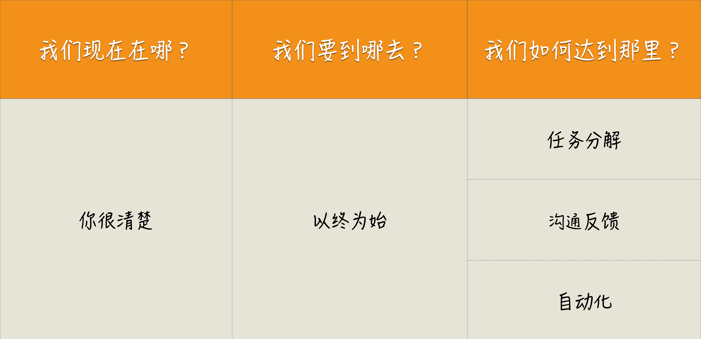
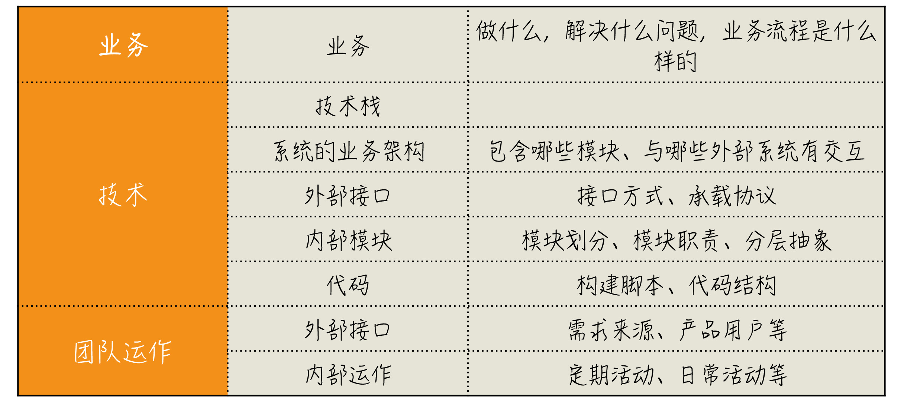
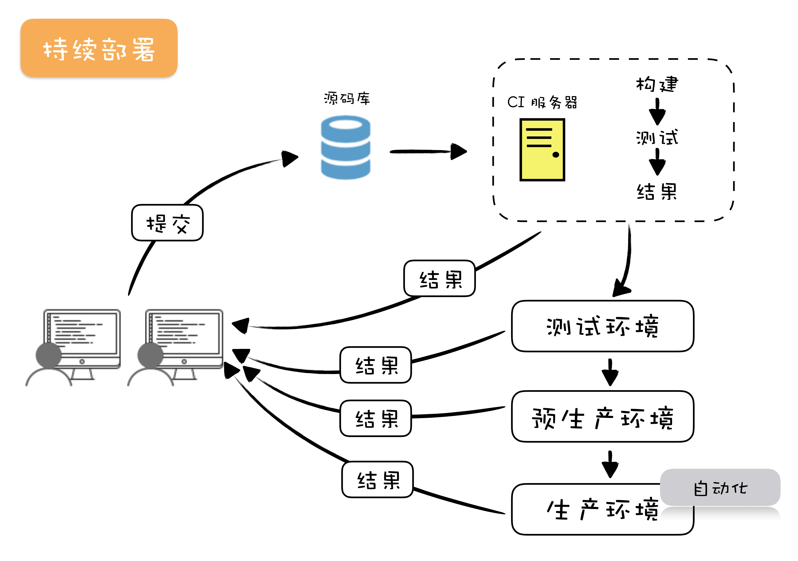
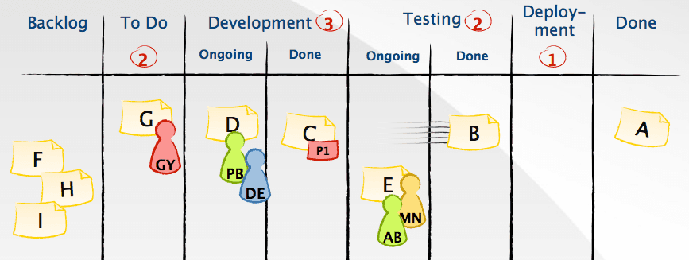

## 高效工作

### 一个思考框架
1. Where are we?（现状）
2. Where are we going?（目标）
3. How Can we get there?（实现路径）

### 四个践行原则
1. 以终为始。
2. 任务分解。
3. 沟通反馈。
4. 自动化。

以终为始确定目标，任务分解拆分目标，形成实现路径，沟通反馈和自动化为确定目标和任务分解以及执行分解任务保驾护航。

### 记住践行语录
- 面对问题时，用思考框架问问自己，现状、目标和路径。
- 遇到事情，倒着想。
- 在做任何事之前，先定义完成的标准。
- 在做任何需求或任务之前，先定好验收标准。
- 尽早提交代码去集成。
- 默认所有需求都不做，直到弄清楚为什么要做这件事。 
- 扩大自己工作的上下文，别把自己局限在一个“程序员”的角色上。
- 在动手做一件事之前，先推演一番。
- 问一下自己，我的工作是不是可以用数字衡量。
- 设计你的迭代 0 清单，给自己的项目做体检。
- 动手做一个工作之前，请先对它进行任务分解。
- 多写单元测试。
- 我们应该编写可测的代码。
- 将任务拆小，越小越好。
- 按照完整实现一个需求的顺序去安排分解出来的任务。
- 要想写好测试，就要写简单的测试。
- 想要管理好需求，先把需求拆小。
- 尽量做最重要的事。
- 做好产品开发，最可行的方式是采用 MVP（Minimum Viable Product）。
- 通过沟通反馈，不断升级自己的编解码能力。
- 用业务的语言写代码。
- 多面对面沟通，少开会。
- 多尝试用可视化的方式进行沟通。
- 做好持续集成的关键在于，快速反馈。
- 定期复盘，找准问题根因，不断改善。
- 多走近用户。
- 事情往前做，有问题尽早暴露。
- 多输出，让知识更有结构。
- 锤炼你的重构技能。
- 请谨慎地将工作自动化。
- 将你的工作过程自动化。
- 有体系地学习运维知识。
- 将部署纳入开发的考量。
- 将验收测试自动化。
- 把函数写短。
- 构建好你的领域模型。
- 用简单技术解决问题，直到问题变复杂。
- 学习领域驱动设计。
- 了解一个项目，从大图景开始。
- 小步改造遗留系统，不要回到老路上。
- 在学习区工作和成长。

### 践行图谱
思考框架：

快速了解一个项目：

迭代0清单：

任务分解（简单登录功能）：

测试金字塔：

测试驱动开发（测试驱动设计）：

持续集成：

持续交付（持续部署）：

运维知识体系：

领域驱动设计：

用业务语言写代码：

精益创业：

看板：

一专多能：

学习模型：

