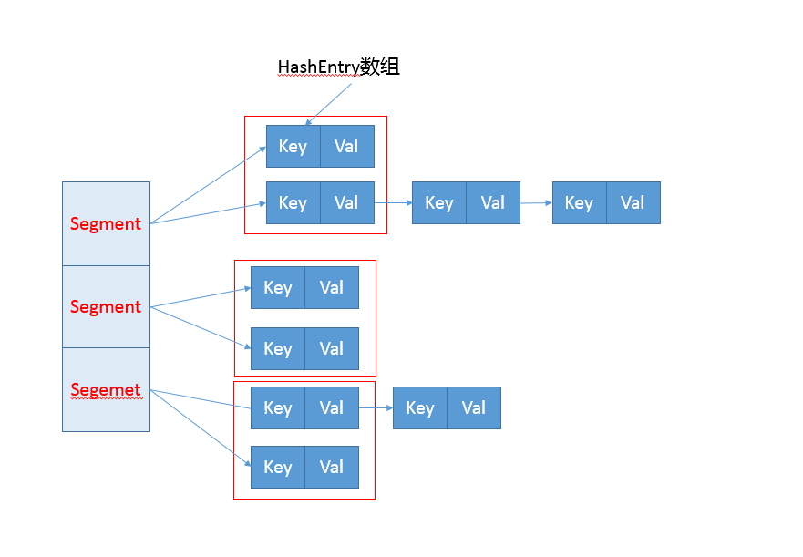
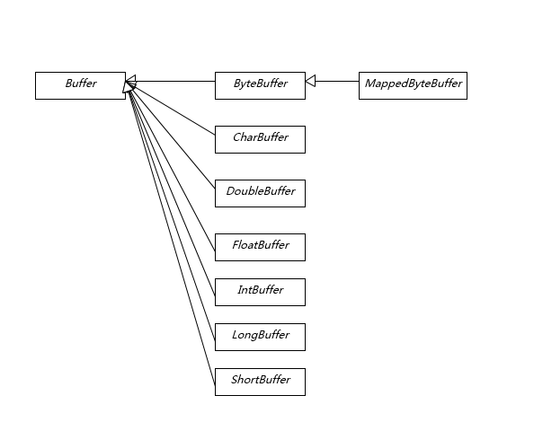
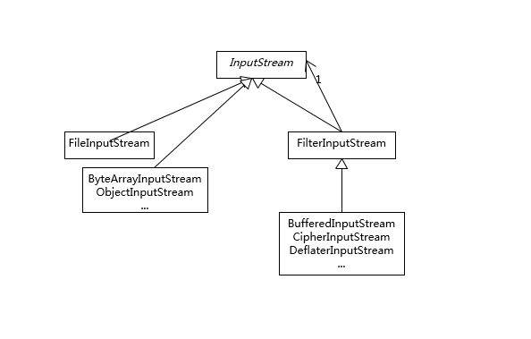

## 一篇文章了解 Java 核心技术

### Java 异常处理机制

#### Throwable 类图


#### 简述
Exception 和 Error 都继承了 Throwable 类，在 Java 中只有 Throwable 的实例才可以被抛出或捕获，它是异常处理机制的基本组成类型。

Exception 和 Error 体现了 Java 平台设计者对不同异常情况的分类。
- Exception 是程序正常运行中，可以预料的意外情况，可能并且应该被捕获，进行相应处理。Exception 又分为可检查异常和不检查异常。可检查异常在源代码里必须显示地进行捕获处理，这是编译期检查的一部分。不检查异常就是所谓的运行时异常，如 ：NullPointerException、ArrayIndeOutOfBoundsException 等，通常是可以编码避免的逻辑错误，具体根据需要来判断是否需要捕获处理，编译期不检查运行时异常。
- Error 指在正常情况下，不大可能出现的情况，绝大部分的 Error 都会导致程序处于非正常的、不可恢复状态。所以不便于也不需要捕获。如：OutOfMemoryError。

#### 异常处理的两个基本原则
1. 尽量不要捕获类似 Exception 这样的通用异常，而是应该捕获特定异常。
2. 不要生吞异常。

如以下代码则违反了这两个基本原则：
```
try {
  // 业务代码
  // …
  Thread.sleep(1000L);
} catch (Exception e) {
  // Ignore it
}

```

```
try {
   // 业务代码
   // …
} catch (IOException e) {
    e.printStackTrace();
}

```


---
### Java引用
Java引用分为：强引用、软引用、弱引用、幻想引用。不同的引用类型，主要体现的是对象的可达性状态和对垃圾收集的影响。
- 强引用：就是我们通常使用的普通引用，可以通过强引用访问对象。GC不会收集有强引用指向的对象。 
- 软引用：比强引用弱化一些的引用，它可以豁免一些垃圾收集，GC可以确保在抛出OOM之前清理掉软引用指向的对象。可以用于实现内存敏感的缓存。 
- 弱引用：主要是提供一种在弱引用状态下访问对象的途径。可以用来构建一种没有特定约束的关系，如维护一种非强制性的映射关系。 
- 幻象引用：不能通过它访问对象。仅仅是提供了一种对象被finalize以后，做某些事情的机制，比如：post-mortem清理机制、cleaner机制等。	


---
### 谈谈final、finally、 finalize有什么不同？
final 可以用来修饰类、方法、变量，分别有不同的意义，final 修饰的 class 代表不可以继承扩展，final 的变量是不可以修改的，而 final 的方法也是不可以重写的（override）。

finally 则是 Java 保证重点代码一定要被执行的一种机制。我们可以使用 try-finally 或者 try-catch-finally 来进行类似关闭 JDBC 连接、保证 unlock 锁等动作。

finalize 是基础类 java.lang.Object 的一个方法，它的设计目的是保证对象在被垃圾收集前完成特定资源的回收。finalize 机制现在已经不推荐使用，并且在 JDK 9 开始被标记为 deprecated。


---
### String、StringBuffer、StringBuilder有什么区别？
String 是 Java 语言非常基础和重要的类，提供了构造和管理字符串的各种基本逻辑。它是典型的 Immutable 类，被声明成为 final class，所有属性也都是 final 的。也由于它的不可变性，类似拼接、裁剪字符串等动作，都会产生新的 String 对象。由于字符串操作的普遍性，所以相关操作的效率往往对应用性能有明显影响。

StringBuffer 是为解决上面提到拼接产生太多中间对象的问题而提供的一个类，我们可以用 append 或者 add 方法，把字符串添加到已有序列的末尾或者指定位置。StringBuffer 本质是一个线程安全的可修改字符序列，它保证了线程安全，也随之带来了额外的性能开销，所以除非有线程安全的需要，不然还是推荐使用它的后继者，也就是 StringBuilder。

StringBuilder 是 Java 1.5 中新增的，在能力上和 StringBuffer 没有本质区别，但是它去掉了线程安全的部分，有效减小了开销，是绝大部分情况下进行字符串拼接的首选。


---
### 动态代理是基于什么原理？
反射机制是 Java 语言提供的一种基础功能，赋予程序在运行时**自省**（introspect，官方用语）的能力。通过反射我们可以直接操作类或者对象，比如获取某个对象的类定义，获取类声明的属性和方法，调用方法或者构造对象，甚至可以运行时修改类定义。

动态代理是一种方便运行时动态构建代理、动态处理代理方法调用的机制，很多场景都是利用类似机制做到的，比如用来包装 RPC 调用、面向切面的编程（AOP）。

实现动态代理的方式很多，比如：
1. JDK 自身提供的动态代理主要利用了反射机制。
2. 利用更高性能的字节码操作机制，类似 ASM、cglib（基于 ASM）、Javassist 等。


---
### int和Integer有什么区别？
int 是我们常说的整形数字，是 Java 的 8 个原始数据类型（boolean【1字节】、byte【1字节】 、short【2字节】、char【2字节】、int【4字节】、float【4字节】、long【8字节】、double【8字节】）之一。
所谓的一切皆是对象并不包括原始数据类型。

Integer 是 int 对应的包装类，它有一个 int 类型的字段存储数据，并且提供了基本操作，比如数学运算、int 和字符串之间转换等。在 Java 5 中，引入了自动装箱和自动拆箱功能（boxing/unboxing），Java 可以根据上下文，自动进行转换，极大地简化了相关编程。

关于 Integer 的值缓存，这涉及 Java 5 中另一个改进。构建 Integer 对象的传统方式是直接调用构造器，直接 new 一个对象。但是根据实践，我们发现大部分数据操作都是集中在有限的、较小的数值范围，因而，在 Java 5 中新增了静态工厂方法 valueOf，在调用它的时候会利用一个缓存机制，带来了明显的性能改进。按照 Javadoc，**这个值默认缓存是 -128 到 127 之间。**


---
### 对比Vector、ArrayList、LinkedList有何区别？
#### Collection 整体结构


#### 简述
这三者都是实现集合框架中的 List，也就是所谓的有序集合，因此具体功能也比较近似，比如都提供按照位置进行定位、添加或者删除的操作，都提供迭代器以遍历其内容等。但因为具体的设计区别，在行为、性能、线程安全等方面，表现又有很大不同。

Vector 是 Java 早期提供的**线程安全的动态数组**，如果不需要线程安全，并不建议选择，毕竟同步是有额外开销的。Vector 内部是使用对象数组来保存数据，可以根据需要自动的增加容量，当数组已满时，会创建新的数组，并拷贝原有数组数据。

ArrayList 是应用更加广泛的**动态数组**实现，它本身不是线程安全的，所以性能要好很多。与 Vector 近似，ArrayList 也是可以根据需要调整容量，不过两者的调整逻辑有所区别，Vector 在扩容时会提高 1 倍，而 ArrayList 则是增加 50%。

LinkedList 顾名思义是 Java 提供的双向链表，所以它不需要像上面两种那样调整容量，它也不是线程安全的。


---
### 对比Hashtable、HashMap、TreeMap有什么不同？
#### Map 整体结构


#### 简述
Hashtable、HashMap、TreeMap 都是最常见的一些 Map 实现，是以**键值对**的形式存储和操作数据的容器类型。

Hashtable 是早期 Java 类库提供的一个哈希表实现，本身是同步的，不支持 null 键和值，由于同步导致的性能开销，所以已经很少被推荐使用。

HashMap 是应用更加广泛的哈希表实现，行为上大致上与 HashTable 一致，主要区别在于 HashMap 不是同步的，支持 null 键和值等。通常情况下，HashMap 进行 put 或者 get 操作，可以达到常数时间的性能，所以**它是绝大部分利用键值对存取场景的首选**，比如，实现一个用户 ID 和用户信息对应的运行时存储结构。

TreeMap 则是基于红黑树的一种提供顺序访问的 Map，和 HashMap 不同，它的 get、put、remove 之类操作都是 O（log(n)）的时间复杂度，具体顺序可以由指定的 Comparator 来决定，或者根据键的自然顺序来判断。


---
### 如何保证集合是线程安全的? ConcurrentHashMap如何实现高效地线程安全？
Java 提供了不同层面的线程安全支持。在传统集合框架内部，除了 Hashtable 等同步容器，还提供了所谓的同步包装器（Synchronized Wrapper），我们可以调用 Collections 工具类提供的包装方法，来获取一个同步的包装容器（如 Collections.synchronizedMap），但是它们都是利用非常粗粒度的同步方式，在高并发情况下，性能比较低下。

另外，更加普遍的选择是利用并发包提供的线程安全容器类，它提供了：
- 各种并发容器，比如 ConcurrentHashMap、CopyOnWriteArrayList。
- 各种线程安全队列（Queue/Deque），如 ArrayBlockingQueue、SynchronousQueue。
- 各种有序容器的线程安全版本等。

具体保证线程安全的方式，包括有从简单的 synchronize 方式，到基于更加精细化的，比如基于分离锁实现的 ConcurrentHashMap 等并发实现等。具体选择要看开发的场景需求，总体来说，并发包内提供的容器通用场景，远优于早期的简单同步实现。

ConcurrentHashMap如何实现高效的线程安全可以参考下面这个早期 ConcurrentHashMap 内部结构的示意图，其核心是利用分段设计，在进行并发操作的时候，只需要锁定相应段，这样就有效避免了类似 Hashtable 整体同步的问题，大大提高了性能。



---
### Java提供了哪些IO方式？ NIO如何实现多路复用？
#### IO 方式简述
Java IO 方式有很多种，基于不同的 IO 抽象模型和交互方式，可以进行简单区分。

首先，传统的 java.io 包，它基于流模型实现，提供了我们最熟知的一些 IO 功能，比如 File 抽象、输入输出流等。交互方式是同步、阻塞的方式，也就是说，在读取输入流或者写入输出流时，在读、写动作完成之前，线程会一直阻塞在那里，它们之间的调用是可靠的线性顺序。

java.io 包的好处是代码比较简单、直观，缺点则是 IO 效率和扩展性存在局限性，容易成为应用性能的瓶颈。

很多时候，人们也把 java.net 下面提供的部分网络 API，比如 Socket、ServerSocket、HttpURLConnection 也归类到同步阻塞 IO 类库，因为网络通信同样是 IO 行为。

第二，在 Java  1.4 中引入了 NIO 框架（java.nio 包），提供了 Channel、Selector、Buffer 等新的抽象，可以构建多路复用的、同步非阻塞 IO 程序，同时提供了更接近操作系统底层的高性能数据操作方式。

第三，在 Java 7 中，NIO 有了进一步的改进，也就是 NIO 2，引入了异步非阻塞 IO 方式，也有很多人叫它 AIO（Asynchronous IO）。异步 IO 操作基于事件和回调机制，可以简单理解为，应用操作直接返回，而不会阻塞在那里，当后台处理完成，操作系统会通知相应线程进行后续工作。

#### BIO（即传统的 java.io 包）主要知识点
- IO 不仅仅是对文件的操作，网络编程中，比如 Socket 通信，都是典型的 IO 操作目标。
- 输入流、输出流（InputStream/OutputStream）是用于读取或写入字节的，例如操作图片文件。
- 而 Reader/Writer 则是用于操作字符，增加了字符编解码等功能，适用于类似从文件中读取或者写入文本信息。本质上计算机操作的都是字节，不管是网络通信还是文件读取，Reader/Writer 相当于构建了应用逻辑和原始数据之间的桥梁。
- BufferedOutputStream 等带缓冲区的实现，可以避免频繁的磁盘读写，进而提高 IO 处理效率。这种设计利用了缓冲区，将批量数据进行一次操作，但在使用中千万别忘了 flush。
- 参考下面这张类图，很多 IO 工具类都实现了 Closeable 接口，因为需要进行资源的释放。比如，打开 FileInputStream，它就会获取相应的文件描述符（FileDescriptor），需要利用 try-with-resources、 try-finally 等机制保证 FileInputStream 被明确关闭，进而相应文件描述符也会失效，否则将导致资源无法被释放。利用 Cleaner 或 finalize 机制作为资源释放的最后把关，也是必要的。

日常开发常用的类型和结构关系：


#### NIO 主要知识点
##### NIO 主要组成部分
- Buffer，高效的数据容器，除了布尔类型，所有原始数据类型都有相应的 Buffer 实现。
- Channel，类似在 Linux 之类操作系统上看到的文件描述符，是 NIO 中被用来支持批量式 IO 操作的一种抽象。  File 或者 Socket，通常被认为是比较高层次的抽象，而 Channel 则是更加操作系统底层的一种抽象，这也使得 NIO 得以充分利用现代操作系统底层机制，获得特定场景的性能优化，例如，DMA（Direct Memory Access）等。不同层次的抽象是相互关联的，我们可以通过 Socket 获取 Channel，反之亦然。
- Selector，是 NIO 实现多路复用的基础，它提供了一种高效的机制，可以检测到注册在 Selector 上的多个 Channel 中，是否有 Channel 处于就绪状态，进而实现了单线程对多 Channel 的高效管理。

Selector 同样是基于底层操作系统机制，不同模式、不同版本都存在区别，例如，在最新的代码库里，相关实现如下：
Linux 上依赖于 epoll（http://hg.openjdk.java.net/jdk/jdk/file/d8327f838b88/src/java.base/linux/classes/sun/nio/ch/EPollSelectorImpl.java）。
Windows 上 NIO2（AIO）模式则是依赖于 iocp（http://hg.openjdk.java.net/jdk/jdk/file/d8327f838b88/src/java.base/windows/classes/sun/nio/ch/Iocp.java）。

- Chartset，提供 Unicode 字符串定义，NIO 也提供了相应的编解码器等，例如，通过下面的方式进行字符串到 ByteBuffer 的转换：
```
Charset.defaultCharset().encode("Hello world!"));

```

##### NIO 多路复用
**实现一个服务器应用（BIO方式）：**
```
serverSocket = new ServerSocket(0);
executor = Executors.newFixedThreadPool(8);
 while (true) {
    Socket socket = serverSocket.accept();
    RequestHandler requestHandler = new RequestHandler(socket);
    executor.execute(requestHandler);
}

```

通过一个固定大小的线程池，来负责管理工作线程，避免频繁创建、销毁线程的开销，这是我们构建并发服务的典型方式。这种工作方式，可以参考下图来理解。


如果连接数并不是非常多，只有最多几百个连接的普通应用，这种模式往往可以工作的很好。但是，如果连接数量急剧上升，这种实现方式就无法很好地工作了，因为线程上下文切换开销会在高并发时变得很明显，这是同步阻塞方式的低扩展性劣势。

**实现一个服务器应用（NIO方式，即多路复用）：**
```
public class NIOServer extends Thread {
    public void run() {
        try (Selector selector = Selector.open();
            ServerSocketChannel serverSocket = ServerSocketChannel.open();) {// 创建 Selector 和 Channel
            serverSocket.bind(new InetSocketAddress(InetAddress.getLocalHost(), 8888));
            serverSocket.configureBlocking(false);
            // 注册到 Selector，并说明关注点
            serverSocket.register(selector, SelectionKey.OP_ACCEPT);
            while (true) {
                selector.select();// 阻塞等待就绪的 Channel，这是关键点之一
                Set<SelectionKey> selectedKeys = selector.selectedKeys();
                Iterator<SelectionKey> iter = selectedKeys.iterator();
                while (iter.hasNext()) {
                    SelectionKey key = iter.next();
                   // 生产系统中一般会额外进行就绪状态检查
                    sayHelloWorld((ServerSocketChannel) key.channel());
                    iter.remove();
                }
            }
        } catch (IOException e) {
            e.printStackTrace();
        }
    }
    private void sayHelloWorld(ServerSocketChannel server) throws IOException {
        try (SocketChannel client = server.accept();) {          
        	client.write(Charset.defaultCharset().encode("Hello world!"));
        }
    }
   // 省略了与前面类似的 main
}

```

这个非常精简的样例掀开了 NIO 多路复用的面纱，我们可以分析下主要步骤和元素：
- 首先，通过 Selector.open() 创建一个 Selector，作为类似调度员的角色。
- 然后，创建一个 ServerSocketChannel，并且向 Selector 注册，通过指定 SelectionKey.OP_ACCEPT，告诉调度员，它关注的是新的连接请求。**注意**，为什么我们要明确配置非阻塞模式呢？这是因为阻塞模式下，注册操作是不允许的，会抛出 IllegalBlockingModeException 异常。
- Selector 阻塞在 select 操作，当有 Channel 发生接入请求，就会被唤醒。
- 在 sayHelloWorld 方法中，通过 SocketChannel 和 Buffer 进行数据操作，在本例中是发送了一段字符串。

可以看到，在前面两个样例中，IO 都是同步阻塞模式，所以需要多线程以实现多任务处理。而 NIO 则是利用了单线程轮询事件的机制，通过高效地定位就绪的 Channel，来决定做什么，仅仅 select 阶段是阻塞的，可以有效避免大量客户端连接时，频繁线程切换带来的问题，应用的扩展能力有了非常大的提高。下面这张图对这种实现思路进行了形象地说明。


**实现一个服务器应用（AIO方式）：** 
```
AsynchronousServerSocketChannel serverSock = AsynchronousServerSocketChannel.open().bind(sockAddr);
serverSock.accept(serverSock, new CompletionHandler<>() { // 为异步操作指定 CompletionHandler 回调函数
    @Override
    public void completed(AsynchronousSocketChannel sockChannel, AsynchronousServerSocketChannel serverSock) {
        serverSock.accept(serverSock, this);
        // 另外一个 write（sock，CompletionHandler{}）
        sayHelloWorld(sockChannel, Charset.defaultCharset().encode("Hello World!"));
    }
  // 省略其他路径处理方法...
});

```

与NIO对比如下：
- 基本抽象很相似，AsynchronousServerSocketChannel 对应于上面例子中的 ServerSocketChannel；AsynchronousSocketChannel 则对应 SocketChannel。
- 业务逻辑的关键在于，通过指定 CompletionHandler 回调接口，在 accept/read/write 等关键节点，通过事件机制调用，这是非常不同的一种编程思路。


---
### Java有几种文件拷贝方式？哪一种最高效？
Java 有多种比较典型的文件拷贝实现方式，比如：
1. 利用 java.io 类库，直接为源文件构建一个 FileInputStream 读取，然后再为目标文件构建一个 FileOutputStream，完成写入工作。
```
public static void copyFileByStream(File source, File dest) throws IOException {
    try (InputStream is = new FileInputStream(source);
        OutputStream os = new FileOutputStream(dest);){
        byte[] buffer = new byte[1024];
        int length;
        while ((length = is.read(buffer)) > 0) {
            os.write(buffer, 0, length);
        }
    }
 }

```

2. 利用 java.nio 类库提供的 transferTo 或 transferFrom 方法实现。
```
public static void copyFileByChannel(File source, File dest) throws IOException {
    try (FileChannel sourceChannel = new FileInputStream(source).getChannel();
        FileChannel targetChannel = new FileOutputStream(dest).getChannel();){
        for (long count = sourceChannel.size() ;count>0 ;) {
            long transferred = sourceChannel.transferTo(sourceChannel.position(), count, targetChannel);            
            sourceChannel.position(sourceChannel.position() + transferred);
            count -= transferred;
        }
    }
 }

```

3. Java 标准类库本身已经提供了几种 Files.copy 的实现。

对于 Copy 的效率，这个其实与操作系统和配置等情况相关，总体上来说，NIO transferTo/From 的方式可能更快，因为它更能利用现代操作系统底层机制，避免不必要拷贝和上下文切换。

**拷贝实现机制分析:**
先来理解一下，前面实现的不同拷贝方法，本质上有什么明显的区别。

首先，需要理解用户态空间（User Space）和内核态空间（Kernel Space），这是操作系统层面的基本概念，操作系统内核、硬件驱动等运行在内核态空间，具有相对高的特权；而用户态空间，则是给普通应用和服务使用。可以参考：https://en.wikipedia.org/wiki/User_space 。

当我们使用输入输出流进行读写时，实际上是进行了多次上下文切换，比如应用读取数据时，先在内核态将数据从磁盘读取到内核缓存，再切换到用户态将数据从内核缓存读取到用户缓存。

写入操作也是类似，仅仅是步骤相反，可以参考下面这张图。


所以，这种方式会带来一定的额外开销，可能会降低 IO 效率。

而基于 NIO transferTo 的实现方式，在 Linux 和 Unix 上，则会使用到零拷贝技术，数据传输并不需要用户态参与，省去了上下文切换的开销和不必要的内存拷贝，进而可能提高应用拷贝性能。注意，transferTo 不仅仅是可以用在文件拷贝中，与其类似的，例如读取磁盘文件，然后进行 Socket 发送，同样可以享受这种机制带来的性能和扩展性提高。

transferTo 的传输过程是：


**NIO Buffer**
Buffer 是 NIO 操作数据的基本工具，Java 为每种原始数据类型都提供了相应的 Buffer 实现（布尔除外），所以掌握和使用 Buffer 是十分必要的，尤其是涉及 Direct  Buffer 等使用，因为其在垃圾收集等方面的特殊性，更要重点掌握。


Buffer 有几个基本属性：
- capcity，它反映这个 Buffer 到底有多大，也就是数组的长度。
- position，要操作的数据起始位置。
- limit，相当于操作的限额。在读取或者写入时，limit 的意义很明显是不一样的。比如，读取操作时，很可能将 limit 设置到所容纳数据的上限；而在写入时，则会设置容量或容量以下的可写限度。
- mark，记录上一次 postion 的位置，默认是 0，算是一个便利性的考虑，往往不是必须的。

前面三个是我们日常使用最频繁的，简单梳理下 Buffer 的基本操作：
- 我们创建了一个 ByteBuffer，准备放入数据，capcity 当然就是缓冲区大小，而 position 就是 0，limit 默认就是 capcity 的大小。
- 当我们写入几个字节的数据时，position 就会跟着水涨船高，但是它不可能超过 limit 的大小。
- 如果我们想把前面写入的数据读出来，需要调用 flip 方法，将 position 设置为 0，limit 设置为以前的 position 那里。
- 如果还想从头再读一遍，可以调用 rewind，让 limit 不变，position 再次设置为 0。


---
### 谈谈接口和抽象类有什么区别？
接口和抽象类是 Java 面向对象设计的两个基础机制。

接口用 interface 关键字修饰，是对行为的抽象，它是抽象方法的集合，利用接口可以达到 API 定义和实现分离的目的。
接口不能实例化。
接口类中只能定义常量成员、抽象方法和静态方法。任何 field 都是隐含着 public static final 的意义。
Java 标准类库中，定义了非常多的接口，比如 java.util.List。

抽象类用 abstract 关键字修饰，抽象类大多用于抽取相关 Java 类的共用方法实现或者共同成员变量，然后通过继承的方式达到代码复用的目的。
抽象类不能实例化。
抽象类中可以定义零个、一个或者多个抽象方法，也可以没有抽象方法。
Java 标准库中，比如 collection 框架，很多通用部分就被抽取成为抽象类，例如 java.util.AbstractList。


**面向对象的基本要素：封装、继承、多态。**
- 封装：*目的是隐藏事务内部的实现细节，以便提高安全性和简化编程。*封装提供了合理的边界，避免外部调用者接触到内部的细节。我们在日常开发中，因为无意间暴露了细节导致的难缠 bug 太多了，比如在多线程环境暴露内部状态，导致的并发修改问题。从另外一个角度看，封装这种隐藏，也提供了简化的界面，避免太多无意义的细节浪费调用者的精力。
- 继承：*是代码复用的基础机制*，类似于我们对于马、白马、黑马的归纳总结。但要注意，继承可以看作*是非常紧耦合的一种关系*，父类代码修改，子类行为也会变动。在实践中，*过度滥用继承，可能会起到反效果*。
- 多态：你可能立即会想到重写（override）和重载（overload）、向上转型。简单说，重写是父子类中相同名字和参数的方法，不同的实现；重载则是相同名字的方法，但是不同的参数，本质上这些方法签名是不一样的。


**面向对象基本设计原则：S.O.L.I.D 原则。**
- 单一职责（Single Responsibility），类或者对象最好是只有单一职责，在程序设计中如果发现某个类承担着多种义务，可以考虑进行拆分。
- 开关原则（Open-Close, Open for extension, close for modification），设计要对扩展开放，对修改关闭。换句话说，程序设计应保证平滑的扩展性，尽量避免因为新增同类功能而修改已有实现，这样可以少产出些回归（regression）问题。
- 里氏替换（Liskov Substitution），这是面向对象的基本要素之一，进行继承关系抽象时，凡是可以用父类或者基类的地方，都可以用子类替换。
- 接口分离（Interface Segregation），我们在进行类和接口设计时，如果在一个接口里定义了太多方法，其子类很可能面临两难，就是只有部分方法对它是有意义的，这就破坏了程序的内聚性。
- 依赖反转（Dependency Inversion），实体应该依赖于抽象而不是实现。也就是说高层次模块，不应该依赖于低层次模块，而是应该基于抽象。实践这一原则是保证产品代码之间适当耦合度的法宝。


---
### 谈谈常用的设计模式？
大致按照模式的应用目标分类，设计模式可以分为创建型模式、结构型模式和行为型模式。
- 创建型模式，是对对象创建过程的各种问题和解决方案的总结，包括各种工厂模式（Factory、Abstract Factory）、单例模式（Singleton）、构建器模式（Builder）、原型模式（ProtoType）。
- 结构型模式，是针对软件设计结构的总结，关注于类、对象继承、组合方式的实践经验。常见的结构型模式，包括桥接模式（Bridge）、适配器模式（Adapter）、装饰者模式（Decorator）、代理模式（Proxy）、组合模式（Composite）、外观模式（Facade）、享元模式（Flyweight）等。
- 行为型模式，是从类或对象之间交互、职责划分等角度总结的模式。比较常见的行为型模式有策略模式（Strategy）、解释器模式（Interpreter）、命令模式（Command）、观察者模式（Observer）、迭代器模式（Iterator）、模板方法模式（Template Method）、访问者模式（Visitor）。


**常用设计模式举例：**
IO 框架，我们知道 InputStream 是一个抽象类，标准类库中提供了 FileInputStream、ByteArrayInputStream 等各种不同的子类，分别从不同角度对 InputStream 进行了功能扩展，这是典型的装饰器模式应用案例。


创建型模式尤其是工厂模式，在我们的代码中随处可见，举个相对不同的 API 设计实践。比如，JDK 最新版本中 HTTP/2 Client API，下面这个创建 HttpRequest 的过程，就是典型的构建器模式（Builder），通常会被实现成fluent 风格的 API，也有人叫它方法链。
```
HttpRequest request = HttpRequest.newBuilder(new URI(uri))
                     .header(headerAlice, valueAlice)
                     .headers(headerBob, value1Bob,
                      headerCarl, valueCarl,
                      headerBob, value2Bob)
                     .GET()
                     .build();

```
使用构建器模式，可以比较优雅地解决构建复杂对象的麻烦，这里的“复杂”是指类似需要输入的参数组合较多，如果用构造函数，我们往往需要为每一种可能的输入参数组合实现相应的构造函数，一系列复杂的构造函数会让代码阅读性和可维护性变得很差。

单例模式：
```
public class Singleton {
	private static volatile Singleton singleton = null;
	private Singleton() {
	}

	public static Singleton getSingleton() {
    	if (singleton == null) { // 尽量避免重复进入同步块
        	synchronized (Singleton.class) { // 同步.class，意味着对同步类方法调用
            	if (singleton == null) {
                	singleton = new Singleton();
            	}
        	}
    	}
    	return singleton;
	}
}

```

Spring 在 API 设计中使用的设计模式：
- BeanFactory 和 ApplicationContext 应用了工厂模式。
- 在 Bean 的创建中，Spring 也为不同 scope 定义的对象，提供了单例和原型等模式实现。
- AOP 领域则是使用了代理模式、装饰器模式、适配器模式等。
- 各种事件监听器，是观察者模式的典型应用。
- 类似 JdbcTemplate 等则是应用了模板模式。


**文章持续更新中！！！**


